# SMVDU TITAN-X SoC — Complete Design Module Reference

> **Architecture:** Quad-Core RV64GC + Monitor RV64IMAC • Sv39 MMU • 15M×9S AXI4 Crossbar • DDR4 • PCIe • GbE • USB OTG • HDMI • MIPI CSI-2  
> **Process Target:** SCL 180 nm • **Last Updated:** 14 September 2026

This repository contains **all 71 pure Verilog design modules** (no testbenches, no scripts) of the SMVDU TITAN-X System-on-Chip. Each module directory includes its own `README.md` with detailed descriptions, I/O tables, and Mermaid diagrams.

---

## 📐 Full SoC Architecture — Microscopic Top-Level Diagram

The diagram below shows **every single one of the 71 Verilog modules**, their exact hierarchical placement, all inter-module signal connections, bus protocols, interrupt routing, clock domains, reset gating, and the complete data path from external pins through the chip and back out. Modules are color-coded by functional subsystem.

```mermaid
graph TB
    %% ════════════════════════════════════════════════════════════
    %% SECTION 1: EXTERNAL I/O PADS
    %% ════════════════════════════════════════════════════════════
    subgraph PADS_CLK["⏱ External Clock & Reset Pads"]
        direction LR
        pad_clk(["clk"])
        pad_rst_n(["rst_n"])
        pad_pipe_clk(["pipe_clk<br/>(PCIe PIPE)"])
        pad_eth_tx_clk(["eth_tx_clk"])
        pad_eth_rx_clk(["eth_rx_clk"])
        pad_ulpi_clk(["ulpi_clk<br/>(USB PHY)"])
        pad_mipi_rxbyteclkhs(["mipi_rxbyteclkhs"])
        pad_hdmi_clk_pixel(["hdmi_clk_pixel"])
        pad_hdmi_clk_tmds(["hdmi_clk_tmds"])
        pad_rtc_clk(["rtc_clk<br/>(32.768 kHz)"])
    end

    subgraph PADS_DDR["💾 DDR4 SDRAM Pads"]
        direction LR
        pad_ddr_addr(["ddr_addr[15:0]<br/>ddr_ba[2:0], ddr_bg[1:0]"])
        pad_ddr_ctrl(["ddr_ck_p/n, ddr_cke<br/>ddr_cs_n, ddr_ras_n<br/>ddr_cas_n, ddr_we_n<br/>ddr_reset_n, ddr_odt<br/>ddr_act_n"])
        pad_ddr_dq(["ddr_dq[63:0] ↔<br/>ddr_dqs_p[7:0]<br/>ddr_dqs_n[7:0]"])
    end

    subgraph PADS_HDMI["🖥 HDMI Output Pads"]
        pad_tmds_clk(["hdmi_tmds_clk_p/n"])
        pad_tmds_data(["hdmi_tmds_data_p/n[2:0]"])
    end

    subgraph PADS_PERIPH["🔌 Peripheral I/O Pads"]
        direction LR
        pad_uart_rx(["uart_rx[4:0]"])
        pad_uart_tx(["uart_tx[4:0]"])
        pad_can_rx(["can_rx[1:0]"])
        pad_can_tx(["can_tx[1:0]"])
    end

    %% ════════════════════════════════════════════════════════════
    %% SECTION 2: RESET INFRASTRUCTURE & BOOT SECURITY
    %% ════════════════════════════════════════════════════════════
    subgraph RESET_INFRA["🔄 Reset Infrastructure"]
        direction LR
        reset_sync_inst["reset_sync.v<br/>(2-FF async→sync)"]
        cdc_sync_inst["cdc_sync.v<br/>(N-FF CDC synchronizer)"]
    end

    subgraph BOOT_SECURITY["🔐 Secure Boot Gate"]
        direction TB
        u_secure_boot["secure_boot.v<br/>━━━━━━━━━━━━━━━━<br/>• SHA-256 image hash verify<br/>• eNVM firmware read<br/>• Boot pass/fail output<br/>━━━━━━━━━━━━━━━━<br/>APB @ 0x20030_000"]
        boot_pass_net{{"boot_pass"}}
        core_rst_n_net{{"core_rst_n<br/>= rst_n & boot_pass"}}

        u_secure_boot -->|"boot_pass"| boot_pass_net
        u_secure_boot -->|"boot_fail"| boot_fail_net{{"boot_fail"}}
    end

    pad_rst_n --> reset_sync_inst
    reset_sync_inst --> u_secure_boot
    boot_pass_net --> core_rst_n_net

    %% ════════════════════════════════════════════════════════════
    %% SECTION 3: CPU CLUSTER — 4× RV64GC + 1× RV64IMAC Monitor
    %% ════════════════════════════════════════════════════════════
    subgraph CPU_CLUSTER["🧠 CPU Cluster (4+1 Cores)"]
        direction TB

        subgraph CORE0["Core 0 — rv_core_top.v #0 (HART_ID=0, RV64GC)"]
            direction LR
            subgraph C0_FE["Stage 1: Fetch"]
                c0_fetch["rv_fetch.v<br/>━━━━━━━━━━━<br/>• PC generation<br/>• AXI AR channel<br/>• Branch redirect<br/>• Redirect-safe<br/>  drain FSM"]
                c0_bpu["rv_bpu.v<br/>━━━━━━━━━━━<br/>• 2K×2-bit BHT<br/>• 12-bit GHR<br/>• gshare XOR<br/>• RAS (8-entry)<br/>• Tournament"]
                c0_icache["rv_icache.v<br/>━━━━━━━━━━━<br/>• 32KB, 8-way SA<br/>• VIPT, PLRU<br/>• 64B cacheline<br/>• AXI4 8-beat refill<br/>• SECDED ECC"]
            end

            subgraph C0_DE["Stage 2: Decode"]
                c0_decode["rv_decode.v<br/>━━━━━━━━━━━<br/>• Imm gen (I/S/B/U/J)<br/>• Control decode<br/>• CSR decode<br/>• SYSTEM instrs"]
                c0_regfile["rv_regfile.v<br/>━━━━━━━━━━━<br/>• 32×64-bit GPRs<br/>• 2R1W sync<br/>• x0 hardwired 0<br/>• WB write-back"]
                c0_decode <-->|"rs1_addr, rs2_addr<br/>rs1_data, rs2_data<br/>wb_rd, wb_data, wb_we"| c0_regfile
            end

            subgraph C0_EX["Stage 3: Execute"]
                c0_execute["rv_execute.v<br/>━━━━━━━━━━━<br/>• 64-bit ALU<br/>  (ADD/SUB/AND/OR/XOR/<br/>   SLL/SRL/SRA/SLT)<br/>• MUL/DIV (M-ext, 64-cyc)<br/>• AMO (A-ext)<br/>• Branch resolution<br/>• Forwarding mux"]
                c0_csr["rv_csr.v<br/>━━━━━━━━━━━<br/>• mstatus, mtvec, mepc<br/>• mcause, mip, mie<br/>• satp, sstatus<br/>• M/S/U privilege<br/>• Trap vectoring"]
                c0_fpu["rv_fpu.v<br/>━━━━━━━━━━━<br/>• F/D extensions<br/>• FMADD/FMSUB<br/>• FADD/FMUL/FDIV<br/>• FSQRT, FCVT<br/>• 32 × 64-bit FPRs"]
                c0_execute <-->|"csr_addr, csr_wdata<br/>csr_rdata, csr_op"| c0_csr
                c0_execute <-->|"fpu_result[63:0]<br/>fpu_valid, fpu_done"| c0_fpu
            end

            subgraph C0_ME["Stage 4: Memory"]
                c0_mem["rv_mem.v<br/>━━━━━━━━━━━<br/>• AXI AW/W/B (store)<br/>• AXI AR/R (load)<br/>• Load sign-extend<br/>• Store byte-enable<br/>• LB/LH/LW/LD<br/>• SB/SH/SW/SD"]
                c0_dcache["rv_dcache.v<br/>━━━━━━━━━━━<br/>• 32KB, 8-way SA<br/>• Write-back<br/>• Write-allocate<br/>• PLRU replacement<br/>• Dirty eviction<br/>• AXI4 refill/evict"]
            end

            subgraph C0_WB["Stage 5: Writeback"]
                c0_wb["rv_writeback.v<br/>━━━━━━━━━━━<br/>• rd commit<br/>• Forwarding output<br/>• fwd_wb_data/rd/valid"]
            end

            subgraph C0_MMU["MMU Subsystem"]
                c0_mmu["rv_mmu.v<br/>━━━━━━━━━━━<br/>• Sv39 translation<br/>• VA→PA mapping<br/>• satp.MODE select"]
                c0_tlb["rv_tlb.v<br/>━━━━━━━━━━━<br/>• 64-entry FA<br/>• ASID tagging<br/>• sfence.vma flush"]
                c0_ptw["rv_ptw.v<br/>━━━━━━━━━━━<br/>• 3-level page walk<br/>• Sv39 L2→L1→L0<br/>• AXI read for PTE"]
                c0_pmp["rv_pmp.v<br/>━━━━━━━━━━━<br/>• 16 PMP entries<br/>• TOR/NAPOT/NA4<br/>• R/W/X permissions"]
                c0_mmu --> c0_tlb
                c0_mmu --> c0_ptw
                c0_mmu --> c0_pmp
                c0_ptw -->|"TLB fill"| c0_tlb
            end

            subgraph C0_HAZARD["Hazard Control"]
                c0_stall{{"stall = mul_div_stall<br/>|| mem_stall || halt_req"}}
                c0_flush{{"flush = branch_taken<br/>|| exception"}}
                c0_bufx4["buf_macros.v (BUFX4×2)<br/>━━━━━━━━━━━<br/>• High-fanout buffer<br/>• flush_de_1, flush_de_4"]
                c0_flush --> c0_bufx4
            end

            %% Pipeline data flow
            c0_fetch -->|"fe_pc[63:0]<br/>fe_instr[31:0]<br/>fe_valid"| c0_decode
            c0_decode -->|"de_pc, de_rs1, de_rs2<br/>de_imm, de_rd[4:0]<br/>de_aluop[4:0], de_f3[2:0]<br/>de_f7[6:0], de_op[6:0]<br/>de_memr/w, de_regw<br/>de_branch/jal/jalr<br/>de_iscsr, de_csrop<br/>de_ecall/ebreak/mret"| c0_execute
            c0_execute -->|"ex_alures[63:0]<br/>ex_rs2[63:0], ex_rd[4:0]<br/>ex_f3[2:0], ex_op[6:0]<br/>ex_memr/w, ex_regw"| c0_mem
            c0_mem -->|"mem_result[63:0]<br/>mem_rd[4:0]<br/>mem_regw, mem_valid"| c0_wb

            %% Forwarding paths
            c0_mem -.->|"fwd_mem_data[63:0]<br/>fwd_mem_rd[4:0]<br/>fwd_mem_valid"| c0_execute
            c0_wb -.->|"fwd_wb_data[63:0]<br/>fwd_wb_rd[4:0]<br/>fwd_wb_valid"| c0_execute
            c0_wb -.->|"wb_data[63:0]<br/>wb_rd[4:0], wb_we"| c0_decode

            %% Branch/stall/flush
            c0_execute -->|"branch_taken<br/>branch_target[63:0]"| c0_fetch
            c0_execute -->|"mul_div_stall"| c0_stall
            c0_mem -->|"mem_stall"| c0_stall
            c0_stall -->|"stall"| c0_fetch
            c0_stall -->|"stall"| c0_decode
            c0_stall -->|"stall_ex (no self-loop)"| c0_execute
            c0_bufx4 -->|"flush_de_1"| c0_decode
            c0_bufx4 -->|"flush_de_4"| c0_execute

            %% Cache/MMU connections
            c0_fetch -.->|"va[63:0]"| c0_mmu
            c0_mem -.->|"va[63:0]"| c0_mmu
            c0_fetch -.-> c0_icache
            c0_mem -.-> c0_dcache
            c0_fetch -.-> c0_bpu
        end

        subgraph CORE1["Core 1 — rv_core_top.v #1 (HART_ID=1, RV64GC)"]
            direction LR
            c1_fe["rv_fetch"] --> c1_de["rv_decode"] --> c1_ex["rv_execute"] --> c1_me["rv_mem"] --> c1_wb["rv_writeback"]
            c1_wb -.-> c1_de
            c1_mmu_sub["rv_mmu<br/>└ rv_tlb<br/>└ rv_ptw<br/>└ rv_pmp"]
            c1_cache_sub["rv_icache<br/>rv_dcache<br/>rv_bpu"]
            c1_misc["rv_csr • rv_fpu<br/>rv_regfile<br/>BUFX4×2"]
        end

        subgraph CORE2["Core 2 — rv_core_top.v #2 (HART_ID=2, RV64GC)"]
            direction LR
            c2_fe["rv_fetch"] --> c2_de["rv_decode"] --> c2_ex["rv_execute"] --> c2_me["rv_mem"] --> c2_wb["rv_writeback"]
            c2_wb -.-> c2_de
            c2_mmu_sub["rv_mmu<br/>└ rv_tlb<br/>└ rv_ptw<br/>└ rv_pmp"]
            c2_cache_sub["rv_icache<br/>rv_dcache<br/>rv_bpu"]
            c2_misc["rv_csr • rv_fpu<br/>rv_regfile<br/>BUFX4×2"]
        end

        subgraph CORE3["Core 3 — rv_core_top.v #3 (HART_ID=3, RV64GC)"]
            direction LR
            c3_fe["rv_fetch"] --> c3_de["rv_decode"] --> c3_ex["rv_execute"] --> c3_me["rv_mem"] --> c3_wb["rv_writeback"]
            c3_wb -.-> c3_de
            c3_mmu_sub["rv_mmu<br/>└ rv_tlb<br/>└ rv_ptw<br/>└ rv_pmp"]
            c3_cache_sub["rv_icache<br/>rv_dcache<br/>rv_bpu"]
            c3_misc["rv_csr • rv_fpu<br/>rv_regfile<br/>BUFX4×2"]
        end

        subgraph MON_CORE["Core 4 — rv_monitor_core.v (HART_ID=4, RV64IMAC)"]
            direction LR
            mon["rv_monitor_core.v<br/>━━━━━━━━━━━━━━━━<br/>• Reduced pipeline<br/>• No FPU, no D-ext<br/>• System monitor<br/>• AXI imem (M8, read-only)<br/>• AXI dmem (M9, write-only)"]
        end

        subgraph DEBUG_MOD["Debug Module"]
            rv_debug_inst["rv_debug.v<br/>━━━━━━━━━━━━━━━━<br/>• JTAG DTM interface<br/>• Debug Module (DM)<br/>• halt_req / resume_req<br/>• Program buffer<br/>• Abstract commands"]
        end
    end

    core_rst_n_net --> CORE0
    core_rst_n_net --> CORE1
    core_rst_n_net --> CORE2
    core_rst_n_net --> CORE3
    core_rst_n_net --> MON_CORE
    pad_clk --> CPU_CLUSTER

    %% ════════════════════════════════════════════════════════════
    %% SECTION 4: AXI4 INTERCONNECT FABRIC
    %% ════════════════════════════════════════════════════════════
    subgraph AXI_FABRIC["🔀 AXI4 Interconnect Fabric"]
        direction TB

        subgraph XBAR["axi4_crossbar.v (15M × 9S)"]
            direction TB
            xbar_core["Address Decoder<br/>+ Round-Robin Arbiter<br/>+ Per-M/S FIFO Queues<br/>+ DECERR Slave Responder<br/>━━━━━━━━━━━━━━━━<br/>NM=15, NS=9, AW=40<br/>DW=64, IDW=4"]
        end

        qos_inst["qos_controller.v<br/>━━━━━━━━━━━━━━━━<br/>• Per-master QoS<br/>• Priority levels<br/>• Bandwidth throttle"]

        mpu_inst["mpu.v<br/>━━━━━━━━━━━━━━━━<br/>• Interconnect MPU<br/>• Address range check<br/>• Access permission<br/>• Fault response"]

        burst_conv["axi4_burst_to_lite.v<br/>━━━━━━━━━━━━━━━━<br/>• Burst→single-beat<br/>• INCR/WRAP→FIXED<br/>• Beat counter<br/>• Last generation"]

        mmu_arb["mmu_arbiter.v<br/>━━━━━━━━━━━━━━━━<br/>• Multi-core MMU<br/>  request arbiter<br/>• Round-robin<br/>• Page walk port"]

        xbar_core --> qos_inst
        qos_inst --> mpu_inst
        burst_conv --> xbar_core
    end

    %% Master connections — Instruction Fetch (read-only)
    c0_fetch -->|"M0: imem_arvalid/araddr[39:0]<br/>imem_rdata[63:0]/rvalid/rlast<br/>(read-only, AR/R channels)"| xbar_core
    c1_fe -->|"M1: imem AR/R"| xbar_core
    c2_fe -->|"M2: imem AR/R"| xbar_core
    c3_fe -->|"M3: imem AR/R"| xbar_core

    %% Master connections — Data Access (read/write)
    c0_mem -->|"M4: dmem AW/W/B/AR/R<br/>awaddr[39:0], wdata[63:0]<br/>wstrb[7:0], bresp[1:0]"| xbar_core
    c1_me -->|"M5: dmem AW/W/B/AR/R"| xbar_core
    c2_me -->|"M6: dmem AW/W/B/AR/R"| xbar_core
    c3_me -->|"M7: dmem AW/W/B/AR/R"| xbar_core

    %% Monitor core master connections
    mon -->|"M8: imem arvalid/araddr<br/>(read-only)"| xbar_core
    mon -->|"M9: dmem awvalid/awaddr<br/>wvalid/wdata<br/>(write-only)"| xbar_core

    %% ════════════════════════════════════════════════════════════
    %% SECTION 5: DMA MASTERS (M10, M11, M12)
    %% ════════════════════════════════════════════════════════════
    subgraph DMA_MASTERS["⚡ High-Speed DMA Masters"]
        direction TB

        subgraph GBE_SUB["Gigabit Ethernet"]
            u_gem["gem_ethernet.v<br/>━━━━━━━━━━━━━━━━<br/>• GbE MAC (IEEE 802.3)<br/>• TX/RX DMA engine<br/>• GMII interface<br/>• AXI4 master (M10)<br/>• APB config @ 0x10020<br/>• Scatter-gather DMA<br/>• mac_irq → PLIC[27]"]
            u_sgmii["gem_sgmii_pcs.v<br/>━━━━━━━━━━━━━━━━<br/>• SGMII PCS sublayer<br/>• 8b/10b encode/decode<br/>• Auto-negotiation<br/>• Link status"]
            u_gem --> u_sgmii
        end

        subgraph PCIE_SUB["PCIe Controller"]
            u_pcie["pcie_top.v<br/>━━━━━━━━━━━━━━━━<br/>• PCIe Gen2 x1<br/>• TLP engine<br/>• DMA read/write<br/>• AXI4 master (M11)<br/>• Config space<br/>• BAR decode"]
            u_pcie_pipe["pcie_pipe_if.v<br/>━━━━━━━━━━━━━━━━<br/>• PIPE PHY interface<br/>• TX data/datak<br/>• RX data/valid<br/>• Power management<br/>• pipe_clk domain"]
            u_pcie --> u_pcie_pipe
        end

        subgraph USB_SUB["USB OTG"]
            u_usb["usb_otg.v<br/>━━━━━━━━━━━━━━━━<br/>• USB 2.0 OTG<br/>• Host + Device modes<br/>• DMA engine<br/>• AXI4 master (M12)<br/>• APB config @ 0x10030<br/>• ULPI PHY interface<br/>• usb_irq → PLIC[28]"]
        end
    end

    u_gem -->|"M10: AXI4 AW/W/B/AR/R<br/>awaddr[39:0], wdata[63:0]"| xbar_core
    u_pcie -->|"M11: AXI4 AW/W/B/AR/R<br/>awaddr[39:0], wdata[63:0]"| xbar_core
    u_usb -->|"M12: AXI4 AW/W/B/AR/R<br/>awaddr[39:0], wdata[63:0]"| xbar_core

    pad_eth_tx_clk --> u_gem
    pad_eth_rx_clk --> u_gem
    pad_pipe_clk --> u_pcie_pipe
    pad_ulpi_clk --> u_usb

    %% Tied-off masters M13, M14
    xbar_m13_14["M13-M14: Tied off<br/>(reserved for expansion)"]

    %% ════════════════════════════════════════════════════════════
    %% SECTION 6: SLAVE 0 — MEMORY SUBSYSTEM
    %% ════════════════════════════════════════════════════════════
    subgraph MEM_SUBSYS["💾 Memory Subsystem — Slave 0 (0x8000_0000+)"]
        direction TB

        subgraph L2_CACHE["L2 Cache — l2_cache_top.v"]
            direction TB
            l2_ctrl["l2_cache_ctrl.v<br/>━━━━━━━━━━━━━━━━<br/>• Hit/miss FSM<br/>• Line fill control<br/>• Eviction policy<br/>• Writeback buffer<br/>• Inclusive policy"]
            l2_tag["l2_tag_array.v<br/>━━━━━━━━━━━━━━━━<br/>• Tag + valid + dirty<br/>• Parity protection<br/>• Tag compare logic"]
            l2_data["l2_data_array.v<br/>━━━━━━━━━━━━━━━━<br/>• Data SRAM banks<br/>• Read/write port<br/>• Bank interleave"]
            l2_snoop["l2_snoop_filter.v<br/>━━━━━━━━━━━━━━━━<br/>• Coherence tracker<br/>• Snoop hit/miss<br/>• Sharers bitmap<br/>• Invalidate/clean"]
            l2_ctrl -->|"tag_rd/wr<br/>tag_addr, tag_din"| l2_tag
            l2_ctrl -->|"data_rd/wr<br/>data_addr, data_din"| l2_data
            l2_ctrl -->|"snoop_req<br/>snoop_addr"| l2_snoop
            l2_tag -->|"tag_hit, tag_dout"| l2_ctrl
            l2_data -->|"data_dout<br/>data_valid"| l2_ctrl
            l2_snoop -->|"snoop_hit<br/>sharers[3:0]"| l2_ctrl
        end

        subgraph DDR_CTRL["DDR4 Controller — ddr_ctrl_top.v"]
            direction TB
            ddr_sched["ddr_scheduler.v<br/>━━━━━━━━━━━━━━━━<br/>• Command queue<br/>• Bank state FSM<br/>• Open-page policy<br/>• tRCD/tRP/tRAS timing<br/>• Row hit optimization"]
            ddr_phy["ddr_phy_if.v<br/>━━━━━━━━━━━━━━━━<br/>• DFI → PHY timing<br/>• DQS strobe gen<br/>• Read leveling<br/>• Write leveling<br/>• IDELAYE2 control"]
            ddr_sched -->|"dfi_cmd, dfi_addr<br/>dfi_bank, dfi_wrdata"| ddr_phy
            ddr_phy -->|"dfi_rddata<br/>dfi_rddata_valid"| ddr_sched
        end

        subgraph SRAM_MACROS["SRAM Macros (SCL 180nm)"]
            sram32["sram_32x64_180nm.v<br/>━━━━━━━━━━━━━━━━<br/>• 32-word × 64-bit<br/>• Single-port<br/>• cs/we/addr/din/dout"]
            sram512["sram_512kx8_180nm.v<br/>━━━━━━━━━━━━━━━━<br/>• 512K × 8-bit<br/>• Single-port<br/>• cs/we/addr/din/dout"]
        end

        L2_CACHE -->|"AXI write-back<br/>evicted cachelines"| DDR_CTRL
        DDR_CTRL -->|"AXI refill data<br/>rdata[63:0]"| L2_CACHE
        l2_data --> sram32
        l2_data --> sram512
        l2_tag --> sram32
    end

    xbar_core -->|"S0: AXI4 Full<br/>awvalid/awaddr/awid<br/>wvalid/wdata/wstrb<br/>bvalid/bresp/bid<br/>arvalid/araddr/arid<br/>rvalid/rdata/rresp/rlast"| L2_CACHE
    ddr_phy -->|"ddr_addr[15:0]<br/>ddr_ba, ddr_bg<br/>ddr_ck_p/n, ddr_cke"| pad_ddr_addr
    ddr_phy -->|"ddr_cs_n, ddr_ras_n<br/>ddr_cas_n, ddr_we_n"| pad_ddr_ctrl
    ddr_phy <-->|"ddr_dq[63:0]<br/>ddr_dqs_p/n[7:0]"| pad_ddr_dq

    %% ════════════════════════════════════════════════════════════
    %% SECTION 7: SLAVE 2 — BOOT ROM
    %% ════════════════════════════════════════════════════════════
    subgraph BOOT_ROM["📖 Boot ROM — Slave 2 (0x1000_0000)"]
        u_boot_rom["axi_rom.v<br/>━━━━━━━━━━━━━━━━<br/>• firmware.hex<br/>• AXI4 read-only slave<br/>• s_arvalid/araddr/arid<br/>• s_rvalid/rdata/rresp/rlast<br/>• Write channels tied off"]
    end

    xbar_core -->|"S2: AXI AR/R<br/>(read-only)<br/>araddr[39:0]<br/>rdata[63:0]"| u_boot_rom

    %% Tied-off slaves S3-S8
    xbar_s3_8["S3-S8: Tied off<br/>(reserved for expansion)<br/>awready=1, rvalid=0"]

    %% ════════════════════════════════════════════════════════════
    %% SECTION 8: SLAVE 1 — BRIDGE CHAIN (AXI → AHB → APB)
    %% ════════════════════════════════════════════════════════════
    subgraph BRIDGE_CHAIN["🌉 Bridge Chain — Slave 1"]
        direction TB

        u_axi2ahb["axi4_to_ahb.v<br/>━━━━━━━━━━━━━━━━<br/>• AXI4 slave → AHB-Lite master<br/>• AW=40, DW=64, IDW=4<br/>• Write buffer<br/>• Read pipeline<br/>• haddr[31:0], hwdata[31:0]<br/>• htrans[1:0], hsize[2:0]"]

        ahb_to_apb_inst["ahb_to_apb.v<br/>━━━━━━━━━━━━━━━━<br/>• AHB-Lite slave → APB master<br/>• haddr→paddr passthrough<br/>• htrans→psel/penable<br/>• hwrite→pwrite"]

        apb_bridge_inst["apb_bridge.v<br/>━━━━━━━━━━━━━━━━<br/>• APB address space manager<br/>• Multi-peripheral mux<br/>• pready generation<br/>• pslverr aggregation"]

        apb_dec["APB Address Decoder<br/>━━━━━━━━━━━━━━━━<br/>psel_uart0 (0x10000)<br/>psel_uart1 (0x10001)<br/>psel_uart2 (0x10002)<br/>psel_uart3 (0x10003)<br/>psel_uart4 (0x10004)<br/>psel_rtc (0x10010)<br/>psel_gem (0x10020)<br/>psel_usb (0x10030)<br/>psel_mipi (0x10040)<br/>psel_isp (0x10050)<br/>psel_hdmi (0x10060)<br/>psel_drbg (0x20000)<br/>psel_aes (0x20010)<br/>psel_envm (0x20020)<br/>psel_boot (0x20030)<br/>psel_can0 (0x30000)<br/>psel_can1 (0x30001)"]

        apb_mux["prdata_mux<br/>━━━━━━━━━━━━━━━━<br/>17-input read data mux<br/>prdata_uart0..4<br/>prdata_rtc, prdata_gem<br/>prdata_usb, prdata_mipi<br/>prdata_isp, prdata_hdmi<br/>prdata_drbg, prdata_aes<br/>prdata_envm, prdata_boot<br/>prdata_can0, prdata_can1"]

        u_axi2ahb -->|"haddr[31:0], hwdata[31:0]<br/>hwrite, htrans[1:0]<br/>hsize[2:0], hburst[2:0]"| ahb_to_apb_inst
        ahb_to_apb_inst -->|"paddr[31:0], pwdata[31:0]<br/>psel, penable, pwrite"| apb_bridge_inst
        apb_bridge_inst --> apb_dec
        apb_mux -->|"hrdata[31:0]<br/>hready=1, hresp=0"| u_axi2ahb
    end

    xbar_core -->|"S1: AXI4 Full<br/>awvalid/awaddr/awid<br/>wvalid/wdata/wstrb<br/>arvalid/araddr/arid"| u_axi2ahb

    %% ════════════════════════════════════════════════════════════
    %% SECTION 9: APB PERIPHERALS — LOW-SPEED I/O
    %% ════════════════════════════════════════════════════════════
    subgraph LOW_SPEED["📡 Low-Speed Peripherals (APB Bus)"]
        direction TB

        subgraph UARTS["UART 16550 × 5"]
            u_uart0["uart_16550.v<br/>u_uart0 @ 0x10000<br/>━━━━━━━━━━━━━━━━<br/>• 16550-compatible<br/>• TX/RX FIFOs (16-deep)<br/>• Baud rate generator<br/>• IrDA SIR mode<br/>• LIN bus mode<br/>• uart_irq → PLIC[20]"]
            u_uart1["uart_16550.v<br/>u_uart1 @ 0x10001<br/>irq → PLIC[21]"]
            u_uart2["uart_16550.v<br/>u_uart2 @ 0x10002<br/>irq → PLIC[22]"]
            u_uart3["uart_16550.v<br/>u_uart3 @ 0x10003<br/>irq → PLIC[23]"]
            u_uart4["uart_16550.v<br/>u_uart4 @ 0x10004<br/>irq → PLIC[24]"]
        end

        subgraph CANS["CAN Controller × 2"]
            u_can0["can_controller.v<br/>u_can0 @ 0x30000<br/>━━━━━━━━━━━━━━━━<br/>• CAN 2.0B protocol<br/>• TX/RX message buffers<br/>• Bit timing unit<br/>• Error management<br/>• can_irq → PLIC[25]"]
            u_can1["can_controller.v<br/>u_can1 @ 0x30001<br/>irq → PLIC[26]"]
        end

        u_rtc["rtc.v @ 0x10010<br/>━━━━━━━━━━━━━━━━<br/>• 32.768 kHz rtc_clk<br/>• 64-bit mtime counter<br/>• 5× mtimecmp registers<br/>• timer_irq[4:0] output<br/>• CDC to system clock"]

        u_gpio["gpio_ctrl.v<br/>━━━━━━━━━━━━━━━━<br/>• 32-bit GPIO port<br/>• Per-pin direction<br/>• Input/output data<br/>• Interrupt per pin<br/>• APB register map"]

        u_i2c["i2c_master.v<br/>━━━━━━━━━━━━━━━━<br/>• I²C master controller<br/>• SCL/SDA open-drain<br/>• 7/10-bit addressing<br/>• Clock stretching<br/>• Multi-master arb"]

        u_spi["spi_master.v<br/>━━━━━━━━━━━━━━━━<br/>• SPI master (mode 0-3)<br/>• SCLK, MOSI, MISO, SS<br/>• Configurable clock div<br/>• TX/RX FIFOs<br/>• DMA request"]

        u_wdt["watchdog_timer.v<br/>━━━━━━━━━━━━━━━━<br/>• Windowed watchdog<br/>• Programmable timeout<br/>• System reset output<br/>• NMI on early/late<br/>• Lock register"]
    end

    apb_dec -->|"psel_uart0..4<br/>paddr, pwdata<br/>penable, pwrite"| UARTS
    apb_dec -->|"psel_can0/1"| CANS
    apb_dec -->|"psel_rtc"| u_rtc

    UARTS -->|"prdata_uart0..4"| apb_mux
    CANS -->|"prdata_can0/1"| apb_mux
    u_rtc -->|"prdata_rtc"| apb_mux
    u_gpio -->|"prdata_gpio"| apb_mux
    u_i2c -->|"prdata_i2c"| apb_mux
    u_spi -->|"prdata_spi"| apb_mux
    u_wdt -->|"prdata_wdt"| apb_mux

    pad_uart_rx -->|"rxd[4:0]"| UARTS
    UARTS -->|"txd[4:0]"| pad_uart_tx
    pad_can_rx -->|"can_rx[1:0]"| CANS
    CANS -->|"can_tx[1:0]"| pad_can_tx
    pad_rtc_clk -->|"rtc_clk"| u_rtc

    %% DMA peripheral APB config
    apb_dec -->|"psel_gem"| u_gem
    apb_dec -->|"psel_usb"| u_usb
    u_gem -->|"prdata_gem"| apb_mux
    u_usb -->|"prdata_usb"| apb_mux

    %% ════════════════════════════════════════════════════════════
    %% SECTION 10: SECURITY SUBSYSTEM
    %% ════════════════════════════════════════════════════════════
    subgraph SECURITY["🔒 Security Subsystem"]
        direction TB

        u_drbg["drbg.v @ 0x20000<br/>━━━━━━━━━━━━━━━━<br/>• CTR-DRBG (NIST SP 800-90A)<br/>• AES-256 core<br/>• Entropy seeded by TRNG<br/>• trng_entropy[127:0]<br/>• trng_valid/ready<br/>• drbg_irq → PLIC[10]"]

        u_aes["aes_engine.v @ 0x20010<br/>━━━━━━━━━━━━━━━━<br/>• AES-128/192/256<br/>• ECB/CBC/CTR modes<br/>• Key expansion<br/>• AXI-Stream in/out<br/>• s_axis/m_axis tdata[31:0]<br/>• aes_irq → PLIC[11]"]

        u_envm["envm_ctrl.v @ 0x20020<br/>━━━━━━━━━━━━━━━━<br/>• eNVM controller<br/>• Flash program/erase<br/>• Read interface<br/>• Wear leveling<br/>• envm_ce_n, envm_we_n"]

        u_sha256["sha256_engine.v<br/>━━━━━━━━━━━━━━━━<br/>• SHA-256 hash engine<br/>• Message schedule<br/>• 64-round compression<br/>• 256-bit digest output<br/>• APB register map"]

        u_trng["trng.v<br/>━━━━━━━━━━━━━━━━<br/>• True Random Number Gen<br/>• Ring oscillator entropy<br/>• Health tests<br/>• 128-bit random output<br/>• NIST SP 800-90B"]

        u_ecdsa["ecdsa_engine.v<br/>━━━━━━━━━━━━━━━━<br/>• ECDSA P-256 signer<br/>• Point multiplication<br/>• Modular arithmetic<br/>• Key generation<br/>• Signature verify"]

        u_trng -->|"trng_entropy[127:0]<br/>trng_valid"| u_drbg
        u_secure_boot -->|"envm_addr[31:0]<br/>envm_req"| u_envm
        u_envm -->|"envm_rdata[31:0]<br/>envm_valid"| u_secure_boot
    end

    apb_dec -->|"psel_drbg"| u_drbg
    apb_dec -->|"psel_aes"| u_aes
    apb_dec -->|"psel_envm"| u_envm
    apb_dec -->|"psel_boot"| u_secure_boot
    u_drbg -->|"prdata_drbg"| apb_mux
    u_aes -->|"prdata_aes"| apb_mux
    u_envm -->|"prdata_envm"| apb_mux
    u_secure_boot -->|"prdata_boot"| apb_mux

    %% ════════════════════════════════════════════════════════════
    %% SECTION 11: VIDEO/IMAGING PIPELINE
    %% ════════════════════════════════════════════════════════════
    subgraph VIDEO["🎬 Video / Imaging Pipeline"]
        direction LR

        u_mipi["mipi_csi2_rx.v @ 0x10040<br/>━━━━━━━━━━━━━━━━<br/>• MIPI CSI-2 receiver<br/>• D-PHY interface<br/>• Lane merging (4-lane)<br/>• Packet decoder<br/>• rxbyteclkhs domain<br/>• AXI-Stream master"]

        u_isp["isp_pipeline.v @ 0x10050<br/>━━━━━━━━━━━━━━━━<br/>• Image Signal Processor<br/>• Bayer demosaic<br/>• White balance<br/>• Gamma correction<br/>• Color space convert<br/>• Noise reduction<br/>• AXI-Stream in/out"]

        u_hdmi["hdmi_ctrl.v @ 0x10060<br/>━━━━━━━━━━━━━━━━<br/>• HDMI 1.4 transmitter<br/>• TMDS 8b/10b encoding<br/>• Pixel clock domain<br/>• TMDS clock domain<br/>• Video timing gen<br/>• Data island packets"]

        u_vdma["vdma.v<br/>━━━━━━━━━━━━━━━━<br/>• Video DMA engine<br/>• Frame buffer R/W<br/>• Scatter-gather<br/>• Line stride config<br/>• AXI4 master"]

        u_mipi -->|"m_axis_tdata[31:0]<br/>m_axis_tvalid<br/>m_axis_tready<br/>m_axis_tuser<br/>m_axis_tlast"| u_isp
        u_isp -->|"m_axis_tdata[31:0]<br/>m_axis_tvalid/tlast/tuser"| u_hdmi
        u_vdma -.->|"Frame buffer<br/>DMA transfers"| u_isp
    end

    pad_mipi_rxbyteclkhs --> u_mipi
    pad_hdmi_clk_pixel --> u_hdmi
    pad_hdmi_clk_tmds --> u_hdmi
    u_hdmi -->|"tmds_clk_p/n"| pad_tmds_clk
    u_hdmi -->|"tmds_data_p/n[2:0]"| pad_tmds_data

    apb_dec -->|"psel_mipi"| u_mipi
    apb_dec -->|"psel_isp"| u_isp
    apb_dec -->|"psel_hdmi"| u_hdmi
    u_mipi -->|"prdata_mipi"| apb_mux
    u_isp -->|"prdata_isp"| apb_mux
    u_hdmi -->|"prdata_hdmi"| apb_mux

    %% ════════════════════════════════════════════════════════════
    %% SECTION 12: STORAGE CONTROLLERS
    %% ════════════════════════════════════════════════════════════
    subgraph STORAGE["💿 Storage Controllers"]
        direction TB

        u_mmc["mmc_controller.v<br/>━━━━━━━━━━━━━━━━<br/>• eMMC/SD controller<br/>• 1/4/8-bit bus widths<br/>• CMD/DAT lines<br/>• HS200/HS400 modes<br/>• DMA support<br/>• APB register map"]

        u_qspi["qspi_controller.v<br/>━━━━━━━━━━━━━━━━<br/>• Quad-SPI flash controller<br/>• Standard/Dual/Quad modes<br/>• XIP (execute-in-place)<br/>• 4 chip selects<br/>• DMA support<br/>• APB register map"]
    end

    %% ════════════════════════════════════════════════════════════
    %% SECTION 13: INTERRUPT CONTROLLERS
    %% ════════════════════════════════════════════════════════════
    subgraph IRQ_CTRL["🚨 Interrupt Controllers"]
        direction TB

        u_plic["plic.v<br/>━━━━━━━━━━━━━━━━<br/>• Platform-Level Interrupt Ctrl<br/>• 32 interrupt sources<br/>• 5 contexts (4 cores + monitor)<br/>• Priority (1-7) + threshold<br/>• Claim/complete protocol<br/>• plic_irq[31:0] input<br/>• irq_m_ext[4:0] output"]

        u_clint["clint.v<br/>━━━━━━━━━━━━━━━━<br/>• Core-Local Interruptor<br/>• 5× msip registers<br/>• mtime / mtimecmp<br/>• sw_irq[4:0] output<br/>• MMIO @ 0x200_0000"]
    end

    %% Interrupt routing
    u_uart0 -->|"plic_irq[20]"| u_plic
    u_uart1 -->|"plic_irq[21]"| u_plic
    u_uart2 -->|"plic_irq[22]"| u_plic
    u_uart3 -->|"plic_irq[23]"| u_plic
    u_uart4 -->|"plic_irq[24]"| u_plic
    u_can0 -->|"plic_irq[25]"| u_plic
    u_can1 -->|"plic_irq[26]"| u_plic
    u_gem -->|"mac_irq → plic_irq[27]"| u_plic
    u_usb -->|"usb_irq → plic_irq[28]"| u_plic
    u_drbg -->|"drbg_irq → plic_irq[10]"| u_plic
    u_aes -->|"aes_irq → plic_irq[11]"| u_plic

    u_plic -->|"irq_m_ext[0]"| CORE0
    u_plic -->|"irq_m_ext[1]"| CORE1
    u_plic -->|"irq_m_ext[2]"| CORE2
    u_plic -->|"irq_m_ext[3]"| CORE3
    u_plic -->|"irq_m_ext[4]"| MON_CORE

    u_rtc -->|"timer_irq[0]"| CORE0
    u_rtc -->|"timer_irq[1]"| CORE1
    u_rtc -->|"timer_irq[2]"| CORE2
    u_rtc -->|"timer_irq[3]"| CORE3
    u_rtc -->|"timer_irq[4]"| MON_CORE

    u_clint -->|"sw_irq[0]"| CORE0
    u_clint -->|"sw_irq[1]"| CORE1
    u_clint -->|"sw_irq[2]"| CORE2
    u_clint -->|"sw_irq[3]"| CORE3
    u_clint -->|"sw_irq[4]"| MON_CORE

    %% ════════════════════════════════════════════════════════════
    %% SECTION 14: COMMON / UTILITY MODULES
    %% ════════════════════════════════════════════════════════════
    subgraph COMMON["🔧 Common Utility Modules"]
        direction LR

        fifo_sync_inst["fifo_sync.v<br/>━━━━━━━━━━━━━━━━<br/>• Synchronous FIFO<br/>• Parameterized depth<br/>• Full/empty flags<br/>• Used in UART, SPI,<br/>  AXI queues"]

        fifo_async_inst["fifo_async.v<br/>━━━━━━━━━━━━━━━━<br/>• Async FIFO<br/>• Gray-code pointers<br/>• CDC-safe<br/>• Used in USB, GbE,<br/>  MIPI clock crossing"]

        cdc_sync_full["cdc_sync.v<br/>━━━━━━━━━━━━━━━━<br/>• N-FF synchronizer<br/>• Parameterized stages<br/>• Used across all<br/>  clock domain crossings"]

        reset_sync_full["reset_sync.v<br/>━━━━━━━━━━━━━━━━<br/>• 2-FF async reset sync<br/>• Assert async<br/>• Deassert sync<br/>• Per-domain reset"]

        bufx4_full["buf_macros.v (BUFX4)<br/>━━━━━━━━━━━━━━━━<br/>• Standard cell wrapper<br/>• High-fanout buffer<br/>• Used for flush nets<br/>• SCL 180nm library"]

        stdcell_full["stdcell_stubs.v<br/>━━━━━━━━━━━━━━━━<br/>• Simulation stubs<br/>• BUFX4, CLKBUF<br/>• Standard cell models<br/>• For RTL simulation"]
    end

    %% Common modules usage (dashed = instantiated-by)
    fifo_sync_inst -.->|"used by"| UARTS
    fifo_sync_inst -.->|"used by"| xbar_core
    fifo_async_inst -.->|"used by"| u_gem
    fifo_async_inst -.->|"used by"| u_usb
    fifo_async_inst -.->|"used by"| u_mipi
    cdc_sync_full -.->|"used by"| u_rtc
    cdc_sync_full -.->|"used by"| u_pcie_pipe
    reset_sync_full -.->|"used by"| RESET_INFRA

    %% ════════════════════════════════════════════════════════════
    %% SECTION 15: GLOBAL CLOCK DISTRIBUTION
    %% ════════════════════════════════════════════════════════════
    pad_clk -->|"clk (system)"| AXI_FABRIC
    pad_clk --> BRIDGE_CHAIN
    pad_clk --> LOW_SPEED
    pad_clk --> SECURITY
    pad_clk --> MEM_SUBSYS

    %% ════════════════════════════════════════════════════════════
    %% STYLING — Color-coded by functional domain
    %% ════════════════════════════════════════════════════════════
    classDef clkPad fill:#ffeaa7,stroke:#fdcb6e,stroke-width:2px,color:#2d3436
    classDef ioPad fill:#dfe6e9,stroke:#b2bec3,stroke-width:2px,color:#2d3436
    classDef coreBlk fill:#74b9ff,stroke:#0984e3,stroke-width:2px,color:#2d3436
    classDef fetchBlk fill:#74b9ff,stroke:#0984e3,stroke-width:2px,color:#2d3436
    classDef decodeBlk fill:#81ecec,stroke:#00cec9,stroke-width:2px,color:#2d3436
    classDef execBlk fill:#ffeaa7,stroke:#fdcb6e,stroke-width:2px,color:#2d3436
    classDef memBlk fill:#fab1a0,stroke:#e17055,stroke-width:2px,color:#2d3436
    classDef wbBlk fill:#a29bfe,stroke:#6c5ce7,stroke-width:2px,color:#fff
    classDef mmuBlk fill:#fd79a8,stroke:#e84393,stroke-width:2px,color:#fff
    classDef cacheBlk fill:#55efc4,stroke:#00b894,stroke-width:2px,color:#2d3436
    classDef hazardBlk fill:#ff7675,stroke:#d63031,stroke-width:2px,color:#fff
    classDef memSysBlk fill:#a29bfe,stroke:#6c5ce7,stroke-width:2px,color:#fff
    classDef periphBlk fill:#55efc4,stroke:#00b894,stroke-width:2px,color:#2d3436
    classDef secBlk fill:#fd79a8,stroke:#e84393,stroke-width:2px,color:#fff
    classDef vidBlk fill:#fdcb6e,stroke:#e17055,stroke-width:2px,color:#2d3436
    classDef bridgeBlk fill:#fab1a0,stroke:#e17055,stroke-width:2px,color:#2d3436
    classDef irqBlk fill:#ff7675,stroke:#d63031,stroke-width:2px,color:#fff
    classDef dmaBlk fill:#00cec9,stroke:#00b894,stroke-width:2px,color:#2d3436
    classDef commonBlk fill:#b2bec3,stroke:#636e72,stroke-width:2px,color:#2d3436
    classDef storageBlk fill:#e17055,stroke:#d63031,stroke-width:2px,color:#fff

    %% Apply styles
    class pad_clk,pad_rst_n,pad_pipe_clk,pad_eth_tx_clk,pad_eth_rx_clk,pad_ulpi_clk,pad_mipi_rxbyteclkhs,pad_hdmi_clk_pixel,pad_hdmi_clk_tmds,pad_rtc_clk clkPad
    class pad_ddr_addr,pad_ddr_ctrl,pad_ddr_dq,pad_tmds_clk,pad_tmds_data,pad_uart_rx,pad_uart_tx,pad_can_rx,pad_can_tx ioPad
    class c0_fetch,c0_bpu,c0_icache,c1_fe,c2_fe,c3_fe fetchBlk
    class c0_decode,c0_regfile,c1_de,c2_de,c3_de decodeBlk
    class c0_execute,c0_csr,c0_fpu,c1_ex,c2_ex,c3_ex execBlk
    class c0_mem,c0_dcache,c1_me,c2_me,c3_me memBlk
    class c0_wb,c1_wb,c2_wb,c3_wb wbBlk
    class c0_mmu,c0_tlb,c0_ptw,c0_pmp,c1_mmu_sub,c2_mmu_sub,c3_mmu_sub mmuBlk
    class c1_cache_sub,c2_cache_sub,c3_cache_sub cacheBlk
    class c0_stall,c0_flush,c0_bufx4 hazardBlk
    class mon,rv_debug_inst,c1_misc,c2_misc,c3_misc coreBlk
    class xbar_core,qos_inst,mpu_inst,burst_conv,mmu_arb bridgeBlk
    class l2_ctrl,l2_tag,l2_data,l2_snoop,ddr_sched,ddr_phy,sram32,sram512,u_boot_rom memSysBlk
    class u_axi2ahb,ahb_to_apb_inst,apb_bridge_inst,apb_dec,apb_mux bridgeBlk
    class u_uart0,u_uart1,u_uart2,u_uart3,u_uart4,u_can0,u_can1,u_rtc,u_gpio,u_i2c,u_spi,u_wdt periphBlk
    class u_gem,u_sgmii,u_pcie,u_pcie_pipe,u_usb dmaBlk
    class u_secure_boot,u_drbg,u_aes,u_envm,u_sha256,u_trng,u_ecdsa secBlk
    class u_mipi,u_isp,u_hdmi,u_vdma vidBlk
    class u_plic,u_clint irqBlk
    class u_mmc,u_qspi storageBlk
    class fifo_sync_inst,fifo_async_inst,cdc_sync_full,reset_sync_full,bufx4_full,stdcell_full,cdc_sync_inst,reset_sync_inst commonBlk
```

---

## 🧠 Single Core Internal Architecture — rv_core_top.v

Each of the four RV64GC cores instantiates the following pipeline and support modules. The diagram below shows the **exact signal-level wiring** inside one core, with every inter-stage signal name, forwarding path, and hazard control wire.

```mermaid
graph LR
    %% ════════════════════════════════════════════════════════════
    %% INPUTS
    %% ════════════════════════════════════════════════════════════
    subgraph CLK_RST["Clock & Reset"]
        clk_i(["clk"])
        rst_i(["rst_n (core_rst_n)"])
    end

    subgraph IRQ_IN["Interrupt Inputs"]
        irq_ext(["irq_m_ext"])
        irq_timer(["irq_m_timer"])
        irq_soft(["irq_m_soft"])
    end

    subgraph IMEM_BUS["AXI4 Instruction Bus (to Crossbar M0-M3)"]
        imem_arready_i(["imem_arready"])
        imem_rvalid_i(["imem_rvalid"])
        imem_rdata_i(["imem_rdata[63:0]"])
        imem_rresp_i(["imem_rresp[1:0]"])
        imem_rlast_i(["imem_rlast"])
    end

    subgraph DMEM_BUS["AXI4 Data Bus (to Crossbar M4-M7)"]
        dmem_awready_i(["dmem_awready"])
        dmem_wready_i(["dmem_wready"])
        dmem_bvalid_i(["dmem_bvalid"])
        dmem_bresp_i(["dmem_bresp[1:0]"])
        dmem_arready_i(["dmem_arready"])
        dmem_rvalid_i(["dmem_rvalid"])
        dmem_rdata_i(["dmem_rdata[63:0]"])
        dmem_rresp_i(["dmem_rresp[1:0]"])
        dmem_rlast_i(["dmem_rlast"])
    end

    subgraph SNOOP_IN["L2 Snoop Port"]
        snoop_valid_i(["snoop_valid"])
        snoop_addr_i(["snoop_addr[39:0]"])
        snoop_type_i(["snoop_type[1:0]"])
    end

    subgraph DEBUG_IN["Debug Control"]
        halt_req_i(["halt_req"])
        resume_req_i(["resume_req"])
    end

    %% ════════════════════════════════════════════════════════════
    %% PIPELINE STAGES
    %% ════════════════════════════════════════════════════════════
    subgraph PIPE["5-Stage In-Order Pipeline"]
        subgraph S1["Stage 1: Fetch"]
            FETCH["rv_fetch.v<br/>━━━━━━━━━━<br/>• PC gen (RESET_PC param)<br/>• AXI-Lite AR channel<br/>• Redirect-safe drain FSM<br/>• States: F_REQ → F_WAIT → F_FLUSH<br/>• ar_fire = arvalid & arready<br/>• r_fire = !stall & rvalid"]
        end

        subgraph S2["Stage 2: Decode"]
            DECODE["rv_decode.v<br/>━━━━━━━━━━<br/>• Immediate gen (I/S/B/U/J types)<br/>• Control signal decode<br/>• CSR instruction decode<br/>• SYSTEM: ecall/ebreak/mret"]
            REGFILE["rv_regfile.v<br/>━━━━━━━━━━<br/>• 32 × 64-bit GPRs<br/>• 2-read, 1-write<br/>• x0 hardwired zero<br/>• Sync write on posedge"]
            DECODE <-->|"rs1_addr[4:0], rs2_addr[4:0]<br/>rs1_data[63:0], rs2_data[63:0]"| REGFILE
        end

        subgraph S3["Stage 3: Execute"]
            EXECUTE["rv_execute.v<br/>━━━━━━━━━━<br/>• 64-bit ALU<br/>  ADD/SUB/AND/OR/XOR/SLL/SRL/SRA/SLT/SLTU<br/>• MUL/DIV (M-ext, 64-cycle iterative)<br/>• AMO operations (A-ext)<br/>• Branch compare & target calc<br/>• Forwarding mux (3 sources)"]
            CSR["rv_csr.v<br/>━━━━━━━━━━<br/>• mstatus, mtvec, mepc<br/>• mcause, mtval<br/>• mip, mie (interrupt pending/enable)<br/>• satp, sstatus (S-mode)<br/>• M/S/U privilege levels<br/>• Trap entry/exit FSM"]
            FPU["rv_fpu.v<br/>━━━━━━━━━━<br/>• F/D extensions<br/>• FMADD/FMSUB/FNMADD/FNMSUB<br/>• FADD/FSUB/FMUL/FDIV/FSQRT<br/>• FCVT.W.S/D, FCVT.S/D.W<br/>• 32 × 64-bit FPRs"]
            EXECUTE <-->|"csr_addr[11:0], csr_wdata[63:0]<br/>csr_rdata[63:0], csr_op[1:0]"| CSR
            EXECUTE <-->|"fpu_result[63:0]<br/>fpu_valid, fpu_done"| FPU
        end

        subgraph S4["Stage 4: Memory"]
            MEM["rv_mem.v<br/>━━━━━━━━━━<br/>• AXI AW/W/B (store path)<br/>• AXI AR/R (load path)<br/>• Load sign-extend (LB/LH/LW/LD)<br/>• Store byte-enable (SB/SH/SW/SD)<br/>• Single-beat, awlen/arlen = 0<br/>• fwd_mem_data forwarding output"]
        end

        subgraph S5["Stage 5: Writeback"]
            WB["rv_writeback.v<br/>━━━━━━━━━━<br/>• rd_in → wb_rd commit<br/>• reg_write & valid_in gate<br/>• wb_we = regw & valid & (rd≠0)<br/>• fwd_wb_data/rd/valid output"]
        end

        %% Inter-stage data flow
        FETCH -->|"fe_pc[63:0]<br/>fe_instr[31:0]<br/>fe_valid"| DECODE
        DECODE -->|"de_pc[63:0], de_rs1[63:0], de_rs2[63:0]<br/>de_imm[63:0], de_rd[4:0]<br/>de_rs1a[4:0], de_rs2a[4:0]<br/>de_f3[2:0], de_f7[6:0], de_op[6:0]<br/>de_aluop[4:0]<br/>de_memr, de_memw, de_regw<br/>de_branch, de_jal, de_jalr<br/>de_iscsr, de_csrop[1:0]<br/>de_ecall, de_ebreak, de_mret<br/>de_valid"| EXECUTE
        EXECUTE -->|"ex_alures[63:0]<br/>ex_rs2[63:0], ex_rd[4:0]<br/>ex_f3[2:0], ex_op[6:0]<br/>ex_memr, ex_memw, ex_regw<br/>ex_valid"| MEM
        MEM -->|"mem_result[63:0]<br/>mem_rd[4:0]<br/>mem_regw<br/>mem_valid"| WB
    end

    %% ════════════════════════════════════════════════════════════
    %% FORWARDING NETWORK (dotted = bypass)
    %% ════════════════════════════════════════════════════════════
    MEM -.->|"fwd_mem_data[63:0]<br/>fwd_mem_rd[4:0]<br/>fwd_mem_valid"| EXECUTE
    WB -.->|"fwd_wb_data[63:0]<br/>fwd_wb_rd[4:0]<br/>fwd_wb_valid"| EXECUTE
    WB -.->|"wb_data[63:0]<br/>wb_rd[4:0]<br/>wb_we"| DECODE

    %% ════════════════════════════════════════════════════════════
    %% BRANCH / STALL / FLUSH CONTROL
    %% ════════════════════════════════════════════════════════════
    EXECUTE -->|"branch_taken<br/>branch_target[63:0]"| FETCH
    MEM -->|"mem_stall"| STALL_CTRL
    EXECUTE -->|"mul_div_stall"| STALL_CTRL

    subgraph HAZARD["Hazard & Pipeline Control"]
        STALL_CTRL["stall logic<br/>━━━━━━━━━━<br/>stall = mul_div_stall<br/>     || mem_stall<br/>     || halt_req"]
        FLUSH_CTRL["flush logic<br/>━━━━━━━━━━<br/>flush_raw = branch_taken<br/>         || exception"]
        BUF["buf_macros.v (BUFX4 × 2)<br/>━━━━━━━━━━<br/>u_buf_flush1: flush → flush_de_1<br/>u_buf_flush4: flush → flush_de_4<br/>(high-fanout buffer cells)"]
    end

    STALL_CTRL -->|"stall"| FETCH
    STALL_CTRL -->|"stall"| DECODE
    STALL_CTRL -->|"stall_ex = mem_stall || halt_req<br/>(excludes mul_div_stall<br/>to avoid self-loop)"| EXECUTE
    FLUSH_CTRL --> BUF
    BUF -->|"flush_de_1"| DECODE
    BUF -->|"flush_de_4"| EXECUTE

    %% ════════════════════════════════════════════════════════════
    %% MMU SUBSYSTEM
    %% ════════════════════════════════════════════════════════════
    subgraph MMU_SUB["MMU Subsystem"]
        MMU["rv_mmu.v<br/>━━━━━━━━━━<br/>• Sv39 VA→PA<br/>• satp.MODE select<br/>• ASID match"]
        TLB["rv_tlb.v<br/>━━━━━━━━━━<br/>• 64-entry fully-assoc<br/>• ASID tagging<br/>• sfence.vma flush"]
        PTW["rv_ptw.v<br/>━━━━━━━━━━<br/>• 3-level walk (L2→L1→L0)<br/>• PTE format decode<br/>• AXI read for PTE fetch"]
        PMP["rv_pmp.v<br/>━━━━━━━━━━<br/>• 16 PMP entries<br/>• TOR/NAPOT/NA4<br/>• R/W/X permission check"]
        MMU --> TLB
        MMU --> PTW
        MMU --> PMP
        PTW -->|"TLB fill<br/>(VPN→PPN mapping)"| TLB
    end

    subgraph CACHE_SUB["Cache Subsystem"]
        ICACHE["rv_icache.v<br/>━━━━━━━━━━<br/>• 32KB, 8-way SA<br/>• VIPT, PLRU<br/>• 64B cacheline<br/>• AXI4 8-beat refill<br/>• SECDED ECC"]
        DCACHE["rv_dcache.v<br/>━━━━━━━━━━<br/>• 32KB, 8-way SA<br/>• Write-back, write-allocate<br/>• PLRU replacement<br/>• Dirty eviction<br/>• AXI4 refill/evict"]
        BPU["rv_bpu.v<br/>━━━━━━━━━━<br/>• Tournament predictor<br/>• 2K×2-bit local BHT<br/>• 12-bit GHR (gshare)<br/>• 8-entry RAS<br/>• Meta selector"]
    end

    FETCH -.->|"va[63:0]"| MMU_SUB
    MEM -.->|"va[63:0]"| MMU_SUB
    FETCH -.-> ICACHE
    MEM -.-> DCACHE
    FETCH -.-> BPU

    %% ════════════════════════════════════════════════════════════
    %% EXTERNAL PORT CONNECTIONS
    %% ════════════════════════════════════════════════════════════
    clk_i --> PIPE
    rst_i --> PIPE
    irq_ext --> EXECUTE
    irq_timer --> EXECUTE
    irq_soft --> EXECUTE
    halt_req_i --> STALL_CTRL

    imem_arready_i --> FETCH
    imem_rvalid_i --> FETCH
    imem_rdata_i --> FETCH
    imem_rresp_i --> FETCH

    dmem_awready_i --> MEM
    dmem_wready_i --> MEM
    dmem_bvalid_i --> MEM
    dmem_bresp_i --> MEM
    dmem_arready_i --> MEM
    dmem_rvalid_i --> MEM
    dmem_rdata_i --> MEM
    dmem_rresp_i --> MEM

    subgraph IMEM_OUT["IMEM Outputs"]
        imem_arvalid_o(["imem_arvalid"])
        imem_araddr_o(["imem_araddr[39:0]"])
        imem_arlen_o(["imem_arlen=0 (single beat)"])
        imem_arsize_o(["imem_arsize=2 (4B)"])
        imem_arburst_o(["imem_arburst=FIXED"])
        imem_rready_o(["imem_rready"])
    end
    FETCH --> imem_arvalid_o
    FETCH --> imem_araddr_o
    FETCH --> imem_rready_o

    subgraph DMEM_OUT["DMEM Outputs"]
        dmem_awvalid_o(["dmem_awvalid"])
        dmem_awaddr_o(["dmem_awaddr[39:0]"])
        dmem_awlen_o(["dmem_awlen=0"])
        dmem_awsize_o(["dmem_awsize=3 (8B)"])
        dmem_wvalid_o(["dmem_wvalid"])
        dmem_wdata_o(["dmem_wdata[63:0]"])
        dmem_wstrb_o(["dmem_wstrb[7:0]"])
        dmem_wlast_o(["dmem_wlast=1"])
        dmem_bready_o(["dmem_bready"])
        dmem_arvalid_o(["dmem_arvalid"])
        dmem_araddr_o(["dmem_araddr[39:0]"])
        dmem_arlen_o(["dmem_arlen=0"])
        dmem_arlock_o(["dmem_arlock=0"])
        dmem_rready_o(["dmem_rready"])
    end
    MEM --> dmem_awvalid_o
    MEM --> dmem_awaddr_o
    MEM --> dmem_wvalid_o
    MEM --> dmem_wdata_o
    MEM --> dmem_wstrb_o
    MEM --> dmem_arvalid_o
    MEM --> dmem_araddr_o
    MEM --> dmem_rready_o

    subgraph SNOOP_OUT["Snoop Outputs (idle)"]
        snoop_ack_o(["snoop_ack = 0"])
        snoop_data_valid_o(["snoop_data_valid = 0"])
        snoop_data_o(["snoop_data[511:0] = 0"])
    end

    subgraph DEBUG_OUT["Debug Outputs"]
        hart_halted_o(["hart_halted = halt_req"])
        hart_running_o(["hart_running = !halt_req"])
    end

    %% ════════════════════════════════════════════════════════════
    %% STYLING
    %% ════════════════════════════════════════════════════════════
    classDef fetchS fill:#74b9ff,stroke:#0984e3,stroke-width:2px,color:#2d3436
    classDef decodeS fill:#81ecec,stroke:#00cec9,stroke-width:2px,color:#2d3436
    classDef execS fill:#ffeaa7,stroke:#fdcb6e,stroke-width:2px,color:#2d3436
    classDef memS fill:#fab1a0,stroke:#e17055,stroke-width:2px,color:#2d3436
    classDef wbS fill:#a29bfe,stroke:#6c5ce7,stroke-width:2px,color:#fff
    classDef mmuS fill:#fd79a8,stroke:#e84393,stroke-width:2px,color:#fff
    classDef cacheS fill:#55efc4,stroke:#00b894,stroke-width:2px,color:#2d3436
    classDef hazardS fill:#ff7675,stroke:#d63031,stroke-width:2px,color:#fff
    classDef portS fill:#dfe6e9,stroke:#b2bec3,stroke-width:1px,color:#2d3436

    class FETCH fetchS
    class DECODE,REGFILE decodeS
    class EXECUTE,CSR,FPU execS
    class MEM memS
    class WB wbS
    class MMU,TLB,PTW,PMP mmuS
    class ICACHE,DCACHE,BPU cacheS
    class STALL_CTRL,FLUSH_CTRL,BUF hazardS
    class imem_arvalid_o,imem_araddr_o,imem_arlen_o,imem_arsize_o,imem_arburst_o,imem_rready_o portS
    class dmem_awvalid_o,dmem_awaddr_o,dmem_awlen_o,dmem_awsize_o,dmem_wvalid_o,dmem_wdata_o,dmem_wstrb_o,dmem_wlast_o,dmem_bready_o,dmem_arvalid_o,dmem_araddr_o,dmem_arlen_o,dmem_arlock_o,dmem_rready_o portS
    class snoop_ack_o,snoop_data_valid_o,snoop_data_o portS
    class hart_halted_o,hart_running_o portS
```



---

## 📂 Complete Module Directory Map (71 Modules)

| # | Category | Module | File | Description |
|---|----------|--------|------|-------------|
| 1 | **Top** | `titan_x_top` | [`titan_x_top.v`](top/titan_x_top/) | SoC top-level integration |
| 2 | **Top** | `axi_rom` | [`axi_rom.v`](top/axi_rom/) | Boot ROM (AXI slave, firmware.hex) |
| 3 | **Frontend** | `rv_fetch` | [`rv_fetch.v`](frontend/rv_fetch/) | Instruction fetch + PC gen + redirect drain |
| 4 | **Frontend** | `rv_decode` | [`rv_decode.v`](frontend/rv_decode/) | Decode + immediate gen + CSR decode |
| 5 | **Frontend** | `rv_bpu` | [`rv_bpu.v`](frontend/rv_bpu/) | Branch predictor (tournament, 2K BHT, GHR, RAS) |
| 6 | **Frontend** | `rv_icache` | [`rv_icache.v`](frontend/rv_icache/) | 32KB 8-way I-cache, SECDED ECC, AXI refill |
| 7 | **Backend** | `rv_core_top` | [`rv_core_top.v`](backend/rv_core_top/) | Core pipeline integration (5-stage spine) |
| 8 | **Backend** | `rv_execute` | [`rv_execute.v`](backend/rv_execute/) | ALU + MUL/DIV (M-ext) + AMO (A-ext) + branch |
| 9 | **Backend** | `rv_mem` | [`rv_mem.v`](backend/rv_mem/) | Memory stage (AXI data, load/store) |
| 10 | **Backend** | `rv_writeback` | [`rv_writeback.v`](backend/rv_writeback/) | Writeback + forwarding output |
| 11 | **Backend** | `rv_csr` | [`rv_csr.v`](backend/rv_csr/) | CSR unit (M/S/U modes, trap vectoring) |
| 12 | **Backend** | `rv_regfile` | [`rv_regfile.v`](backend/rv_regfile/) | 32×64-bit register file (2R1W) |
| 13 | **Backend** | `rv_fpu` | [`rv_fpu.v`](backend/rv_fpu/) | Floating-point unit (F/D-ext) |
| 14 | **Backend** | `rv_debug` | [`rv_debug.v`](backend/rv_debug/) | Debug module (JTAG DTM, halt/resume) |
| 15 | **Backend** | `rv_mmu` | [`rv_mmu.v`](backend/rv_mmu/) | MMU top (Sv39 VA→PA translation) |
| 16 | **Backend** | `rv_tlb` | [`rv_tlb.v`](backend/rv_tlb/) | TLB (64-entry, fully-associative, ASID) |
| 17 | **Backend** | `rv_ptw` | [`rv_ptw.v`](backend/rv_ptw/) | Page table walker (3-level Sv39) |
| 18 | **Backend** | `rv_pmp` | [`rv_pmp.v`](backend/rv_pmp/) | Physical memory protection (16 entries) |
| 19 | **Backend** | `rv_dcache` | [`rv_dcache.v`](backend/rv_dcache/) | 32KB 8-way D-cache, write-back, PLRU |
| 20 | **Backend** | `rv_monitor_core` | [`rv_monitor_core.v`](backend/rv_monitor_core/) | Monitor core (RV64IMAC, reduced pipeline) |
| 21 | **Backend** | `clint` | [`clint.v`](backend/clint/) | Core-local interruptor (msip, mtime) |
| 22 | **Backend** | `plic` | [`plic.v`](backend/plic/) | Platform-level interrupt ctrl (32 sources) |
| 23 | **Interconnect** | `axi4_crossbar` | [`axi4_crossbar.v`](interconnect/axi4_crossbar/) | 15M×9S AXI4 crossbar |
| 24 | **Interconnect** | `axi4_to_ahb` | [`axi4_to_ahb.v`](interconnect/axi4_to_ahb/) | AXI4 → AHB-Lite bridge |
| 25 | **Interconnect** | `ahb_to_apb` | [`ahb_to_apb.v`](interconnect/ahb_to_apb/) | AHB → APB bridge |
| 26 | **Interconnect** | `apb_bridge` | [`apb_bridge.v`](interconnect/apb_bridge/) | APB peripheral bridge |
| 27 | **Interconnect** | `axi4_burst_to_lite` | [`axi4_burst_to_lite.v`](interconnect/) | Burst → single-beat converter |
| 28 | **Interconnect** | `mpu` | [`mpu.v`](interconnect/interconnect_mpu/) | Interconnect MPU (address protection) |
| 29 | **Interconnect** | `mmu_arbiter` | [`mmu_arbiter.v`](interconnect/mmu_arbiter/) | Multi-core MMU request arbiter |
| 30 | **Interconnect** | `qos_controller` | [`qos_controller.v`](interconnect/qos_controller/) | QoS controller (bandwidth management) |
| 31 | **Memory** | `ddr_ctrl_top` | [`ddr_ctrl_top.v`](memory/ddr_ctrl_top/) | DDR4 controller top |
| 32 | **Memory** | `ddr_scheduler` | [`ddr_scheduler.v`](memory/ddr_scheduler/) | DDR command scheduler (bank FSM) |
| 33 | **Memory** | `ddr_phy_if` | [`ddr_phy_if.v`](memory/ddr_phy_if/) | DDR PHY interface (DFI, leveling) |
| 34 | **Memory** | `l2_cache_top` | [`l2_cache_top.v`](memory/l2_cache_top/) | L2 cache top integration |
| 35 | **Memory** | `l2_cache_ctrl` | [`l2_cache_ctrl.v`](memory/l2_cache_ctrl/) | L2 cache controller (FSM, hit/miss) |
| 36 | **Memory** | `l2_tag_array` | [`l2_tag_array.v`](memory/l2_tag_array/) | L2 tag array (valid/dirty bits) |
| 37 | **Memory** | `l2_data_array` | [`l2_data_array.v`](memory/l2_data_array/) | L2 data array (SRAM banks) |
| 38 | **Memory** | `l2_snoop_filter` | [`l2_snoop_filter.v`](memory/l2_snoop_filter/) | L2 snoop filter (coherence tracker) |
| 39 | **Memory** | `sram_32x64_180nm` | [`sram_32x64_180nm.v`](memory/sram_32x64_180nm/) | SRAM macro 32×64 (SCL 180nm) |
| 40 | **Memory** | `sram_512kx8_180nm` | [`sram_512kx8_180nm.v`](memory/sram_512kx8_180nm/) | SRAM macro 512K×8 (SCL 180nm) |
| 41 | **Peripherals** | `uart_16550` | [`uart_16550.v`](peripherals/uart_16550/) | UART 16550 (×5 instances, IrDA/LIN) |
| 42 | **Peripherals** | `spi_master` | [`spi_master.v`](peripherals/spi_master/) | SPI master (mode 0-3, configurable) |
| 43 | **Peripherals** | `i2c_master` | [`i2c_master.v`](peripherals/i2c_master/) | I²C master (7/10-bit addr, multi-master) |
| 44 | **Peripherals** | `gpio_ctrl` | [`gpio_ctrl.v`](peripherals/gpio_ctrl/) | 32-bit GPIO controller |
| 45 | **Peripherals** | `rtc` | [`rtc.v`](peripherals/rtc/) | Real-time clock (mtime, 5× mtimecmp) |
| 46 | **Peripherals** | `watchdog_timer` | [`watchdog_timer.v`](peripherals/watchdog_timer/) | Windowed watchdog timer |
| 47 | **Peripherals** | `can_controller` | [`can_controller.v`](peripherals/can_controller/) | CAN 2.0B controller (×2 instances) |
| 48 | **Peripherals** | `aes_engine` | [`aes_engine.v`](peripherals/aes_engine/) | AES-128/256 crypto engine |
| 49 | **Peripherals** | `sha256_engine` | [`sha256_engine.v`](peripherals/sha256_engine/) | SHA-256 hash engine |
| 50 | **Peripherals** | `trng` | [`trng.v`](peripherals/trng/) | True random number generator |
| 51 | **Peripherals** | `gem_ethernet` | [`gem_ethernet.v`](peripherals/gem_ethernet/) | GbE MAC + scatter-gather DMA |
| 52 | **Peripherals** | `gem_sgmii_pcs` | [`gem_sgmii_pcs.v`](peripherals/gem_sgmii_pcs/) | SGMII PCS (8b/10b, auto-neg) |
| 53 | **Peripherals** | `pcie_top` | [`pcie_top.v`](peripherals/pcie_top/) | PCIe Gen2 x1 controller + DMA |
| 54 | **Peripherals** | `pcie_pipe_if` | [`pcie_pipe_if.v`](peripherals/pcie_pipe_if/) | PCIe PIPE PHY interface |
| 55 | **Security** | `secure_boot` | [`secure_boot.v`](security/secure_boot/) | Secure boot validator (SHA-256 verify) |
| 56 | **Security** | `drbg` | [`drbg.v`](security/drbg/) | CTR-DRBG (NIST SP 800-90A) |
| 57 | **Security** | `ecdsa_engine` | [`ecdsa_engine.v`](security/ecdsa_engine/) | ECDSA P-256 signature engine |
| 58 | **Security** | `envm_ctrl` | [`envm_ctrl.v`](security/envm_ctrl/) | eNVM flash controller |
| 59 | **Storage** | `mmc_controller` | [`mmc_controller.v`](storage/mmc_controller/) | eMMC/SD controller (HS200/HS400) |
| 60 | **Storage** | `qspi_controller` | [`qspi_controller.v`](storage/qspi_controller/) | Quad-SPI flash (XIP, 4 CS) |
| 61 | **Storage** | `usb_otg` | [`usb_otg.v`](storage/usb_otg/) | USB 2.0 OTG (host+device, DMA) |
| 62 | **Video** | `hdmi_ctrl` | [`hdmi_ctrl.v`](video/hdmi_ctrl/) | HDMI 1.4 TMDS encoder |
| 63 | **Video** | `isp_pipeline` | [`isp_pipeline.v`](video/isp_pipeline/) | Image signal processor (demosaic, WB, gamma) |
| 64 | **Video** | `mipi_csi2_rx` | [`mipi_csi2_rx.v`](video/mipi_csi2_rx/) | MIPI CSI-2 receiver (4-lane D-PHY) |
| 65 | **Video** | `vdma` | [`vdma.v`](video/vdma/) | Video DMA engine (frame buffer) |
| 66 | **Common** | `cdc_sync` | [`cdc_sync.v`](common/cdc_sync/) | N-FF clock-domain crossing sync |
| 67 | **Common** | `fifo_async` | [`fifo_async.v`](common/fifo_async/) | Async FIFO (Gray-code pointers) |
| 68 | **Common** | `fifo_sync` | [`fifo_sync.v`](common/fifo_sync/) | Synchronous FIFO (parameterized) |
| 69 | **Common** | `reset_sync` | [`reset_sync.v`](common/reset_sync/) | 2-FF async reset synchronizer |
| 70 | **Common** | `buf_macros` | [`buf_macros.v`](common/BUFX4/) | BUFX4 standard cell wrapper |
| 71 | **Common** | `stdcell_stubs` | [`stdcell_stubs.v`](includes/) | Standard cell simulation stubs |

---

## 🗺 AXI4 Crossbar Port Map

### Masters (15)
| Port | Module | Instance | Bus Type | Signal Widths |
|------|--------|----------|----------|---------------|
| M0 | rv_core_top #0 → rv_fetch | gen_cores[0].u_core | Instruction (AR/R only) | araddr[39:0], rdata[63:0] |
| M1 | rv_core_top #1 → rv_fetch | gen_cores[1].u_core | Instruction (AR/R only) | araddr[39:0], rdata[63:0] |
| M2 | rv_core_top #2 → rv_fetch | gen_cores[2].u_core | Instruction (AR/R only) | araddr[39:0], rdata[63:0] |
| M3 | rv_core_top #3 → rv_fetch | gen_cores[3].u_core | Instruction (AR/R only) | araddr[39:0], rdata[63:0] |
| M4 | rv_core_top #0 → rv_mem | gen_cores[0].u_core | Data (AW/W/B/AR/R) | awaddr[39:0], wdata[63:0], wstrb[7:0] |
| M5 | rv_core_top #1 → rv_mem | gen_cores[1].u_core | Data (AW/W/B/AR/R) | awaddr[39:0], wdata[63:0], wstrb[7:0] |
| M6 | rv_core_top #2 → rv_mem | gen_cores[2].u_core | Data (AW/W/B/AR/R) | awaddr[39:0], wdata[63:0], wstrb[7:0] |
| M7 | rv_core_top #3 → rv_mem | gen_cores[3].u_core | Data (AW/W/B/AR/R) | awaddr[39:0], wdata[63:0], wstrb[7:0] |
| M8 | rv_monitor_core | u_monitor | Instruction (AR/R only) | araddr[39:0], rdata[63:0] |
| M9 | rv_monitor_core | u_monitor | Data (AW/W/B only) | awaddr[39:0], wdata[63:0] |
| M10 | gem_ethernet | u_gem | DMA (AW/W/B/AR/R) | Full AXI4 |
| M11 | pcie_top | u_pcie | DMA (AW/W/B/AR/R) | Full AXI4 |
| M12 | usb_otg | u_usb | DMA (AW/W/B/AR/R) | Full AXI4 |
| M13 | *Tied off* | — | Reserved | All signals grounded |
| M14 | *Tied off* | — | Reserved | All signals grounded |

### Slaves (9)
| Port | Module | Instance | Address Range | Access |
|------|--------|----------|---------------|--------|
| S0 | ddr_ctrl_top (via L2 cache) | u_ddr_ctrl | `0x8000_0000_0000_0000` | Full R/W |
| S1 | axi4_to_ahb → APB peripherals | u_axi2ahb | `0x0000_0000_1000_0000` | Full R/W |
| S2 | axi_rom (Boot ROM) | u_boot_rom | `0x0000_0000_1000_0000` | Read-only |
| S3 | *Tied off (reserved)* | — | — | DECERR |
| S4 | *Tied off (reserved)* | — | — | DECERR |
| S5 | *Tied off (reserved)* | — | — | DECERR |
| S6 | *Tied off (reserved)* | — | — | DECERR |
| S7 | *Tied off (reserved)* | — | — | DECERR |
| S8 | *Tied off (reserved)* | — | — | DECERR |

---

## 🔐 APB Address Map

| Base Address | Peripheral | Instance | IRQ | Description |
|-------------|------------|----------|-----|-------------|
| `0x10000_000` | uart_16550 | u_uart0 | PLIC[20] | UART channel 0 |
| `0x10001_000` | uart_16550 | u_uart1 | PLIC[21] | UART channel 1 |
| `0x10002_000` | uart_16550 | u_uart2 | PLIC[22] | UART channel 2 |
| `0x10003_000` | uart_16550 | u_uart3 | PLIC[23] | UART channel 3 |
| `0x10004_000` | uart_16550 | u_uart4 | PLIC[24] | UART channel 4 |
| `0x10010_000` | rtc | u_rtc | timer_irq[4:0] | Real-time clock |
| `0x10020_000` | gem_ethernet | u_gem (config) | PLIC[27] | GbE MAC config |
| `0x10030_000` | usb_otg | u_usb (config) | PLIC[28] | USB OTG config |
| `0x10040_000` | mipi_csi2_rx | u_mipi | — | MIPI CSI-2 config |
| `0x10050_000` | isp_pipeline | u_isp | — | ISP config |
| `0x10060_000` | hdmi_ctrl | u_hdmi | — | HDMI config |
| `0x20000_000` | drbg | u_drbg | PLIC[10] | CTR-DRBG PRNG |
| `0x20010_000` | aes_engine | u_aes | PLIC[11] | AES crypto |
| `0x20020_000` | envm_ctrl | u_envm | — | eNVM controller |
| `0x20030_000` | secure_boot | u_secure_boot | — | Boot validator |
| `0x30000_000` | can_controller | u_can0 | PLIC[25] | CAN bus 0 |
| `0x30001_000` | can_controller | u_can1 | PLIC[26] | CAN bus 1 |

---

## 🚨 Interrupt Map

### PLIC Sources (plic_irq[31:0])
| IRQ # | Source Module | Instance | Trigger |
|-------|-------------|----------|---------|
| 10 | drbg | u_drbg | DRBG operation complete |
| 11 | aes_engine | u_aes | AES operation complete |
| 20 | uart_16550 | u_uart0 | TX/RX FIFO threshold |
| 21 | uart_16550 | u_uart1 | TX/RX FIFO threshold |
| 22 | uart_16550 | u_uart2 | TX/RX FIFO threshold |
| 23 | uart_16550 | u_uart3 | TX/RX FIFO threshold |
| 24 | uart_16550 | u_uart4 | TX/RX FIFO threshold |
| 25 | can_controller | u_can0 | Message TX/RX/Error |
| 26 | can_controller | u_can1 | Message TX/RX/Error |
| 27 | gem_ethernet | u_gem | Frame TX/RX complete |
| 28 | usb_otg | u_usb | Transfer complete |

### Timer Interrupts (timer_irq[4:0])
| Bit | Target | Source |
|-----|--------|--------|
| 0 | Core 0 | rtc.mtimecmp[0] vs mtime |
| 1 | Core 1 | rtc.mtimecmp[1] vs mtime |
| 2 | Core 2 | rtc.mtimecmp[2] vs mtime |
| 3 | Core 3 | rtc.mtimecmp[3] vs mtime |
| 4 | Monitor | rtc.mtimecmp[4] vs mtime |

### Software Interrupts (sw_irq[4:0])
| Bit | Target | Source |
|-----|--------|--------|
| 0 | Core 0 | clint.msip[0] |
| 1 | Core 1 | clint.msip[1] |
| 2 | Core 2 | clint.msip[2] |
| 3 | Core 3 | clint.msip[3] |
| 4 | Monitor | clint.msip[4] |

---

## 🔗 Top-Level Internal Net Table

| Net Name | Width | Direction | Connected Modules | Description |
|----------|-------|-----------|-------------------|-------------|
| `clk` | 1 | input | All modules | System clock |
| `rst_n` | 1 | input | reset_sync, secure_boot, ddr_ctrl, bridges | Active-low async reset |
| `core_rst_n` | 1 | internal | = rst_n & boot_pass → all cores | Gated reset (post-boot) |
| `boot_pass` | 1 | internal | secure_boot → core_rst_n gate | Boot validation passed |
| `boot_fail` | 1 | internal | secure_boot → (unused) | Boot validation failed |
| `plic_irq[31:0]` | 32 | internal | peripherals → PLIC | Interrupt source vector |
| `timer_irq[4:0]` | 5 | internal | RTC → cores | Per-hart timer interrupts |
| `sw_irq[4:0]` | 5 | internal | CLINT → cores | Per-hart software interrupts |
| `axm_awvalid[14:0]` | 15 | internal | masters → crossbar | AXI master write addr valid |
| `axm_awready[14:0]` | 15 | internal | crossbar → masters | AXI master write addr ready |
| `axm_awaddr[599:0]` | 15×40 | internal | masters → crossbar | AXI master write addresses |
| `axm_awid[59:0]` | 15×4 | internal | masters → crossbar | AXI master write IDs |
| `axm_wvalid[14:0]` | 15 | internal | masters → crossbar | AXI master write data valid |
| `axm_wready[14:0]` | 15 | internal | crossbar → masters | AXI master write data ready |
| `axm_wdata[959:0]` | 15×64 | internal | masters → crossbar | AXI master write data |
| `axm_wstrb[119:0]` | 15×8 | internal | masters → crossbar | AXI master write strobes |
| `axm_wlast[14:0]` | 15 | internal | masters → crossbar | AXI master write last beat |
| `axm_bvalid[14:0]` | 15 | internal | crossbar → masters | AXI master write resp valid |
| `axm_bready[14:0]` | 15 | internal | masters → crossbar | AXI master write resp ready |
| `axm_bresp[29:0]` | 15×2 | internal | crossbar → masters | AXI master write responses |
| `axm_arvalid[14:0]` | 15 | internal | masters → crossbar | AXI master read addr valid |
| `axm_arready[14:0]` | 15 | internal | crossbar → masters | AXI master read addr ready |
| `axm_araddr[599:0]` | 15×40 | internal | masters → crossbar | AXI master read addresses |
| `axm_rvalid[14:0]` | 15 | internal | crossbar → masters | AXI master read data valid |
| `axm_rready[14:0]` | 15 | internal | masters → crossbar | AXI master read data ready |
| `axm_rdata[959:0]` | 15×64 | internal | crossbar → masters | AXI master read data |
| `axm_rresp[29:0]` | 15×2 | internal | crossbar → masters | AXI master read responses |
| `axm_rlast[14:0]` | 15 | internal | crossbar → masters | AXI master read last beat |
| `axs_awvalid[8:0]` | 9 | internal | crossbar → slaves | AXI slave write addr valid |
| `axs_awready[8:0]` | 9 | internal | slaves → crossbar | AXI slave write addr ready |
| `axs_awaddr[359:0]` | 9×40 | internal | crossbar → slaves | AXI slave write addresses |
| `axs_wvalid[8:0]` | 9 | internal | crossbar → slaves | AXI slave write data valid |
| `axs_wdata[575:0]` | 9×64 | internal | crossbar → slaves | AXI slave write data |
| `axs_arvalid[8:0]` | 9 | internal | crossbar → slaves | AXI slave read addr valid |
| `axs_rvalid[8:0]` | 9 | internal | slaves → crossbar | AXI slave read data valid |
| `axs_rdata[575:0]` | 9×64 | internal | slaves → crossbar | AXI slave read data |
| `haddr[31:0]` | 32 | internal | axi4_to_ahb → APB decoder | AHB bus address |
| `hwdata[31:0]` | 32 | internal | axi4_to_ahb → APB decoder | AHB write data |
| `hrdata[31:0]` | 32 | internal | prdata_mux → axi4_to_ahb | AHB read data |
| `hwrite` | 1 | internal | axi4_to_ahb → APB | AHB write enable |
| `htrans[1:0]` | 2 | internal | axi4_to_ahb → APB | AHB transfer type |
| `paddr[31:0]` | 32 | internal | = haddr → all APB peripherals | APB address (passthrough) |
| `pwdata[31:0]` | 32 | internal | = hwdata[31:0] → all APB periphs | APB write data |
| `psel` | 1 | internal | = htrans[1] → address decoder | APB peripheral select |
| `penable` | 1 | internal | = htrans[1] → all APB periphs | APB transfer enable |
| `pwrite` | 1 | internal | = hwrite → all APB peripherals | APB write enable |
| `prdata_mux[63:0]` | 64 | internal | 17-input mux → hrdata | APB read data multiplexer |
| `psel_uart0..4` | 5 | internal | decoder → uart_16550 instances | UART select signals |
| `psel_rtc` | 1 | internal | decoder → rtc | RTC select |
| `psel_gem` | 1 | internal | decoder → gem_ethernet | GbE config select |
| `psel_usb` | 1 | internal | decoder → usb_otg | USB config select |
| `psel_mipi` | 1 | internal | decoder → mipi_csi2_rx | MIPI config select |
| `psel_isp` | 1 | internal | decoder → isp_pipeline | ISP config select |
| `psel_hdmi` | 1 | internal | decoder → hdmi_ctrl | HDMI config select |
| `psel_drbg` | 1 | internal | decoder → drbg | DRBG select |
| `psel_aes` | 1 | internal | decoder → aes_engine | AES select |
| `psel_envm` | 1 | internal | decoder → envm_ctrl | eNVM select |
| `psel_boot` | 1 | internal | decoder → secure_boot | Secure boot select |
| `psel_can0/1` | 2 | internal | decoder → can_controller | CAN select |
| `isp_tdata[31:0]` | 32 | internal | mipi_csi2_rx → isp_pipeline | AXI-Stream video data |
| `isp_tvalid` | 1 | internal | mipi_csi2_rx → isp_pipeline | AXI-Stream valid |
| `isp_tlast` | 1 | internal | mipi_csi2_rx → isp_pipeline | AXI-Stream last |
| `isp_tuser` | 1 | internal | mipi_csi2_rx → isp_pipeline | AXI-Stream user (SOF) |
| `isp_tready` | 1 | internal | isp_pipeline → mipi_csi2_rx | AXI-Stream ready |
| `trng_seed[127:0]` | 128 | internal | TRNG → DRBG | Random entropy seed |
| `trng_seed_valid` | 1 | internal | TRNG → DRBG | Entropy valid |
| `envm_addr[31:0]` | 32 | internal | secure_boot → envm_ctrl | eNVM read address |
| `envm_req` | 1 | internal | secure_boot → envm_ctrl | eNVM read request |
| `envm_rdata[31:0]` | 32 | internal | envm_ctrl → secure_boot | eNVM read data |
| `envm_valid` | 1 | internal | envm_ctrl → secure_boot | eNVM data valid |

---

*Generated from exhaustive RTL source analysis — SMVDU TITAN-X SoC, September 2026*
