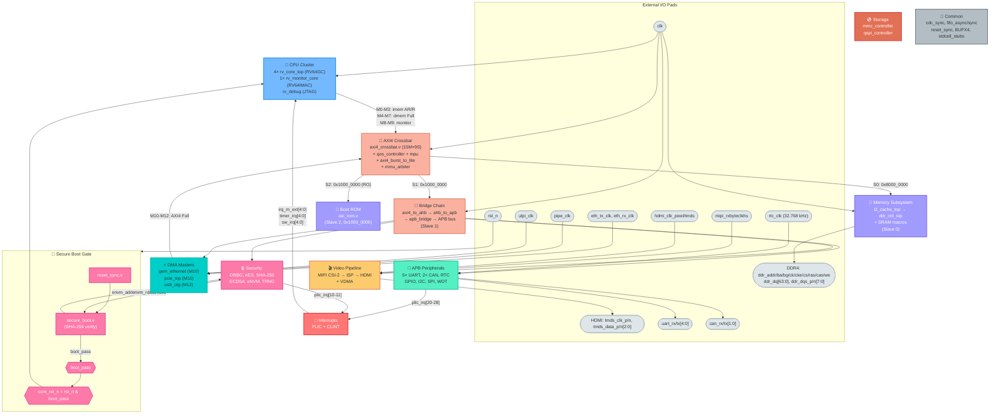
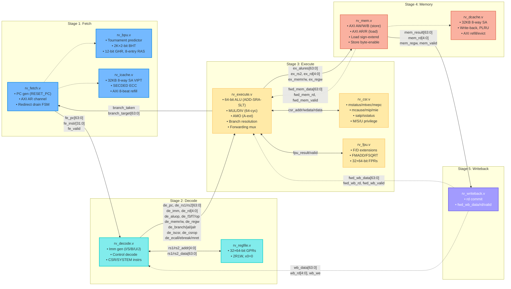
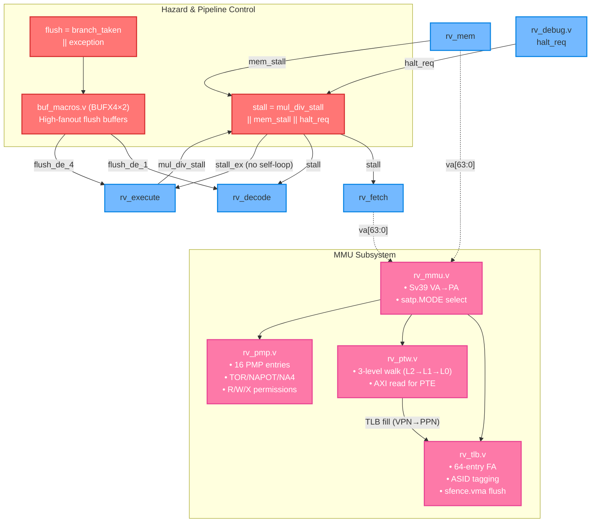
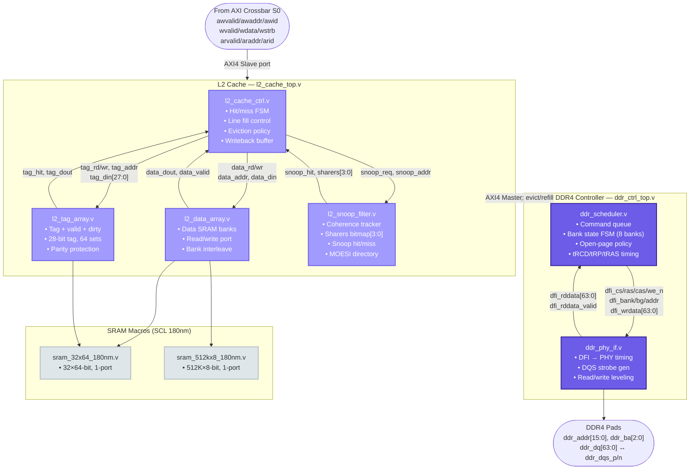
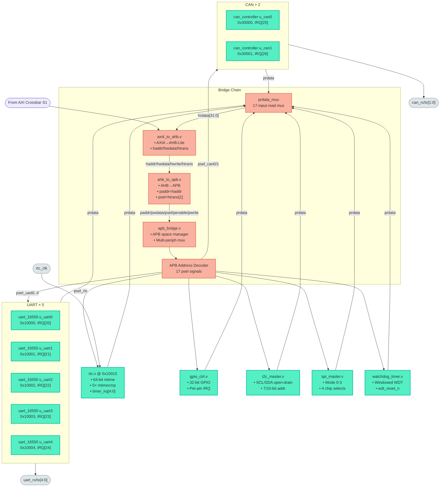
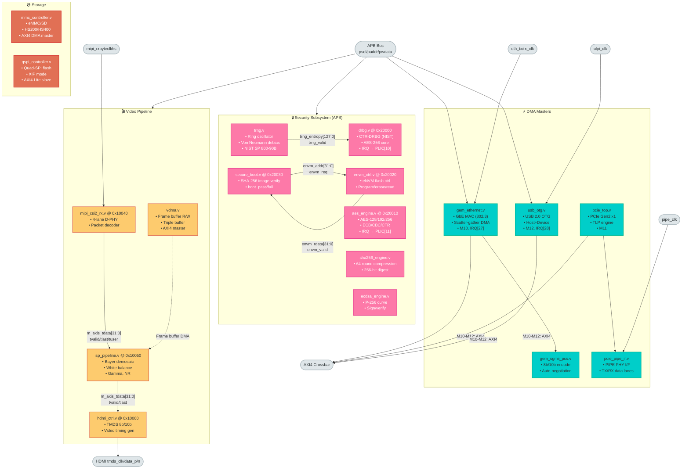
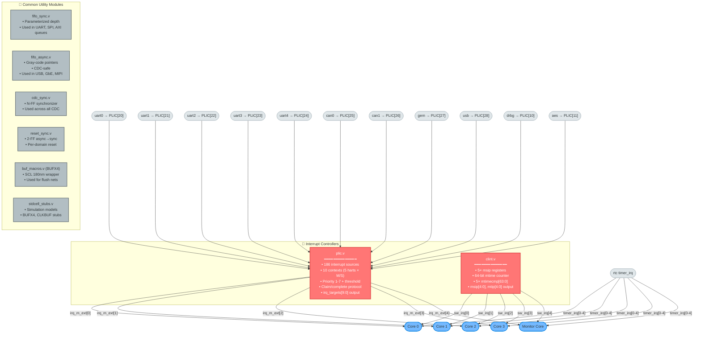

# SMVDU TITAN-X SoC — Complete Design Module Reference

> **Architecture:** Quad-Core RV64GC + Monitor RV64IMAC • Sv39 MMU • 15M×9S AXI4 Crossbar • DDR4 • PCIe • GbE • USB OTG • HDMI • MIPI CSI-2  
> **Process Target:** SCL 180 nm • **Last Updated:** 15 September 2026

This repository contains **all 71 pure Verilog design modules** (no testbenches, no scripts) of the SMVDU TITAN-X System-on-Chip. Each module directory includes its own `README.md` with detailed descriptions, I/O tables, and Mermaid diagrams.

---

## 📐 SoC Architecture — Microscopic Diagrams

The full SoC is split into **8 focused subsystem diagrams** below, each showing exact module instances, signal connections, and bus protocols. Together they cover **all 71 Verilog modules**.

---

### Diagram 1 — Top-Level SoC Block Interconnect

Shows the major functional blocks of `titan_x_top.v`, AXI master/slave port assignments, boot gating, and clock distribution.

---

### Diagram 2 — CPU Core 0 Internal Pipeline (rv_core_top.v)

Fully expanded view of one RV64GC core — all 16 sub-modules with every inter-stage signal.

---

### Diagram 3 — Hazard Control & MMU Subsystem (inside rv_core_top.v)

---

### Diagram 4 — AXI4 Interconnect Fabric & Master Connections

```mermaid
graph TB
    subgraph MASTERS["AXI4 Masters (15)"]
        M0["M0: Core 0 rv_fetch<br/>(imem AR/R, read-only)"]
        M1["M1: Core 1 rv_fetch"]
        M2["M2: Core 2 rv_fetch"]
        M3["M3: Core 3 rv_fetch"]
        M4["M4: Core 0 rv_mem<br/>(dmem AW/W/B/AR/R)"]
        M5["M5: Core 1 rv_mem"]
        M6["M6: Core 2 rv_mem"]
        M7["M7: Core 3 rv_mem"]
        M8["M8: Monitor imem (RO)"]
        M9["M9: Monitor dmem (WO)"]
        M10["M10: gem_ethernet DMA"]
        M11["M11: pcie_top DMA"]
        M12["M12: usb_otg DMA"]
        M13["M13: Tied off"]
        M14["M14: Tied off"]
    end

    subgraph FABRIC["AXI4 Interconnect Fabric"]
        QOS["qos_controller.v<br/>• Per-master QoS<br/>• Bandwidth throttle<br/>• cfg_base/boost_qos"]
        MPU["mpu.v<br/>• 16 address regions<br/>• Per-master permission<br/>• Fault DECERR"]
        B2L["axi4_burst_to_lite.v<br/>• Burst→single-beat<br/>• INCR/WRAP→FIXED"]
        ARB["mmu_arbiter.v<br/>• 5-port round-robin<br/>• PTW request merge"]
        XBAR["axi4_crossbar.v<br/>━━━━━━━━━━━━━━━━<br/>• 15M × 9S switch<br/>• Address decoder<br/>• Round-robin arbiter<br/>• Per-port FIFOs<br/>• DECERR responder"]
        QOS --> XBAR
        MPU --> XBAR
        B2L --> XBAR
    end

    subgraph SLAVES["AXI4 Slaves (9)"]
        S0["S0: L2→DDR (0x8000_0000)"]
        S1["S1: AXI→AHB→APB (0x1000_0000)"]
        S2["S2: Boot ROM (0x1000_0000, RO)"]
        S3_8["S3-S8: Tied off (DECERR)"]
    end

    M0 & M1 & M2 & M3 -->|"arvalid/araddr[39:0]<br/>rdata[63:0]/rvalid"| XBAR
    M4 & M5 & M6 & M7 -->|"awvalid/awaddr/wdata[63:0]<br/>wstrb[7:0]/arvalid/araddr"| XBAR
    M8 & M9 -->|"imem AR/R, dmem AW/W"| XBAR
    M10 & M11 & M12 -->|"Full AXI4 AW/W/B/AR/R"| XBAR
    XBAR --> S0 & S1 & S2 & S3_8

    classDef masterN fill:#74b9ff,stroke:#0984e3,stroke-width:2px,color:#2d3436
    classDef fabricN fill:#fab1a0,stroke:#e17055,stroke-width:2px,color:#2d3436
    classDef slaveN fill:#a29bfe,stroke:#6c5ce7,stroke-width:2px,color:#fff

    class M0,M1,M2,M3,M4,M5,M6,M7,M8,M9 masterN
    class M10,M11,M12 masterN
    class M13,M14 masterN
    class QOS,MPU,B2L,ARB,XBAR fabricN
    class S0,S1,S2,S3_8 slaveN
```

---

### Diagram 5 — Memory Subsystem (Slave 0)

---

### Diagram 6 — Bridge Chain & APB Peripheral Bus (Slave 1)

---

### Diagram 7 — Security Subsystem, DMA Masters & Video Pipeline

---

### Diagram 8 — Interrupt Controllers & Common Utilities

---

## 📂 Complete Module Directory Map (71 Modules)

| # | Category | Module | File | Description |
|---|----------|--------|------|-------------|
| 1 | **Top** | `titan_x_top` | [`titan_x_top.v`](top/titan_x_top/) | SoC top-level integration |
| 2 | **Top** | `axi_rom` | [`axi_rom.v`](top/axi_rom/) | Boot ROM (AXI slave, firmware.hex) |
| 3 | **Frontend** | `rv_fetch` | [`rv_fetch.v`](frontend/rv_fetch/) | Instruction fetch + PC gen + redirect drain |
| 4 | **Frontend** | `rv_decode` | [`rv_decode.v`](frontend/rv_decode/) | Decode + immediate gen + CSR decode |
| 5 | **Frontend** | `rv_bpu` | [`rv_bpu.v`](frontend/rv_bpu/) | Branch predictor (tournament, 2K BHT, GHR, RAS) |
| 6 | **Frontend** | `rv_icache` | [`rv_icache.v`](frontend/rv_icache/) | 32KB 8-way I-cache, SECDED ECC, AXI refill |
| 7 | **Backend** | `rv_core_top` | [`rv_core_top.v`](backend/rv_core_top/) | Core pipeline integration (5-stage spine) |
| 8 | **Backend** | `rv_execute` | [`rv_execute.v`](backend/rv_execute/) | ALU + MUL/DIV (M-ext) + AMO (A-ext) + branch |
| 9 | **Backend** | `rv_mem` | [`rv_mem.v`](backend/rv_mem/) | Memory stage (AXI data, load/store) |
| 10 | **Backend** | `rv_writeback` | [`rv_writeback.v`](backend/rv_writeback/) | Writeback + forwarding output |
| 11 | **Backend** | `rv_csr` | [`rv_csr.v`](backend/rv_csr/) | CSR unit (M/S/U modes, trap vectoring) |
| 12 | **Backend** | `rv_regfile` | [`rv_regfile.v`](backend/rv_regfile/) | 32×64-bit register file (2R1W) |
| 13 | **Backend** | `rv_fpu` | [`rv_fpu.v`](backend/rv_fpu/) | Floating-point unit (F/D-ext) |
| 14 | **Backend** | `rv_debug` | [`rv_debug.v`](backend/rv_debug/) | Debug module (JTAG DTM, halt/resume) |
| 15 | **Backend** | `rv_mmu` | [`rv_mmu.v`](backend/rv_mmu/) | MMU top (Sv39 VA→PA translation) |
| 16 | **Backend** | `rv_tlb` | [`rv_tlb.v`](backend/rv_tlb/) | TLB (64-entry, fully-associative, ASID) |
| 17 | **Backend** | `rv_ptw` | [`rv_ptw.v`](backend/rv_ptw/) | Page table walker (3-level Sv39) |
| 18 | **Backend** | `rv_pmp` | [`rv_pmp.v`](backend/rv_pmp/) | Physical memory protection (16 entries) |
| 19 | **Backend** | `rv_dcache` | [`rv_dcache.v`](backend/rv_dcache/) | 32KB 8-way D-cache, write-back, PLRU |
| 20 | **Backend** | `rv_monitor_core` | [`rv_monitor_core.v`](backend/rv_monitor_core/) | Monitor core (RV64IMAC, reduced pipeline) |
| 21 | **Backend** | `clint` | [`clint.v`](backend/clint/) | Core-local interruptor (msip, mtime) |
| 22 | **Backend** | `plic` | [`plic.v`](backend/plic/) | Platform-level interrupt ctrl (32 sources) |
| 23 | **Interconnect** | `axi4_crossbar` | [`axi4_crossbar.v`](interconnect/axi4_crossbar/) | 15M×9S AXI4 crossbar |
| 24 | **Interconnect** | `axi4_to_ahb` | [`axi4_to_ahb.v`](interconnect/axi4_to_ahb/) | AXI4 → AHB-Lite bridge |
| 25 | **Interconnect** | `ahb_to_apb` | [`ahb_to_apb.v`](interconnect/ahb_to_apb/) | AHB → APB bridge |
| 26 | **Interconnect** | `apb_bridge` | [`apb_bridge.v`](interconnect/apb_bridge/) | APB peripheral bridge |
| 27 | **Interconnect** | `axi4_burst_to_lite` | [`axi4_burst_to_lite.v`](interconnect/) | Burst → single-beat converter |
| 28 | **Interconnect** | `mpu` | [`mpu.v`](interconnect/interconnect_mpu/) | Interconnect MPU (address protection) |
| 29 | **Interconnect** | `mmu_arbiter` | [`mmu_arbiter.v`](interconnect/mmu_arbiter/) | Multi-core MMU request arbiter |
| 30 | **Interconnect** | `qos_controller` | [`qos_controller.v`](interconnect/qos_controller/) | QoS controller (bandwidth management) |
| 31 | **Memory** | `ddr_ctrl_top` | [`ddr_ctrl_top.v`](memory/ddr_ctrl_top/) | DDR4 controller top |
| 32 | **Memory** | `ddr_scheduler` | [`ddr_scheduler.v`](memory/ddr_scheduler/) | DDR command scheduler (bank FSM) |
| 33 | **Memory** | `ddr_phy_if` | [`ddr_phy_if.v`](memory/ddr_phy_if/) | DDR PHY interface (DFI, leveling) |
| 34 | **Memory** | `l2_cache_top` | [`l2_cache_top.v`](memory/l2_cache_top/) | L2 cache top integration |
| 35 | **Memory** | `l2_cache_ctrl` | [`l2_cache_ctrl.v`](memory/l2_cache_ctrl/) | L2 cache controller (FSM, hit/miss) |
| 36 | **Memory** | `l2_tag_array` | [`l2_tag_array.v`](memory/l2_tag_array/) | L2 tag array (valid/dirty bits) |
| 37 | **Memory** | `l2_data_array` | [`l2_data_array.v`](memory/l2_data_array/) | L2 data array (SRAM banks) |
| 38 | **Memory** | `l2_snoop_filter` | [`l2_snoop_filter.v`](memory/l2_snoop_filter/) | L2 snoop filter (coherence tracker) |
| 39 | **Memory** | `sram_32x64_180nm` | [`sram_32x64_180nm.v`](memory/sram_32x64_180nm/) | SRAM macro 32×64 (SCL 180nm) |
| 40 | **Memory** | `sram_512kx8_180nm` | [`sram_512kx8_180nm.v`](memory/sram_512kx8_180nm/) | SRAM macro 512K×8 (SCL 180nm) |
| 41 | **Peripherals** | `uart_16550` | [`uart_16550.v`](peripherals/uart_16550/) | UART 16550 (×5 instances, IrDA/LIN) |
| 42 | **Peripherals** | `spi_master` | [`spi_master.v`](peripherals/spi_master/) | SPI master (mode 0-3, configurable) |
| 43 | **Peripherals** | `i2c_master` | [`i2c_master.v`](peripherals/i2c_master/) | I²C master (7/10-bit addr, multi-master) |
| 44 | **Peripherals** | `gpio_ctrl` | [`gpio_ctrl.v`](peripherals/gpio_ctrl/) | 32-bit GPIO controller |
| 45 | **Peripherals** | `rtc` | [`rtc.v`](peripherals/rtc/) | Real-time clock (mtime, 5× mtimecmp) |
| 46 | **Peripherals** | `watchdog_timer` | [`watchdog_timer.v`](peripherals/watchdog_timer/) | Windowed watchdog timer |
| 47 | **Peripherals** | `can_controller` | [`can_controller.v`](peripherals/can_controller/) | CAN 2.0B controller (×2 instances) |
| 48 | **Peripherals** | `aes_engine` | [`aes_engine.v`](peripherals/aes_engine/) | AES-128/256 crypto engine |
| 49 | **Peripherals** | `sha256_engine` | [`sha256_engine.v`](peripherals/sha256_engine/) | SHA-256 hash engine |
| 50 | **Peripherals** | `trng` | [`trng.v`](peripherals/trng/) | True random number generator |
| 51 | **Peripherals** | `gem_ethernet` | [`gem_ethernet.v`](peripherals/gem_ethernet/) | GbE MAC + scatter-gather DMA |
| 52 | **Peripherals** | `gem_sgmii_pcs` | [`gem_sgmii_pcs.v`](peripherals/gem_sgmii_pcs/) | SGMII PCS (8b/10b, auto-neg) |
| 53 | **Peripherals** | `pcie_top` | [`pcie_top.v`](peripherals/pcie_top/) | PCIe Gen2 x1 controller + DMA |
| 54 | **Peripherals** | `pcie_pipe_if` | [`pcie_pipe_if.v`](peripherals/pcie_pipe_if/) | PCIe PIPE PHY interface |
| 55 | **Security** | `secure_boot` | [`secure_boot.v`](security/secure_boot/) | Secure boot validator (SHA-256 verify) |
| 56 | **Security** | `drbg` | [`drbg.v`](security/drbg/) | CTR-DRBG (NIST SP 800-90A) |
| 57 | **Security** | `ecdsa_engine` | [`ecdsa_engine.v`](security/ecdsa_engine/) | ECDSA P-256 signature engine |
| 58 | **Security** | `envm_ctrl` | [`envm_ctrl.v`](security/envm_ctrl/) | eNVM flash controller |
| 59 | **Storage** | `mmc_controller` | [`mmc_controller.v`](storage/mmc_controller/) | eMMC/SD controller (HS200/HS400) |
| 60 | **Storage** | `qspi_controller` | [`qspi_controller.v`](storage/qspi_controller/) | Quad-SPI flash (XIP, 4 CS) |
| 61 | **Storage** | `usb_otg` | [`usb_otg.v`](storage/usb_otg/) | USB 2.0 OTG (host+device, DMA) |
| 62 | **Video** | `hdmi_ctrl` | [`hdmi_ctrl.v`](video/hdmi_ctrl/) | HDMI 1.4 TMDS encoder |
| 63 | **Video** | `isp_pipeline` | [`isp_pipeline.v`](video/isp_pipeline/) | Image signal processor (demosaic, WB, gamma) |
| 64 | **Video** | `mipi_csi2_rx` | [`mipi_csi2_rx.v`](video/mipi_csi2_rx/) | MIPI CSI-2 receiver (4-lane D-PHY) |
| 65 | **Video** | `vdma` | [`vdma.v`](video/vdma/) | Video DMA engine (frame buffer) |
| 66 | **Common** | `cdc_sync` | [`cdc_sync.v`](common/cdc_sync/) | N-FF clock-domain crossing sync |
| 67 | **Common** | `fifo_async` | [`fifo_async.v`](common/fifo_async/) | Async FIFO (Gray-code pointers) |
| 68 | **Common** | `fifo_sync` | [`fifo_sync.v`](common/fifo_sync/) | Synchronous FIFO (parameterized) |
| 69 | **Common** | `reset_sync` | [`reset_sync.v`](common/reset_sync/) | 2-FF async reset synchronizer |
| 70 | **Common** | `buf_macros` | [`buf_macros.v`](common/BUFX4/) | BUFX4 standard cell wrapper |
| 71 | **Common** | `stdcell_stubs` | [`stdcell_stubs.v`](includes/) | Standard cell simulation stubs |

---

## 🗺 AXI4 Crossbar Port Map

### Masters (15)
| Port | Module | Instance | Bus Type | Signal Widths |
|------|--------|----------|----------|---------------|
| M0 | rv_core_top #0 → rv_fetch | gen_cores[0].u_core | Instruction (AR/R only) | araddr[39:0], rdata[63:0] |
| M1 | rv_core_top #1 → rv_fetch | gen_cores[1].u_core | Instruction (AR/R only) | araddr[39:0], rdata[63:0] |
| M2 | rv_core_top #2 → rv_fetch | gen_cores[2].u_core | Instruction (AR/R only) | araddr[39:0], rdata[63:0] |
| M3 | rv_core_top #3 → rv_fetch | gen_cores[3].u_core | Instruction (AR/R only) | araddr[39:0], rdata[63:0] |
| M4 | rv_core_top #0 → rv_mem | gen_cores[0].u_core | Data (AW/W/B/AR/R) | awaddr[39:0], wdata[63:0], wstrb[7:0] |
| M5 | rv_core_top #1 → rv_mem | gen_cores[1].u_core | Data (AW/W/B/AR/R) | awaddr[39:0], wdata[63:0], wstrb[7:0] |
| M6 | rv_core_top #2 → rv_mem | gen_cores[2].u_core | Data (AW/W/B/AR/R) | awaddr[39:0], wdata[63:0], wstrb[7:0] |
| M7 | rv_core_top #3 → rv_mem | gen_cores[3].u_core | Data (AW/W/B/AR/R) | awaddr[39:0], wdata[63:0], wstrb[7:0] |
| M8 | rv_monitor_core | u_monitor | Instruction (AR/R only) | araddr[39:0], rdata[63:0] |
| M9 | rv_monitor_core | u_monitor | Data (AW/W/B only) | awaddr[39:0], wdata[63:0] |
| M10 | gem_ethernet | u_gem | DMA (AW/W/B/AR/R) | Full AXI4 |
| M11 | pcie_top | u_pcie | DMA (AW/W/B/AR/R) | Full AXI4 |
| M12 | usb_otg | u_usb | DMA (AW/W/B/AR/R) | Full AXI4 |
| M13 | *Tied off* | — | Reserved | All signals grounded |
| M14 | *Tied off* | — | Reserved | All signals grounded |

### Slaves (9)
| Port | Module | Instance | Address Range | Access |
|------|--------|----------|---------------|--------|
| S0 | ddr_ctrl_top (via L2 cache) | u_ddr_ctrl | `0x8000_0000_0000_0000` | Full R/W |
| S1 | axi4_to_ahb → APB peripherals | u_axi2ahb | `0x0000_0000_1000_0000` | Full R/W |
| S2 | axi_rom (Boot ROM) | u_boot_rom | `0x0000_0000_1000_0000` | Read-only |
| S3 | *Tied off (reserved)* | — | — | DECERR |
| S4 | *Tied off (reserved)* | — | — | DECERR |
| S5 | *Tied off (reserved)* | — | — | DECERR |
| S6 | *Tied off (reserved)* | — | — | DECERR |
| S7 | *Tied off (reserved)* | — | — | DECERR |
| S8 | *Tied off (reserved)* | — | — | DECERR |

---

## 🔐 APB Address Map

| Base Address | Peripheral | Instance | IRQ | Description |
|-------------|------------|----------|-----|-------------|
| `0x10000_000` | uart_16550 | u_uart0 | PLIC[20] | UART channel 0 |
| `0x10001_000` | uart_16550 | u_uart1 | PLIC[21] | UART channel 1 |
| `0x10002_000` | uart_16550 | u_uart2 | PLIC[22] | UART channel 2 |
| `0x10003_000` | uart_16550 | u_uart3 | PLIC[23] | UART channel 3 |
| `0x10004_000` | uart_16550 | u_uart4 | PLIC[24] | UART channel 4 |
| `0x10010_000` | rtc | u_rtc | timer_irq[4:0] | Real-time clock |
| `0x10020_000` | gem_ethernet | u_gem (config) | PLIC[27] | GbE MAC config |
| `0x10030_000` | usb_otg | u_usb (config) | PLIC[28] | USB OTG config |
| `0x10040_000` | mipi_csi2_rx | u_mipi | — | MIPI CSI-2 config |
| `0x10050_000` | isp_pipeline | u_isp | — | ISP config |
| `0x10060_000` | hdmi_ctrl | u_hdmi | — | HDMI config |
| `0x20000_000` | drbg | u_drbg | PLIC[10] | CTR-DRBG PRNG |
| `0x20010_000` | aes_engine | u_aes | PLIC[11] | AES crypto |
| `0x20020_000` | envm_ctrl | u_envm | — | eNVM controller |
| `0x20030_000` | secure_boot | u_secure_boot | — | Boot validator |
| `0x30000_000` | can_controller | u_can0 | PLIC[25] | CAN bus 0 |
| `0x30001_000` | can_controller | u_can1 | PLIC[26] | CAN bus 1 |

---

## 🚨 Interrupt Map

### PLIC Sources (plic_irq[31:0])
| IRQ # | Source Module | Instance | Trigger |
|-------|-------------|----------|---------|
| 10 | drbg | u_drbg | DRBG operation complete |
| 11 | aes_engine | u_aes | AES operation complete |
| 20 | uart_16550 | u_uart0 | TX/RX FIFO threshold |
| 21 | uart_16550 | u_uart1 | TX/RX FIFO threshold |
| 22 | uart_16550 | u_uart2 | TX/RX FIFO threshold |
| 23 | uart_16550 | u_uart3 | TX/RX FIFO threshold |
| 24 | uart_16550 | u_uart4 | TX/RX FIFO threshold |
| 25 | can_controller | u_can0 | Message TX/RX/Error |
| 26 | can_controller | u_can1 | Message TX/RX/Error |
| 27 | gem_ethernet | u_gem | Frame TX/RX complete |
| 28 | usb_otg | u_usb | Transfer complete |

### Timer Interrupts (timer_irq[4:0])
| Bit | Target | Source |
|-----|--------|--------|
| 0 | Core 0 | rtc.mtimecmp[0] vs mtime |
| 1 | Core 1 | rtc.mtimecmp[1] vs mtime |
| 2 | Core 2 | rtc.mtimecmp[2] vs mtime |
| 3 | Core 3 | rtc.mtimecmp[3] vs mtime |
| 4 | Monitor | rtc.mtimecmp[4] vs mtime |

### Software Interrupts (sw_irq[4:0])
| Bit | Target | Source |
|-----|--------|--------|
| 0 | Core 0 | clint.msip[0] |
| 1 | Core 1 | clint.msip[1] |
| 2 | Core 2 | clint.msip[2] |
| 3 | Core 3 | clint.msip[3] |
| 4 | Monitor | clint.msip[4] |

---

## 🔗 Top-Level Internal Net Table

| Net Name | Width | Direction | Connected Modules | Description |
|----------|-------|-----------|-------------------|-------------|
| `clk` | 1 | input | All modules | System clock |
| `rst_n` | 1 | input | reset_sync, secure_boot, ddr_ctrl, bridges | Active-low async reset |
| `core_rst_n` | 1 | internal | = rst_n & boot_pass → all cores | Gated reset (post-boot) |
| `boot_pass` | 1 | internal | secure_boot → core_rst_n gate | Boot validation passed |
| `boot_fail` | 1 | internal | secure_boot → (unused) | Boot validation failed |
| `plic_irq[31:0]` | 32 | internal | peripherals → PLIC | Interrupt source vector |
| `timer_irq[4:0]` | 5 | internal | RTC → cores | Per-hart timer interrupts |
| `sw_irq[4:0]` | 5 | internal | CLINT → cores | Per-hart software interrupts |
| `axm_awvalid[14:0]` | 15 | internal | masters → crossbar | AXI master write addr valid |
| `axm_awready[14:0]` | 15 | internal | crossbar → masters | AXI master write addr ready |
| `axm_awaddr[599:0]` | 15×40 | internal | masters → crossbar | AXI master write addresses |
| `axm_awid[59:0]` | 15×4 | internal | masters → crossbar | AXI master write IDs |
| `axm_wvalid[14:0]` | 15 | internal | masters → crossbar | AXI master write data valid |
| `axm_wready[14:0]` | 15 | internal | crossbar → masters | AXI master write data ready |
| `axm_wdata[959:0]` | 15×64 | internal | masters → crossbar | AXI master write data |
| `axm_wstrb[119:0]` | 15×8 | internal | masters → crossbar | AXI master write strobes |
| `axm_wlast[14:0]` | 15 | internal | masters → crossbar | AXI master write last beat |
| `axm_bvalid[14:0]` | 15 | internal | crossbar → masters | AXI master write resp valid |
| `axm_bready[14:0]` | 15 | internal | masters → crossbar | AXI master write resp ready |
| `axm_bresp[29:0]` | 15×2 | internal | crossbar → masters | AXI master write responses |
| `axm_arvalid[14:0]` | 15 | internal | masters → crossbar | AXI master read addr valid |
| `axm_arready[14:0]` | 15 | internal | crossbar → masters | AXI master read addr ready |
| `axm_araddr[599:0]` | 15×40 | internal | masters → crossbar | AXI master read addresses |
| `axm_rvalid[14:0]` | 15 | internal | crossbar → masters | AXI master read data valid |
| `axm_rready[14:0]` | 15 | internal | masters → crossbar | AXI master read data ready |
| `axm_rdata[959:0]` | 15×64 | internal | crossbar → masters | AXI master read data |
| `axm_rresp[29:0]` | 15×2 | internal | crossbar → masters | AXI master read responses |
| `axm_rlast[14:0]` | 15 | internal | crossbar → masters | AXI master read last beat |
| `axs_awvalid[8:0]` | 9 | internal | crossbar → slaves | AXI slave write addr valid |
| `axs_awready[8:0]` | 9 | internal | slaves → crossbar | AXI slave write addr ready |
| `axs_awaddr[359:0]` | 9×40 | internal | crossbar → slaves | AXI slave write addresses |
| `axs_wvalid[8:0]` | 9 | internal | crossbar → slaves | AXI slave write data valid |
| `axs_wdata[575:0]` | 9×64 | internal | crossbar → slaves | AXI slave write data |
| `axs_arvalid[8:0]` | 9 | internal | crossbar → slaves | AXI slave read addr valid |
| `axs_rvalid[8:0]` | 9 | internal | slaves → crossbar | AXI slave read data valid |
| `axs_rdata[575:0]` | 9×64 | internal | slaves → crossbar | AXI slave read data |
| `haddr[31:0]` | 32 | internal | axi4_to_ahb → APB decoder | AHB bus address |
| `hwdata[31:0]` | 32 | internal | axi4_to_ahb → APB decoder | AHB write data |
| `hrdata[31:0]` | 32 | internal | prdata_mux → axi4_to_ahb | AHB read data |
| `hwrite` | 1 | internal | axi4_to_ahb → APB | AHB write enable |
| `htrans[1:0]` | 2 | internal | axi4_to_ahb → APB | AHB transfer type |
| `paddr[31:0]` | 32 | internal | = haddr → all APB peripherals | APB address (passthrough) |
| `pwdata[31:0]` | 32 | internal | = hwdata[31:0] → all APB periphs | APB write data |
| `psel` | 1 | internal | = htrans[1] → address decoder | APB peripheral select |
| `penable` | 1 | internal | = htrans[1] → all APB periphs | APB transfer enable |
| `pwrite` | 1 | internal | = hwrite → all APB peripherals | APB write enable |
| `prdata_mux[63:0]` | 64 | internal | 17-input mux → hrdata | APB read data multiplexer |
| `psel_uart0..4` | 5 | internal | decoder → uart_16550 instances | UART select signals |
| `psel_rtc` | 1 | internal | decoder → rtc | RTC select |
| `psel_gem` | 1 | internal | decoder → gem_ethernet | GbE config select |
| `psel_usb` | 1 | internal | decoder → usb_otg | USB config select |
| `psel_mipi` | 1 | internal | decoder → mipi_csi2_rx | MIPI config select |
| `psel_isp` | 1 | internal | decoder → isp_pipeline | ISP config select |
| `psel_hdmi` | 1 | internal | decoder → hdmi_ctrl | HDMI config select |
| `psel_drbg` | 1 | internal | decoder → drbg | DRBG select |
| `psel_aes` | 1 | internal | decoder → aes_engine | AES select |
| `psel_envm` | 1 | internal | decoder → envm_ctrl | eNVM select |
| `psel_boot` | 1 | internal | decoder → secure_boot | Secure boot select |
| `psel_can0/1` | 2 | internal | decoder → can_controller | CAN select |
| `isp_tdata[31:0]` | 32 | internal | mipi_csi2_rx → isp_pipeline | AXI-Stream video data |
| `isp_tvalid` | 1 | internal | mipi_csi2_rx → isp_pipeline | AXI-Stream valid |
| `isp_tlast` | 1 | internal | mipi_csi2_rx → isp_pipeline | AXI-Stream last |
| `isp_tuser` | 1 | internal | mipi_csi2_rx → isp_pipeline | AXI-Stream user (SOF) |
| `isp_tready` | 1 | internal | isp_pipeline → mipi_csi2_rx | AXI-Stream ready |
| `trng_seed[127:0]` | 128 | internal | TRNG → DRBG | Random entropy seed |
| `trng_seed_valid` | 1 | internal | TRNG → DRBG | Entropy valid |
| `envm_addr[31:0]` | 32 | internal | secure_boot → envm_ctrl | eNVM read address |
| `envm_req` | 1 | internal | secure_boot → envm_ctrl | eNVM read request |
| `envm_rdata[31:0]` | 32 | internal | envm_ctrl → secure_boot | eNVM read data |
| `envm_valid` | 1 | internal | envm_ctrl → secure_boot | eNVM data valid |

---

*Generated from exhaustive RTL source analysis — SMVDU TITAN-X SoC, September 2026*
