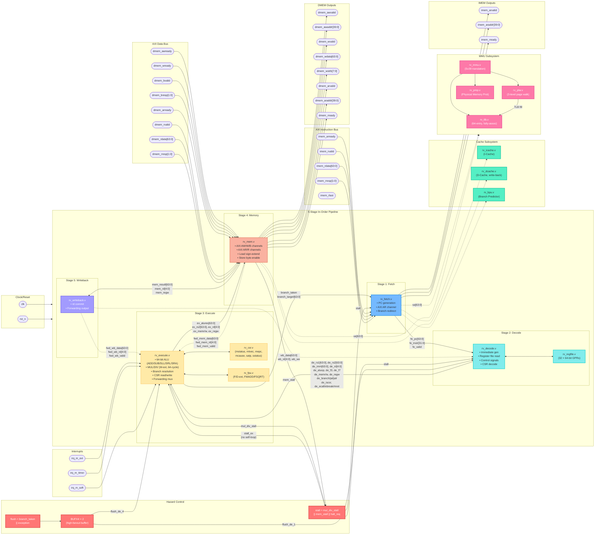

# SMVDU TITAN-X SoC — Complete Design Module Reference

> **Architecture:** Quad-Core RV64GC + Monitor RV64IMAC &bull; Sv39 MMU &bull; 15M×9S AXI4 Crossbar &bull; DDR4 &bull; PCIe &bull; GbE &bull; USB OTG &bull; HDMI &bull; MIPI CSI-2  
> **Process Target:** SCL 180 nm &bull; **Last Updated:** 14 September 2026

This repository contains **all 71 pure Verilog design modules** (no testbenches, no scripts) of the SMVDU TITAN-X System-on-Chip. Each module directory includes its own `README.md` with detailed descriptions, I/O tables, and Mermaid diagrams.

---

## 📐 Full SoC Architecture — Top-Level Mermaid Diagram

The diagram below shows **every instantiated module** in `titan_x_top.v`, the exact AXI master/slave port assignments, the bridge chain, APB address decoding, interrupt routing, security boot flow, and the video pipeline — all with their actual signal connections.

```mermaid
graph TB
    %% ============================================================
    %% EXTERNAL I/O PINS
    %% ============================================================
    subgraph EXT_CLK["⏱ External Clocks"]
        clk(["clk"])
        rst_n(["rst_n"])
        pipe_clk(["pipe_clk"])
        eth_tx_clk(["eth_tx_clk"])
        eth_rx_clk(["eth_rx_clk"])
        ulpi_clk(["ulpi_clk"])
        mipi_rxbyteclkhs(["mipi_rxbyteclkhs"])
        hdmi_clk_pixel(["hdmi_clk_pixel"])
        hdmi_clk_tmds(["hdmi_clk_tmds"])
        rtc_clk(["rtc_clk"])
    end

    subgraph EXT_IO["🔌 External I/O"]
        uart_rx(["uart_rx[4:0]"])
        uart_tx(["uart_tx[4:0]"])
        can_rx(["can_rx[1:0]"])
        can_tx(["can_tx[1:0]"])
    end

    subgraph EXT_DDR["💾 DDR4 SDRAM Interface"]
        ddr_pins(["ddr_addr/ba/bg/ck/cke/cs/ras/cas/we/odt/act"])
        ddr_dq(["ddr_dq[63:0] ↔ ddr_dqs_p/n[7:0]"])
    end

    subgraph EXT_HDMI["🖥 HDMI Output"]
        tmds_out(["tmds_clk_p/n + tmds_data_p/n[2:0]"])
    end

    %% ============================================================
    %% SECURE BOOT GATE
    %% ============================================================
    subgraph BOOT_GATE["🔐 Boot Validation"]
        u_secure_boot["secure_boot.v\n(SHA-256 image verify)"]
        boot_pass{{"boot_pass"}}
        core_rst_n{{"core_rst_n\n= rst_n & boot_pass"}}
    end
    rst_n --> u_secure_boot
    u_secure_boot -->|"boot_pass"| boot_pass
    boot_pass --> core_rst_n

    %% ============================================================
    %% CPU CLUSTER — 4× RV64GC + 1× RV64IMAC Monitor
    %% ============================================================
    subgraph CPU_CLUSTER["🧠 CPU Cluster"]
        subgraph CORE0["Core 0 — rv_core_top (RV64GC)"]
            direction LR
            fe0["rv_fetch.v\n(PC gen, AXI AR)"]
            de0["rv_decode.v\n(imm gen, regfile)"]
            ex0["rv_execute.v\n(ALU, MUL/DIV, CSR, Branch)"]
            me0["rv_mem.v\n(AXI AW/W/AR/R)"]
            wb0["rv_writeback.v\n(rd commit)"]
            fe0 -->|"pc, instr"| de0
            de0 -->|"rs1, rs2, imm, ctrl"| ex0
            ex0 -->|"alu_result, rs2"| me0
            me0 -->|"result, rd"| wb0
            wb0 -.->|"wb_data, wb_rd, wb_we"| de0
        end

        subgraph CORE1["Core 1 — rv_core_top (RV64GC)"]
            fe1["rv_fetch"] --> de1["rv_decode"] --> ex1["rv_execute"] --> me1["rv_mem"] --> wb1["rv_writeback"]
            wb1 -.-> de1
        end

        subgraph CORE2["Core 2 — rv_core_top (RV64GC)"]
            fe2["rv_fetch"] --> de2["rv_decode"] --> ex2["rv_execute"] --> me2["rv_mem"] --> wb2["rv_writeback"]
            wb2 -.-> de2
        end

        subgraph CORE3["Core 3 — rv_core_top (RV64GC)"]
            fe3["rv_fetch"] --> de3["rv_decode"] --> ex3["rv_execute"] --> me3["rv_mem"] --> wb3["rv_writeback"]
            wb3 -.-> de3
        end

        subgraph MON["Core 4 — rv_monitor_core (RV64IMAC)"]
            mon_core["rv_monitor_core.v\n(Reduced pipeline)"]
        end
    end

    core_rst_n --> CORE0
    core_rst_n --> CORE1
    core_rst_n --> CORE2
    core_rst_n --> CORE3
    core_rst_n --> MON

    %% ============================================================
    %% AXI4 CROSSBAR (15 Masters × 9 Slaves)
    %% ============================================================
    subgraph XBAR["🔀 AXI4 Crossbar — axi4_crossbar.v (15M × 9S)"]
        direction TB
        xbar_core["Address Decoder\n+ Round-Robin Arbiter\n+ Per-Master/Slave FIFOs\n+ DECERR Responder"]
    end

    %% Master Connections (Instruction Fetch = read-only)
    fe0 -->|"M0: imem AR/R\n(read-only)"| xbar_core
    me0 -->|"M4: dmem AW/W/B/AR/R"| xbar_core
    fe1 -->|"M1: imem AR/R"| xbar_core
    me1 -->|"M5: dmem AW/W/B/AR/R"| xbar_core
    fe2 -->|"M2: imem AR/R"| xbar_core
    me2 -->|"M6: dmem AW/W/B/AR/R"| xbar_core
    fe3 -->|"M3: imem AR/R"| xbar_core
    me3 -->|"M7: dmem AW/W/B/AR/R"| xbar_core
    mon_core -->|"M8: imem AR/R\nM9: dmem AW/W/B"| xbar_core

    %% ============================================================
    %% DMA PERIPHERALS (Masters 10, 11, 12)
    %% ============================================================
    subgraph DMA_MASTERS["⚡ High-Speed DMA Masters"]
        u_gem["gem_ethernet.v\n(GbE MAC + DMA)"]
        u_pcie["pcie_top.v\n(PCIe TLP + DMA)\n  └─ pcie_pipe_if.v"]
        u_usb["usb_otg.v\n(USB 2.0 OTG + DMA)"]
    end

    u_gem -->|"M10: AXI AW/W/B/AR/R"| xbar_core
    u_pcie -->|"M11: AXI AW/W/B/AR/R"| xbar_core
    u_usb -->|"M12: AXI AW/W/B/AR/R"| xbar_core

    eth_tx_clk --> u_gem
    eth_rx_clk --> u_gem
    pipe_clk --> u_pcie
    ulpi_clk --> u_usb

    %% ============================================================
    %% SLAVE 0: MEMORY SUBSYSTEM (DDR4)
    %% ============================================================
    subgraph MEM_SUBSYS["💾 Memory Subsystem — Slave 0"]
        subgraph L2["L2 Cache — l2_cache_top.v"]
            l2_ctrl["l2_cache_ctrl.v\n(FSM, hit/miss)"]
            l2_tag["l2_tag_array.v\n(tag + valid/dirty)"]
            l2_data["l2_data_array.v\n(data SRAM banks)"]
            l2_snoop["l2_snoop_filter.v\n(coherence tracker)"]
            l2_ctrl --> l2_tag
            l2_ctrl --> l2_data
            l2_ctrl --> l2_snoop
        end

        subgraph DDR["DDR4 Controller — ddr_ctrl_top.v"]
            ddr_sched["ddr_scheduler.v\n(cmd queue, bank FSM)"]
            ddr_phy["ddr_phy_if.v\n(DFI → PHY timing)"]
            ddr_sched --> ddr_phy
        end

        subgraph SRAM_MODELS["SRAM Macros"]
            sram32["sram_32x64_180nm.v"]
            sram512["sram_512kx8_180nm.v"]
        end

        L2 --> DDR
        l2_data --> sram32
        l2_data --> sram512
    end

    xbar_core -->|"S0: AXI\n0x8000_0000"| MEM_SUBSYS
    ddr_phy --> ddr_pins
    ddr_phy <--> ddr_dq

    %% ============================================================
    %% SLAVE 2: BOOT ROM
    %% ============================================================
    subgraph BOOTROM["📖 Boot ROM — Slave 2"]
        u_boot_rom["axi_rom.v\n(firmware.hex\n@ 0x1000_0000)"]
    end
    xbar_core -->|"S2: AXI AR/R\n0x1000_0000\n(read-only)"| u_boot_rom

    %% ============================================================
    %% SLAVE 1: AXI → AHB → APB BRIDGE CHAIN
    %% ============================================================
    subgraph BRIDGE["🌉 Bridge Chain — Slave 1"]
        u_axi2ahb["axi4_to_ahb.v\n(AXI4 → AHB-Lite)"]
        ahb_bus{{"AHB Bus\nhaddr, hwdata, hrdata"}}
        apb_dec["APB Address Decoder\n(psel_uart0..4, psel_rtc,\npsel_gem, psel_usb, psel_mipi,\npsel_isp, psel_hdmi, psel_drbg,\npsel_aes, psel_envm, psel_boot,\npsel_can0, psel_can1)"]
        apb_mux["prdata_mux\n(17-input read mux)"]
    end

    xbar_core -->|"S1: AXI\n0x1000_0000+"| u_axi2ahb
    u_axi2ahb --> ahb_bus
    ahb_bus --> apb_dec
    apb_mux --> ahb_bus

    %% ============================================================
    %% APB PERIPHERALS — Low-Speed I/O
    %% ============================================================
    subgraph LOW_SPEED["📡 Low-Speed Peripherals (APB)"]
        subgraph UARTS["UART 16550 × 5"]
            u_uart0["uart_16550.v\nu_uart0 @ 0x10000"]
            u_uart1["uart_16550.v\nu_uart1 @ 0x10001"]
            u_uart2["uart_16550.v\nu_uart2 @ 0x10002"]
            u_uart3["uart_16550.v\nu_uart3 @ 0x10003"]
            u_uart4["uart_16550.v\nu_uart4 @ 0x10004"]
        end
        subgraph CANS["CAN Controller × 2"]
            u_can0["can_controller.v\nu_can0 @ 0x30000"]
            u_can1["can_controller.v\nu_can1 @ 0x30001"]
        end
        u_rtc["rtc.v\n(Real-Time Clock)\n@ 0x10010"]
    end

    apb_dec -->|"psel_uart0..4"| UARTS
    apb_dec -->|"psel_can0/1"| CANS
    apb_dec -->|"psel_rtc"| u_rtc

    UARTS --> apb_mux
    CANS --> apb_mux
    u_rtc --> apb_mux

    uart_rx --> UARTS
    UARTS --> uart_tx
    can_rx --> CANS
    CANS --> can_tx
    rtc_clk --> u_rtc

    %% ============================================================
    %% APB PERIPHERALS — Security
    %% ============================================================
    subgraph SECURITY["🔒 Security Subsystem (APB)"]
        u_drbg["drbg.v\n(CTR-DRBG PRNG)\n@ 0x20000"]
        u_aes["aes_engine.v\n(AES-128/256)\n@ 0x20010"]
        u_envm["envm_ctrl.v\n(eNVM controller)\n@ 0x20020"]
    end

    apb_dec -->|"psel_drbg"| u_drbg
    apb_dec -->|"psel_aes"| u_aes
    apb_dec -->|"psel_envm"| u_envm
    apb_dec -->|"psel_boot"| u_secure_boot
    u_drbg --> apb_mux
    u_aes --> apb_mux
    u_envm --> apb_mux
    u_secure_boot --> apb_mux

    %% ============================================================
    %% APB PERIPHERALS — High-Speed Config
    %% ============================================================
    apb_dec -->|"psel_gem"| u_gem
    apb_dec -->|"psel_usb"| u_usb
    u_gem --> apb_mux
    u_usb --> apb_mux

    %% ============================================================
    %% VIDEO SUBSYSTEM
    %% ============================================================
    subgraph VIDEO["🎬 Video / Imaging Pipeline (APB + AXI-Stream)"]
        u_mipi["mipi_csi2_rx.v\n(MIPI CSI-2 Receiver)\n@ 0x10040"]
        u_isp["isp_pipeline.v\n(Image Signal Proc)\n@ 0x10050"]
        u_hdmi["hdmi_ctrl.v\n(HDMI TMDS Encoder)\n@ 0x10060"]
    end

    mipi_rxbyteclkhs --> u_mipi
    u_mipi -->|"AXI-Stream\nm_axis_tdata[31:0]\ntvalid, tlast, tuser"| u_isp
    u_isp -->|"AXI-Stream\nprocessed pixel data"| u_hdmi
    hdmi_clk_pixel --> u_hdmi
    hdmi_clk_tmds --> u_hdmi
    u_hdmi --> tmds_out

    apb_dec -->|"psel_mipi"| u_mipi
    apb_dec -->|"psel_isp"| u_isp
    apb_dec -->|"psel_hdmi"| u_hdmi
    u_mipi --> apb_mux
    u_isp --> apb_mux
    u_hdmi --> apb_mux

    %% ============================================================
    %% INTERRUPT ROUTING
    %% ============================================================
    subgraph IRQ["🚨 Interrupt Controller"]
        u_plic["plic.v\n(Platform-Level\nInterrupt Controller)"]
        u_clint["clint.v\n(Core-Local Interruptor)"]
    end

    u_uart0 -->|"plic_irq[20]"| u_plic
    u_uart1 -->|"plic_irq[21]"| u_plic
    u_uart2 -->|"plic_irq[22]"| u_plic
    u_uart3 -->|"plic_irq[23]"| u_plic
    u_uart4 -->|"plic_irq[24]"| u_plic
    u_can0 -->|"plic_irq[25]"| u_plic
    u_can1 -->|"plic_irq[26]"| u_plic
    u_gem -->|"plic_irq[27]"| u_plic
    u_usb -->|"plic_irq[28]"| u_plic
    u_drbg -->|"plic_irq[10]"| u_plic
    u_aes -->|"plic_irq[11]"| u_plic

    u_plic -->|"irq_m_ext[0..4]"| CPU_CLUSTER
    u_rtc -->|"timer_irq[0..4]"| CPU_CLUSTER
    u_clint -->|"sw_irq[0..4]"| CPU_CLUSTER

    %% ============================================================
    %% STYLING
    %% ============================================================
    classDef clkNode fill:#ffeaa7,stroke:#fdcb6e,stroke-width:2px,color:#2d3436
    classDef ioNode fill:#dfe6e9,stroke:#b2bec3,stroke-width:2px,color:#2d3436
    classDef coreBlock fill:#74b9ff,stroke:#0984e3,stroke-width:2px,color:#2d3436
    classDef memBlock fill:#a29bfe,stroke:#6c5ce7,stroke-width:2px,color:#fff
    classDef periphBlock fill:#55efc4,stroke:#00b894,stroke-width:2px,color:#2d3436
    classDef secBlock fill:#fd79a8,stroke:#e84393,stroke-width:2px,color:#fff
    classDef vidBlock fill:#fdcb6e,stroke:#e17055,stroke-width:2px,color:#2d3436
    classDef bridgeBlock fill:#fab1a0,stroke:#e17055,stroke-width:2px,color:#2d3436
    classDef irqBlock fill:#ff7675,stroke:#d63031,stroke-width:2px,color:#fff

    class clk,rst_n,pipe_clk,eth_tx_clk,eth_rx_clk,ulpi_clk,mipi_rxbyteclkhs,hdmi_clk_pixel,hdmi_clk_tmds,rtc_clk clkNode
    class uart_rx,uart_tx,can_rx,can_tx,ddr_pins,ddr_dq,tmds_out ioNode
    class fe0,de0,ex0,me0,wb0,fe1,de1,ex1,me1,wb1,fe2,de2,ex2,me2,wb2,fe3,de3,ex3,me3,wb3,mon_core coreBlock
    class l2_ctrl,l2_tag,l2_data,l2_snoop,ddr_sched,ddr_phy,sram32,sram512,u_boot_rom memBlock
    class u_uart0,u_uart1,u_uart2,u_uart3,u_uart4,u_can0,u_can1,u_rtc,u_gem,u_pcie,u_usb periphBlock
    class u_secure_boot,u_drbg,u_aes,u_envm secBlock
    class u_mipi,u_isp,u_hdmi vidBlock
    class u_axi2ahb,apb_dec,apb_mux bridgeBlock
    class u_plic,u_clint irqBlock
```

---

## 🧠 Single Core Internal Architecture — rv_core_top.v

Each of the four RV64GC cores instantiates the following pipeline and support modules. The diagram below shows the **exact signal-level wiring** inside one core.

---

## 📂 Module Directory Map

| Category | Module | File | Description |
|----------|--------|------|-------------|
| **Top** | `titan_x_top` | [`titan_x_top.v`](top/titan_x_top/) | SoC top-level integration |
| **Top** | `axi_rom` | [`axi_rom.v`](top/axi_rom/) | Boot ROM (AXI slave) |
| **Frontend** | `rv_fetch` | [`rv_fetch.v`](frontend/rv_fetch/) | Instruction fetch + PC gen |
| | `rv_decode` | [`rv_decode.v`](frontend/rv_decode/) | Decode + register file |
| | `rv_bpu` | [`rv_bpu.v`](frontend/rv_bpu/) | Branch prediction unit |
| | `rv_icache` | [`rv_icache.v`](frontend/rv_icache/) | Instruction cache |
| **Backend** | `rv_core_top` | [`rv_core_top.v`](backend/rv_core_top/) | Core pipeline integration |
| | `rv_execute` | [`rv_execute.v`](backend/rv_execute/) | ALU + MUL/DIV + branch |
| | `rv_mem` | [`rv_mem.v`](backend/rv_mem/) | Memory stage (AXI data) |
| | `rv_writeback` | [`rv_writeback.v`](backend/rv_writeback/) | Writeback + forwarding |
| | `rv_csr` | [`rv_csr.v`](backend/rv_csr/) | CSR unit (M/S/U modes) |
| | `rv_regfile` | [`rv_regfile.v`](backend/rv_regfile/) | 32×64-bit register file |
| | `rv_fpu` | [`rv_fpu.v`](backend/rv_fpu/) | Floating-point unit (F/D) |
| | `rv_debug` | [`rv_debug.v`](backend/rv_debug/) | Debug module (JTAG/DM) |
| | `rv_mmu` | [`rv_mmu.v`](backend/rv_mmu/) | MMU top (Sv39) |
| | `rv_tlb` | [`rv_tlb.v`](backend/rv_tlb/) | Translation lookaside buffer |
| | `rv_ptw` | [`rv_ptw.v`](backend/rv_ptw/) | Page table walker |
| | `rv_pmp` | [`rv_pmp.v`](backend/rv_pmp/) | Physical memory protection |
| | `rv_dcache` | [`rv_dcache.v`](backend/rv_dcache/) | Data cache (write-back) |
| | `rv_monitor_core` | [`rv_monitor_core.v`](backend/rv_monitor_core/) | Monitor core (RV64IMAC) |
| | `clint` | [`clint.v`](backend/clint/) | Core-local interruptor |
| | `plic` | [`plic.v`](backend/plic/) | Platform-level interrupt ctrl |
| **Interconnect** | `axi4_crossbar` | [`axi4_crossbar.v`](interconnect/axi4_crossbar/) | 15M×9S AXI4 crossbar |
| | `axi4_to_ahb` | [`axi4_to_ahb.v`](interconnect/axi4_to_ahb/) | AXI4 → AHB-Lite bridge |
| | `ahb_to_apb` | [`ahb_to_apb.v`](interconnect/ahb_to_apb/) | AHB → APB bridge |
| | `apb_bridge` | [`apb_bridge.v`](interconnect/apb_bridge/) | APB peripheral bridge |
| | `axi4_burst_to_lite` | [`axi4_burst_to_lite.v`](interconnect/) | Burst → single-beat |
| | `mpu` | [`mpu.v`](interconnect/interconnect_mpu/) | Interconnect MPU |
| | `mmu_arbiter` | [`mmu_arbiter.v`](interconnect/mmu_arbiter/) | MMU request arbiter |
| | `qos_controller` | [`qos_controller.v`](interconnect/qos_controller/) | QoS controller |
| **Memory** | `ddr_ctrl_top` | [`ddr_ctrl_top.v`](memory/ddr_ctrl_top/) | DDR4 controller top |
| | `ddr_scheduler` | [`ddr_scheduler.v`](memory/ddr_scheduler/) | Command scheduler |
| | `ddr_phy_if` | [`ddr_phy_if.v`](memory/ddr_phy_if/) | DDR PHY interface |
| | `l2_cache_top` | [`l2_cache_top.v`](memory/l2_cache_top/) | L2 cache top |
| | `l2_cache_ctrl` | [`l2_cache_ctrl.v`](memory/l2_cache_ctrl/) | L2 cache controller |
| | `l2_tag_array` | [`l2_tag_array.v`](memory/l2_tag_array/) | L2 tag array |
| | `l2_data_array` | [`l2_data_array.v`](memory/l2_data_array/) | L2 data array |
| | `l2_snoop_filter` | [`l2_snoop_filter.v`](memory/l2_snoop_filter/) | L2 snoop filter |
| | `sram_32x64_180nm` | [`sram_32x64_180nm.v`](memory/sram_32x64_180nm/) | SRAM macro (32×64) |
| | `sram_512kx8_180nm` | [`sram_512kx8_180nm.v`](memory/sram_512kx8_180nm/) | SRAM macro (512K×8) |
| **Peripherals** | `uart_16550` | [`uart_16550.v`](peripherals/uart_16550/) | UART 16550 (×5 instances) |
| | `spi_master` | [`spi_master.v`](peripherals/spi_master/) | SPI master controller |
| | `i2c_master` | [`i2c_master.v`](peripherals/i2c_master/) | I²C master controller |
| | `gpio_ctrl` | [`gpio_ctrl.v`](peripherals/gpio_ctrl/) | GPIO controller |
| | `rtc` | [`rtc.v`](peripherals/rtc/) | Real-time clock |
| | `watchdog_timer` | [`watchdog_timer.v`](peripherals/watchdog_timer/) | Watchdog timer |
| | `can_controller` | [`can_controller.v`](peripherals/can_controller/) | CAN controller (×2) |
| | `aes_engine` | [`aes_engine.v`](peripherals/aes_engine/) | AES crypto engine |
| | `sha256_engine` | [`sha256_engine.v`](peripherals/sha256_engine/) | SHA-256 hash engine |
| | `trng` | [`trng.v`](peripherals/trng/) | True RNG |
| | `gem_ethernet` | [`gem_ethernet.v`](peripherals/gem_ethernet/) | GbE MAC + DMA |
| | `gem_sgmii_pcs` | [`gem_sgmii_pcs.v`](peripherals/gem_sgmii_pcs/) | SGMII PCS layer |
| | `pcie_top` | [`pcie_top.v`](peripherals/pcie_top/) | PCIe controller top |
| | `pcie_pipe_if` | [`pcie_pipe_if.v`](peripherals/pcie_pipe_if/) | PCIe PIPE interface |
| **Security** | `secure_boot` | [`secure_boot.v`](security/secure_boot/) | Secure boot validator |
| | `drbg` | [`drbg.v`](security/drbg/) | CTR-DRBG (NIST SP 800-90A) |
| | `ecdsa_engine` | [`ecdsa_engine.v`](security/ecdsa_engine/) | ECDSA signature engine |
| | `envm_ctrl` | [`envm_ctrl.v`](security/envm_ctrl/) | eNVM controller |
| **Storage** | `mmc_controller` | [`mmc_controller.v`](storage/mmc_controller/) | eMMC/SD controller |
| | `qspi_controller` | [`qspi_controller.v`](storage/qspi_controller/) | Quad-SPI flash controller |
| | `usb_otg` | [`usb_otg.v`](storage/usb_otg/) | USB 2.0 OTG + DMA |
| **Video** | `hdmi_ctrl` | [`hdmi_ctrl.v`](video/hdmi_ctrl/) | HDMI TMDS encoder |
| | `isp_pipeline` | [`isp_pipeline.v`](video/isp_pipeline/) | Image signal processor |
| | `mipi_csi2_rx` | [`mipi_csi2_rx.v`](video/mipi_csi2_rx/) | MIPI CSI-2 receiver |
| | `vdma` | [`vdma.v`](video/vdma/) | Video DMA engine |
| **Common** | `cdc_sync` | [`cdc_sync.v`](common/cdc_sync/) | Clock-domain crossing sync |
| | `fifo_async` | [`fifo_async.v`](common/fifo_async/) | Async FIFO (Gray-code) |
| | `fifo_sync` | [`fifo_sync.v`](common/fifo_sync/) | Synchronous FIFO |
| | `reset_sync` | [`reset_sync.v`](common/reset_sync/) | Reset synchronizer |
| | `buf_macros` | [`buf_macros.v`](common/BUFX4/) | BUFX4 standard cell wrapper |
| | `stdcell_stubs` | [`stdcell_stubs.v`](includes/) | Standard cell stubs (sim) |

---

## 🗺 AXI4 Crossbar Port Map

### Masters (15)
| Port | Module | Bus |
|------|--------|-----|
| M0 | Core 0 rv_fetch | Instruction (read-only) |
| M1 | Core 1 rv_fetch | Instruction (read-only) |
| M2 | Core 2 rv_fetch | Instruction (read-only) |
| M3 | Core 3 rv_fetch | Instruction (read-only) |
| M4 | Core 0 rv_mem | Data (read/write) |
| M5 | Core 1 rv_mem | Data (read/write) |
| M6 | Core 2 rv_mem | Data (read/write) |
| M7 | Core 3 rv_mem | Data (read/write) |
| M8 | Monitor rv_monitor_core | Instruction (read-only) |
| M9 | Monitor rv_monitor_core | Data (write-only) |
| M10 | gem_ethernet | DMA (read/write) |
| M11 | pcie_top | DMA (read/write) |
| M12 | usb_otg | DMA (read/write) |
| M13 | *Tied off (reserved)* | — |
| M14 | *Tied off (reserved)* | — |

### Slaves (9)
| Port | Module | Address Range |
|------|--------|---------------|
| S0 | ddr_ctrl_top (via L2) | `0x8000_0000_0000_0000` |
| S1 | axi4_to_ahb → APB | `0x0000_0000_1000_0000` |
| S2 | axi_rom (Boot ROM) | `0x0000_0000_1000_0000` |
| S3–S8 | *Tied off (reserved)* | — |

---

## 🔐 APB Address Map

| Base Address | Peripheral | Instance |
|-------------|------------|----------|
| `0x10000_000` | UART 16550 | u_uart0 |
| `0x10001_000` | UART 16550 | u_uart1 |
| `0x10002_000` | UART 16550 | u_uart2 |
| `0x10003_000` | UART 16550 | u_uart3 |
| `0x10004_000` | UART 16550 | u_uart4 |
| `0x10010_000` | RTC | u_rtc |
| `0x10020_000` | GbE MAC (config) | u_gem |
| `0x10030_000` | USB OTG (config) | u_usb |
| `0x10040_000` | MIPI CSI-2 RX | u_mipi |
| `0x10050_000` | ISP Pipeline | u_isp |
| `0x10060_000` | HDMI Controller | u_hdmi |
| `0x20000_000` | DRBG | u_drbg |
| `0x20010_000` | AES Engine | u_aes |
| `0x20020_000` | eNVM Controller | u_envm |
| `0x20030_000` | Secure Boot | u_secure_boot |
| `0x30000_000` | CAN Controller | u_can0 |
| `0x30001_000` | CAN Controller | u_can1 |

---

## 🚨 Interrupt Map (PLIC Sources)

| IRQ # | Source |
|-------|--------|
| 10 | DRBG |
| 11 | AES Engine |
| 20 | UART 0 |
| 21 | UART 1 |
| 22 | UART 2 |
| 23 | UART 3 |
| 24 | UART 4 |
| 25 | CAN 0 |
| 26 | CAN 1 |
| 27 | GbE MAC |
| 28 | USB OTG |

---

*Generated from RTL source analysis — SMVDU TITAN-X SoC, September 2026*
