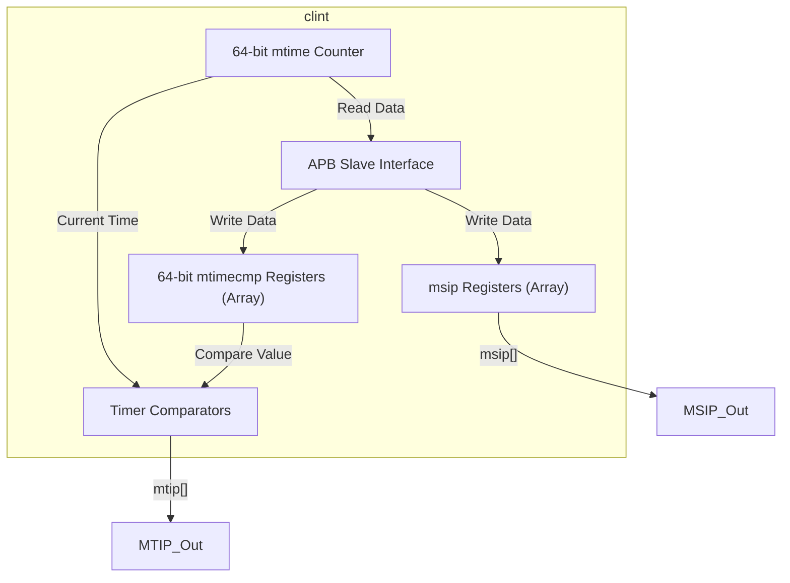
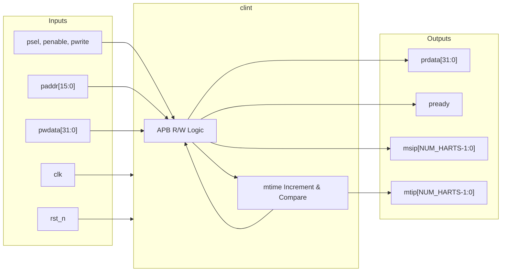

# clint

## Description

The `clint` (Core-Local Interruptor) module generates precise software and timer interrupts for the SMVDU-TITAN-X SoC in accordance with the RISC-V Privileged Architecture. It provides a centralized 64-bit real-time counter (`mtime`) and supports up to 5 hardware threads (harts). For each hart, it maintains a memory-mapped 64-bit time comparator (`mtimecmp`) and a Machine Software Interrupt Pending register (`msip`). The module features an APB slave interface for fast, memory-mapped configuration by the operating system.

## Interface

### Inputs

| Signal | Width | Description |
|--------|-------|-------------|
| clk | 1 | System clock |
| rst_n | 1 | Active-low asynchronous reset |
| psel | 1 | APB select signal |
| penable | 1 | APB enable signal |
| pwrite | 1 | APB write strobe |
| paddr | 16 | APB 16-bit address for memory-mapped I/O |
| pwdata | 32 | APB 32-bit write data |

### Outputs

| Signal | Width | Description |
|--------|-------|-------------|
| prdata | 32 | APB 32-bit read data returning to the master |
| pready | 1 | APB ready signal, always asserted for zero-wait access |
| msip | NUM_HARTS | Machine Software Interrupt Pending signals (one per hart) |
| mtip | NUM_HARTS | Machine Timer Interrupt Pending signals (one per hart) |

## Functionality

The `clint` module maintains a 64-bit internal register (`mtime`) that increments by one on every clock cycle. It concurrently compares this master time against 5 independent 64-bit `mtimecmp` registers (one for each supported hart). Whenever `mtime` is greater than or equal to a hart's `mtimecmp` value, the corresponding `mtip` (Machine Timer Interrupt Pending) output is asserted. Software interrupts are managed via the `msip` register block. The module exposes these registers through a standard APB slave interface mapped to specific address ranges: `0x0000` for `msip`, `0x4000` for `mtimecmp`, and `0xBFF8` for `mtime`. Since `mtime` and `mtimecmp` are 64-bit, the 32-bit APB interface writes to them in two separate 32-bit halves (lower and upper).

## Hierarchical Block Diagram

## Signal-Level Diagram

