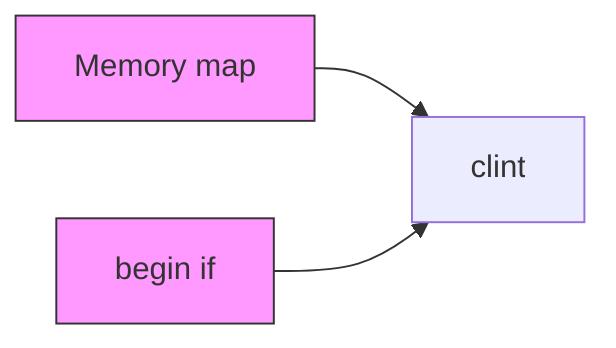
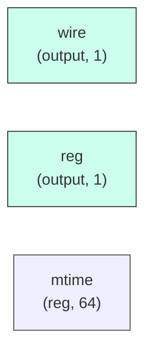

# clint

## Description

The **clint** module SPDX-License-Identifier: Apache-2.0
 SMVDU-TITAN-X SoC — CLINT: Core-Local Interruptor
 Implements: mtime (64-bit), mtimecmp[0:4] (64-bit), msip[0:4]
 Memory map (APB-style, 32-bit access):
   0x0000 - 0x0013: msip[0..4]  (4 bytes each)
   0x4000 - 0x4027: mtimecmp[0..4] (8 bytes each, lo then hi)
   0xBFF8 - 0xBFFF: mtime (8 bytes, lo then hi)
`timescale 1ns/1ps

## Interface

### Inputs

| Name | Width | Description |
|------|-------|-------------|
| wire | 1 | – |
| wire | 1 | – |
| wire | 1 | – |
| wire | 1 | – |
| wire | 1 | – |
| wire | 1 | – |
| wire | 1 | – |

### Outputs

| Name | Width | Description |
|------|-------|-------------|
| reg | 1 | – |
| wire | 1 | – |
| wire | 1 | – |
| wire | 1 | – |

## Functionality

*clint provides the hardware implementation for its designated function within the SoC.*

## Hierarchical Block Diagram (Mermaid)

## Full Signal‑Level Diagram (Mermaid)

