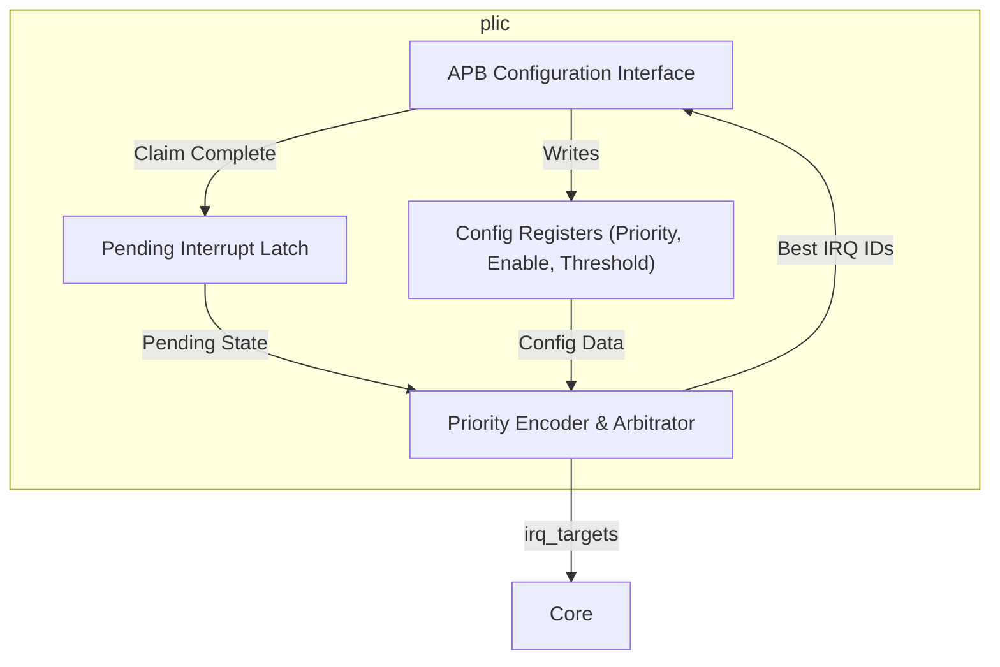
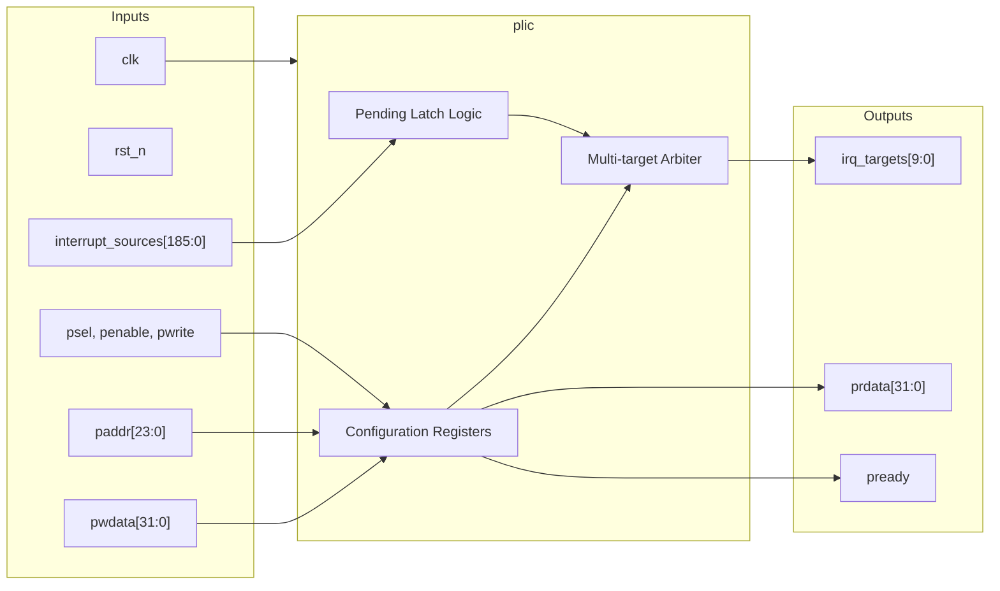

# plic

## Description

The `plic` (Platform Level Interrupt Controller) routes external hardware interrupts to specific hart contexts in the SMVDU-TITAN-X SoC. It scales to handle 186 independent global interrupt sources and routes them to 10 distinct targets (representing Machine and Supervisor privilege modes across 5 hardware threads). The PLIC evaluates incoming interrupts dynamically, considering per-source priorities, per-target enables, and per-target priority thresholds. It exposes an APB slave interface to allow system software to configure these parameters, read interrupt claims, and signal completion of interrupt service routines.

## Interface

### Inputs

| Signal | Width | Description |
|--------|-------|-------------|
| clk | 1 | System clock |
| rst_n | 1 | Active-low asynchronous reset |
| interrupt_sources | 186 | Raw external interrupt signals from peripherals |
| psel | 1 | APB select signal |
| penable | 1 | APB enable signal |
| pwrite | 1 | APB write strobe |
| paddr | 24 | APB 24-bit address for configuration registers |
| pwdata | 32 | APB 32-bit write data |

### Outputs

| Signal | Width | Description |
|--------|-------|-------------|
| prdata | 32 | APB 32-bit read data returning to the master |
| pready | 1 | APB ready signal, always asserted for zero-wait access |
| irq_targets | 10 | Resolved interrupt request lines directed to the 10 core targets |

## Functionality

The `plic` captures the rising edges of 186 `interrupt_sources` into its internal `pending` register array. On every cycle, a combinational priority encoder evaluates all pending interrupts against the configuration matrix. For each of the 10 targets, the PLIC checks if the pending interrupt is enabled (`enable` array), and if its assigned priority (`priority_reg`) strictly exceeds the target's configured `threshold`. It selects the highest-priority valid interrupt for each target and asserts the corresponding bit in `irq_targets`. 

System software interacts with the PLIC via the APB interface. When a target receives an interrupt, it reads the claim register to get the ID of the highest-priority pending interrupt, which automatically acknowledges it. After servicing, the software writes the ID back to the claim register, which clears the corresponding bit in the `pending` register, allowing subsequent interrupts from that source to be processed.

## Hierarchical Block Diagram

## Signal-Level Diagram

