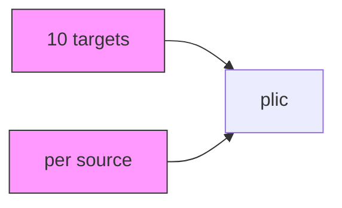
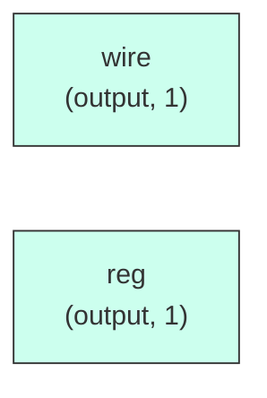

# plic

## Description

The **plic** module SPDX-License-Identifier: Apache-2.0
 SMVDU-TITAN-X SoC — PLIC: Platform Level Interrupt Controller
 186 interrupt sources, 10 targets (5 harts × M+S modes)
 Priority encoder finds highest-priority enabled pending interrupt above threshold
`timescale 1ns/1ps

## Interface

### Inputs

| Name | Width | Description |
|------|-------|-------------|
| wire | 1 | – |
| wire | 1 | – |
| wire | 1 | – |
| wire | 1 | – |
| wire | 1 | – |
| wire | 1 | – |
| wire | 1 | – |
| wire | 1 | – |

### Outputs

| Name | Width | Description |
|------|-------|-------------|
| reg | 1 | – |
| wire | 1 | – |
| reg | 1 | – |

## Functionality

*plic provides the hardware implementation for its designated function within the SoC.*

## Hierarchical Block Diagram (Mermaid)

## Full Signal‑Level Diagram (Mermaid)

