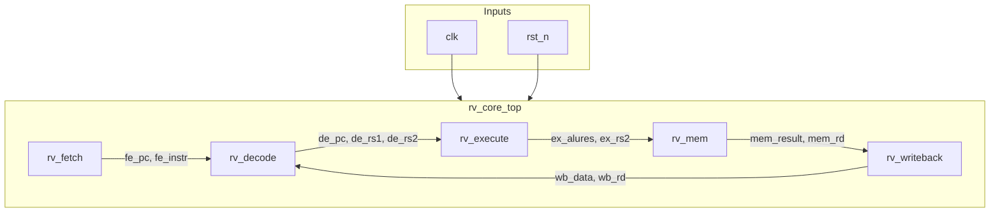
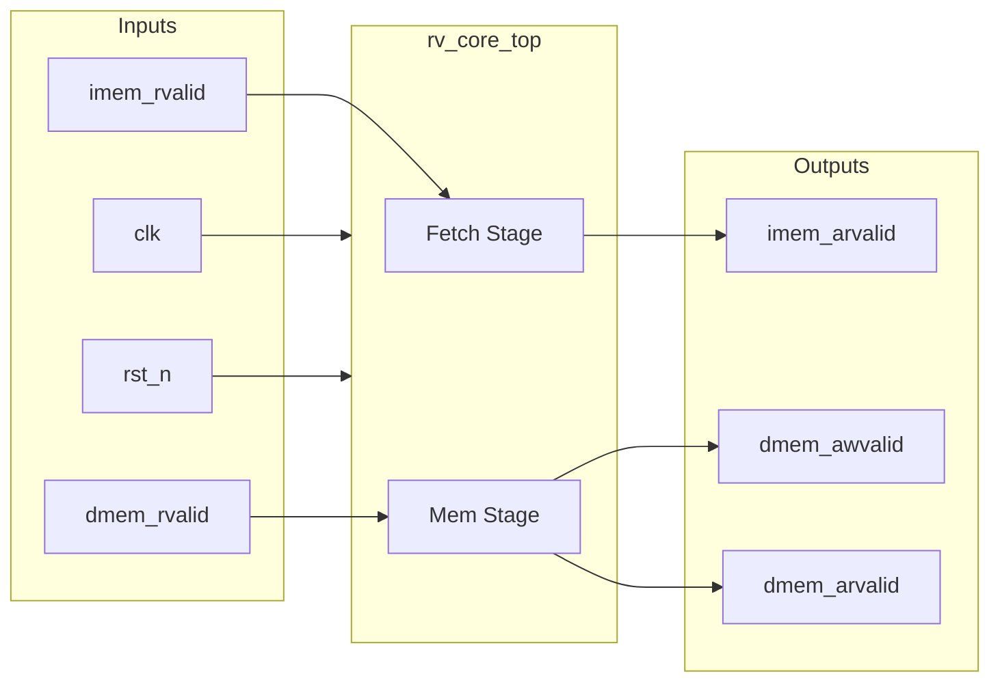

# rv_core_top

## Description
The `rv_core_top` module is the top-level retirement spine of the SMVDU-TitanX RV64IMC core. It instantiates the five-stage in-order pipeline consisting of fetch, decode, execute, memory, and writeback stages. It wires up the data and control paths between these stages, including the forwarding network to handle data hazards and the writeback feedback loop. It also acts as the interface to the AXI4 instruction and data memory buses and handles basic debug and stall control.

## Interface

### Inputs
| Signal | Width | Description |
|--------|-------|-------------|
| clk | 1 | System clock |
| rst_n | 1 | Active-low asynchronous reset |
| irq_m_ext | 1 | External machine interrupt |
| irq_m_timer | 1 | Timer machine interrupt |
| irq_m_soft | 1 | Software machine interrupt |
| imem_arready | 1 | AXI4 instruction read address ready |
| imem_rvalid | 1 | AXI4 instruction read data valid |
| imem_rdata | 64 | AXI4 instruction read data |
| imem_rlast | 1 | AXI4 instruction read last beat |
| imem_rresp | 2 | AXI4 instruction read response |
| dmem_awready | 1 | AXI4 data write address ready |
| dmem_wready | 1 | AXI4 data write data ready |
| dmem_bvalid | 1 | AXI4 data write response valid |
| dmem_bresp | 2 | AXI4 data write response |
| dmem_arready | 1 | AXI4 data read address ready |
| dmem_rvalid | 1 | AXI4 data read data valid |
| dmem_rdata | 64 | AXI4 data read data |
| dmem_rlast | 1 | AXI4 data read last beat |
| dmem_rresp | 2 | AXI4 data read response |
| snoop_valid | 1 | L2 snoop request valid |
| snoop_addr | 40 | L2 snoop address |
| snoop_type | 2 | L2 snoop transaction type |
| halt_req | 1 | Debug halt request |
| resume_req | 1 | Debug resume request |

### Outputs
| Signal | Width | Description |
|--------|-------|-------------|
| imem_arvalid | 1 | AXI4 instruction read address valid |
| imem_araddr | 40 | AXI4 instruction read address |
| imem_arlen | 8 | AXI4 instruction read burst length |
| imem_arsize | 3 | AXI4 instruction read burst size |
| imem_arburst | 2 | AXI4 instruction read burst type |
| imem_rready | 1 | AXI4 instruction read data ready |
| dmem_awvalid | 1 | AXI4 data write address valid |
| dmem_awaddr | 40 | AXI4 data write address |
| dmem_awlen | 8 | AXI4 data write burst length |
| dmem_awsize | 3 | AXI4 data write burst size |
| dmem_awburst | 2 | AXI4 data write burst type |
| dmem_wvalid | 1 | AXI4 data write data valid |
| dmem_wdata | 64 | AXI4 data write data |
| dmem_wstrb | 8 | AXI4 data write strobes |
| dmem_wlast | 1 | AXI4 data write last beat |
| dmem_bready | 1 | AXI4 data write response ready |
| dmem_arvalid | 1 | AXI4 data read address valid |
| dmem_araddr | 40 | AXI4 data read address |
| dmem_arlen | 8 | AXI4 data read burst length |
| dmem_arsize | 3 | AXI4 data read burst size |
| dmem_arburst | 2 | AXI4 data read burst type |
| dmem_arlock | 1 | AXI4 data read lock type |
| dmem_rready | 1 | AXI4 data read data ready |
| snoop_ack | 1 | L2 snoop acknowledge |
| snoop_data_valid | 1 | L2 snoop data valid |
| snoop_data | 512 | L2 snoop data payload |
| hart_halted | 1 | Debug status: hart is halted |
| hart_running | 1 | Debug status: hart is running |

## Functionality
The `rv_core_top` module wires together the 5 pipeline stages: `rv_fetch`, `rv_decode`, `rv_execute`, `rv_mem`, and `rv_writeback`. It routes AXI4 memory interfaces out to the top level for both instruction fetching and data accesses. It implements a pipeline stall mechanism that reacts to memory stalls and multicycle operations like division or multiplication. Additionally, the core handles data hazards by routing forwarding paths from the execute, memory, and writeback stages back to the decode operands.

## Instruction Memory (.hex) & Golden Trace (.mem) Suites

The directory contains 6 self-checking test suites loaded via `$readmemh` into the core instruction memory alongside their golden state trace files:

| Test Suite | Program Binary (`.hex`) | Expected GPRs (`.mem`) | Memory Address Trace (`.mem`) | Memory Value Trace (`.mem`) | Metadata (`.mem`) |
|------------|-------------------------|------------------------|-------------------------------|-----------------------------|-------------------|
| **Base RV64I** | [`tb_imem.hex`](tb_imem.hex) | [`tb_expected_regs.mem`](tb_expected_regs.mem) | [`tb_expected_maddr.mem`](tb_expected_maddr.mem) | [`tb_expected_mval.mem`](tb_expected_mval.mem) | [`tb_expected_meta.mem`](tb_expected_meta.mem) |
| **RISC-V Compliance** | [`tb_compliance_imem.hex`](tb_compliance_imem.hex) | [`tb_compliance_expected_regs.mem`](tb_compliance_expected_regs.mem) | [`tb_compliance_expected_maddr.mem`](tb_compliance_expected_maddr.mem) | [`tb_compliance_expected_mval.mem`](tb_compliance_expected_mval.mem) | [`tb_compliance_expected_meta.mem`](tb_compliance_expected_meta.mem) |
| **Privileged / CSR** | [`tb_csr_imem.hex`](tb_csr_imem.hex) | [`tb_csr_expected_regs.mem`](tb_csr_expected_regs.mem) | [`tb_csr_expected_maddr.mem`](tb_csr_expected_maddr.mem) | [`tb_csr_expected_mval.mem`](tb_csr_expected_mval.mem) | [`tb_csr_expected_meta.mem`](tb_csr_expected_meta.mem) |
| **Interrupts / Traps** | [`tb_irq_imem.hex`](tb_irq_imem.hex) | [`tb_irq_expected_regs.mem`](tb_irq_expected_regs.mem) | [`tb_irq_expected_maddr.mem`](tb_irq_expected_maddr.mem) | [`tb_irq_expected_mval.mem`](tb_irq_expected_mval.mem) | [`tb_irq_expected_meta.mem`](tb_irq_expected_meta.mem) |
| **M-Extension (MUL/DIV)** | [`tb_mext_imem.hex`](tb_mext_imem.hex) | [`tb_mext_expected_regs.mem`](tb_mext_expected_regs.mem) | [`tb_mext_expected_maddr.mem`](tb_mext_expected_maddr.mem) | [`tb_mext_expected_mval.mem`](tb_mext_expected_mval.mem) | [`tb_mext_expected_meta.mem`](tb_mext_expected_meta.mem) |
| **64-bit Word Ops** | [`tb_wops_imem.hex`](tb_wops_imem.hex) | [`tb_wops_expected_regs.mem`](tb_wops_expected_regs.mem) | [`tb_wops_expected_maddr.mem`](tb_wops_expected_maddr.mem) | [`tb_wops_expected_mval.mem`](tb_wops_expected_mval.mem) | [`tb_wops_expected_meta.mem`](tb_wops_expected_meta.mem) |

## Hierarchical Block Diagram

## Signal-Level Diagram

