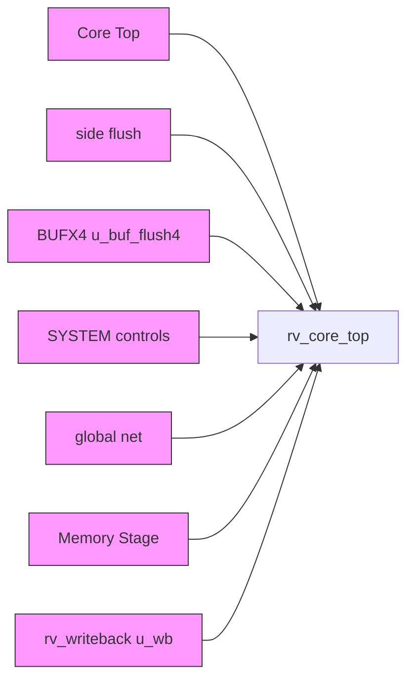

# rv_core_top

## Description

The **rv_core_top** module SPDX-License-Identifier: Apache-2.0
 SMVDU-TitanX SoC — RV64IMC Core Top (retirement spine)

 Phase 5 rebuild: classic five-stage in-order pipeline assembled from this
 repo's own stage modules:

   rv_fetch -> rv_decode -> rv_execute -> rv_mem -> rv_writeback

 with a complete forwarding network (EX pass-through / MEM / WB) back to
 both operand read stations, and the writeback feedback into the register
 file finally live (the old top tied wb_we=0 — nothing ever retired).

 Vertical bring-up scope (Step 5.1):
  - rv_fetch and rv_mem drive the AXI master ports directly with
    single-beat transactions. icache/dcache/MMU/PMP/FPU/BPU return BEHIND
    these same ports once the spine is compliance-green; caches must then
    prove transparent equivalence.
  - exception is tied 0 and exception_target 0 until the CSR/trap unit
    provides mtvec.
  - snoop_* outputs idle until the dcache returns.
`timescale 1ns/1ps
`include "params.vh"
`include "isa_pkg.vh"

## Interface

### Inputs

| Name | Width | Description |
|------|-------|-------------|
| wire | 1 | – |
| wire | 1 | – |
| wire | 1 | – |
| wire | 1 | – |
| wire | 1 | – |
| wire | 1 | – |
| wire | 1 | – |
| wire | 1 | – |
| wire | 1 | – |
| wire | 1 | – |
| wire | 1 | – |
| wire | 1 | – |
| wire | 1 | – |
| wire | 1 | – |
| wire | 1 | – |
| wire | 1 | – |
| wire | 1 | – |
| wire | 1 | – |
| wire | 1 | – |
| wire | 1 | – |
| wire | 1 | – |
| wire | 1 | – |
| wire | 1 | – |
| wire | 1 | – |

### Outputs

| Name | Width | Description |
|------|-------|-------------|
| wire | 1 | – |
| wire | 1 | – |
| wire | 1 | – |
| wire | 1 | – |
| wire | 1 | – |
| wire | 1 | – |
| wire | 1 | – |
| wire | 1 | – |
| wire | 1 | – |
| wire | 1 | – |
| wire | 1 | – |
| wire | 1 | – |
| wire | 1 | – |
| wire | 1 | – |
| wire | 1 | – |
| wire | 1 | – |
| wire | 1 | – |
| wire | 1 | – |
| wire | 1 | – |
| wire | 1 | – |
| wire | 1 | – |
| wire | 1 | – |
| wire | 1 | – |
| wire | 1 | – |
| wire | 1 | – |
| wire | 1 | – |
| wire | 1 | – |
| wire | 1 | – |

## Functionality

*rv_core_top provides the hardware implementation for its designated function within the SoC.*

## Hierarchical Block Diagram (Mermaid)

## Full Signal‑Level Diagram (Mermaid)

```mermaid
graph LR
    classDef sig fill:#eef,stroke:#555,stroke-width:1px;
    classDef port fill:#cfe,stroke:#333,stroke-width:1px;
    wire["wire\n(input, 1)"]:::port
    wire["wire\n(input, 1)"]:::port
    wire["wire\n(input, 1)"]:::port
    wire["wire\n(input, 1)"]:::port
    wire["wire\n(input, 1)"]:::port
    wire["wire\n(output, 1)"]:::port
    wire["wire\n(input, 1)"]:::port
    wire["wire\n(output, 1)"]:::port
    wire["wire\n(output, 1)"]:::port
    wire["wire\n(output, 1)"]:::port
    wire["wire\n(output, 1)"]:::port
    wire["wire\n(input, 1)"]:::port
    wire["wire\n(output, 1)"]:::port
    wire["wire\n(input, 1)"]:::port
    wire["wire\n(input, 1)"]:::port
    wire["wire\n(input, 1)"]:::port
    wire["wire\n(output, 1)"]:::port
    wire["wire\n(input, 1)"]:::port
    wire["wire\n(output, 1)"]:::port
    wire["wire\n(output, 1)"]:::port
    wire["wire\n(output, 1)"]:::port
    wire["wire\n(output, 1)"]:::port
    wire["wire\n(output, 1)"]:::port
    wire["wire\n(input, 1)"]:::port
    wire["wire\n(output, 1)"]:::port
    wire["wire\n(output, 1)"]:::port
    wire["wire\n(output, 1)"]:::port
    wire["wire\n(input, 1)"]:::port
    wire["wire\n(output, 1)"]:::port
    wire["wire\n(input, 1)"]:::port
    wire["wire\n(output, 1)"]:::port
    wire["wire\n(input, 1)"]:::port
    wire["wire\n(output, 1)"]:::port
    wire["wire\n(output, 1)"]:::port
    wire["wire\n(output, 1)"]:::port
    wire["wire\n(output, 1)"]:::port
    wire["wire\n(output, 1)"]:::port
    wire["wire\n(input, 1)"]:::port
    wire["wire\n(output, 1)"]:::port
    wire["wire\n(input, 1)"]:::port
    wire["wire\n(input, 1)"]:::port
    wire["wire\n(input, 1)"]:::port
    wire["wire\n(input, 1)"]:::port
    wire["wire\n(input, 1)"]:::port
    wire["wire\n(input, 1)"]:::port
    wire["wire\n(output, 1)"]:::port
    wire["wire\n(output, 1)"]:::port
    wire["wire\n(output, 1)"]:::port
    wire["wire\n(input, 1)"]:::port
    wire["wire\n(input, 1)"]:::port
    wire["wire\n(output, 1)"]:::port
    wire["wire\n(output, 1)"]:::port
    stall["stall\n(wire, 1)"]:::sig
    branch_taken["branch_taken\n(wire, 1)"]:::sig
    branch_target["branch_target\n(wire, 64)"]:::sig
    flush_de_1["flush_de_1\n(wire, 1)"]:::sig
    flush_de_4["flush_de_4\n(wire, 1)"]:::sig
    fe_pc["fe_pc\n(wire, 64)"]:::sig
    fe_imem_addr["fe_imem_addr\n(wire, 64)"]:::sig
    fe_instr["fe_instr\n(wire, 32)"]:::sig
    fe_valid["fe_valid\n(wire, 1)"]:::sig
    fe_rready["fe_rready\n(wire, 1)"]:::sig
    de_pc["de_pc\n(wire, 64)"]:::sig
    de_rs1["de_rs1\n(wire, 64)"]:::sig
    de_rs2["de_rs2\n(wire, 64)"]:::sig
    de_imm["de_imm\n(wire, 64)"]:::sig
    de_rd["de_rd\n(wire, 5)"]:::sig
    de_rs1a["de_rs1a\n(wire, 5)"]:::sig
    de_rs2a["de_rs2a\n(wire, 5)"]:::sig
    de_f3["de_f3\n(wire, 3)"]:::sig
    de_f7["de_f7\n(wire, 7)"]:::sig
    de_op["de_op\n(wire, 7)"]:::sig
    de_aluop["de_aluop\n(wire, 5)"]:::sig
    de_memr["de_memr\n(wire, 1)"]:::sig
    de_memw["de_memw\n(wire, 1)"]:::sig
    de_regw["de_regw\n(wire, 1)"]:::sig
    de_branch["de_branch\n(wire, 1)"]:::sig
    de_jal["de_jal\n(wire, 1)"]:::sig
    de_jalr["de_jalr\n(wire, 1)"]:::sig
    de_valid["de_valid\n(wire, 1)"]:::sig
    de_iscsr["de_iscsr\n(wire, 1)"]:::sig
    de_csrop["de_csrop\n(wire, 2)"]:::sig
    de_ecall["de_ecall\n(wire, 1)"]:::sig
    de_ebreak["de_ebreak\n(wire, 1)"]:::sig
    de_mret["de_mret\n(wire, 1)"]:::sig
    wb_data["wb_data\n(wire, 64)"]:::sig
    wb_rd["wb_rd\n(wire, 5)"]:::sig
    wb_we["wb_we\n(wire, 1)"]:::sig
    ex_alures["ex_alures\n(wire, 64)"]:::sig
    ex_rs2["ex_rs2\n(wire, 64)"]:::sig
    ex_rd["ex_rd\n(wire, 5)"]:::sig
    ex_f3["ex_f3\n(wire, 3)"]:::sig
    ex_op["ex_op\n(wire, 7)"]:::sig
    ex_memr["ex_memr\n(wire, 1)"]:::sig
    ex_memw["ex_memw\n(wire, 1)"]:::sig
    ex_regw["ex_regw\n(wire, 1)"]:::sig
    ex_valid["ex_valid\n(wire, 1)"]:::sig
    mul_div_stall["mul_div_stall\n(wire, 1)"]:::sig
    stall_ex["stall_ex\n(wire, 1)"]:::sig
    fwd_mem_data["fwd_mem_data\n(wire, 64)"]:::sig
    fwd_wb_data["fwd_wb_data\n(wire, 64)"]:::sig
    fwd_mem_rd["fwd_mem_rd\n(wire, 5)"]:::sig
    fwd_wb_rd["fwd_wb_rd\n(wire, 5)"]:::sig
    fwd_mem_valid["fwd_mem_valid\n(wire, 1)"]:::sig
    fwd_wb_valid["fwd_wb_valid\n(wire, 1)"]:::sig
    mem_result["mem_result\n(wire, 64)"]:::sig
    mem_rd["mem_rd\n(wire, 5)"]:::sig
    mem_regw["mem_regw\n(wire, 1)"]:::sig
    mem_valid["mem_valid\n(wire, 1)"]:::sig
    mem_stall["mem_stall\n(wire, 1)"]:::sig
```

