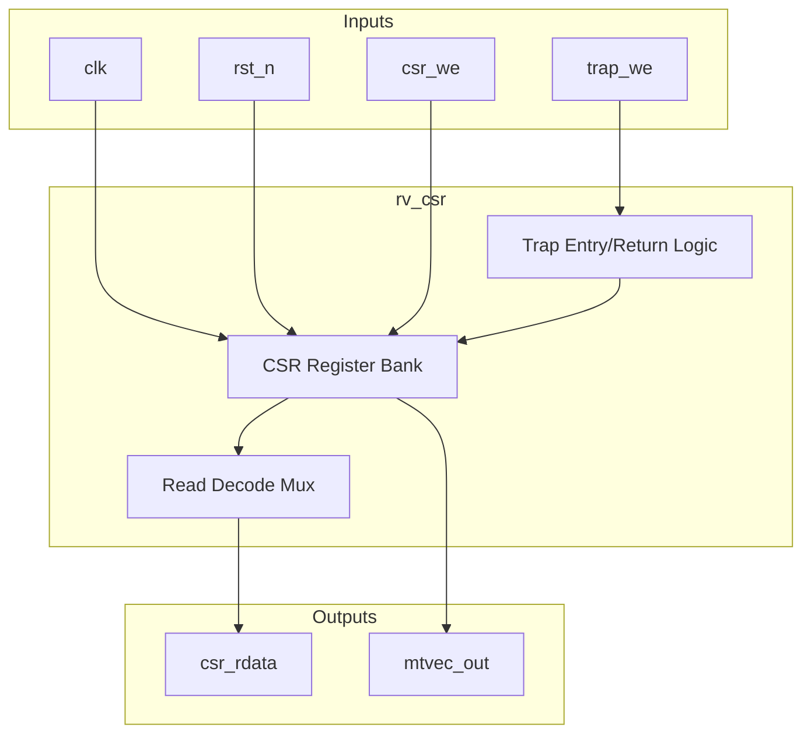
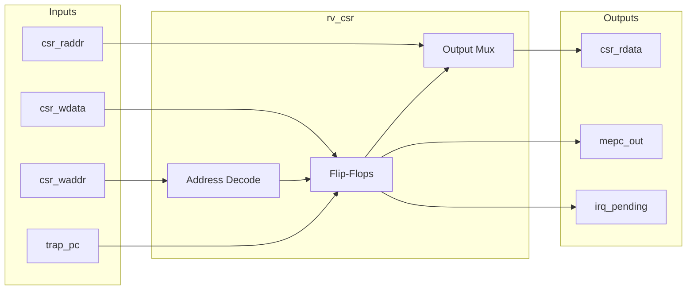

# rv_csr

## Description
The `rv_csr` module manages the Machine-mode Control and Status Registers (CSRs) for the RISC-V core. It handles CSR read/write operations, machine trap entry, and trap return (`mret`). The read port is combinational to feed the execute stage immediately, while the write port is synchronous.

## Interface

### Inputs
| Signal | Width | Description |
|--------|-------|-------------|
| clk | 1 | System clock |
| rst_n | 1 | Active-low asynchronous reset |
| csr_raddr | 12 | CSR read address |
| csr_we | 1 | CSR write enable |
| csr_waddr | 12 | CSR write address |
| csr_wdata | 64 | CSR write data |
| trap_we | 1 | Trap write enable (captures pc and cause) |
| trap_pc | 64 | PC of the trapping instruction |
| trap_cause | 64 | Exception or interrupt cause |
| mret_we | 1 | MRET write enable (restores status) |
| mip_m_ext | 1 | External machine interrupt pending |
| mip_m_timer | 1 | Timer machine interrupt pending |
| mip_m_soft | 1 | Software machine interrupt pending |
| retire_pulse | 1 | Instruction retirement pulse for performance counters |

### Outputs
| Signal | Width | Description |
|--------|-------|-------------|
| csr_rdata | 64 | CSR read data |
| mtvec_out | 64 | Machine trap vector base address |
| mepc_out | 64 | Machine exception program counter |
| irq_pending | 1 | Global interrupt pending flag |

## Functionality
This module maintains core machine state including `mstatus`, `misa`, `mie`, `mtvec`, `mscratch`, `mepc`, `mcause`, `mtval`, and cycle/instruction counters. On a CSR read, it maps the 12-bit address to the internal register. On a CSR write, it selectively updates bits according to WARL rules. When a trap occurs (`trap_we`), it saves the current PC into `mepc`, logs the cause, and disables interrupts in `mstatus`. Conversely, `mret_we` restores previous interrupt enable states.

## Hierarchical Block Diagram

## Signal-Level Diagram

