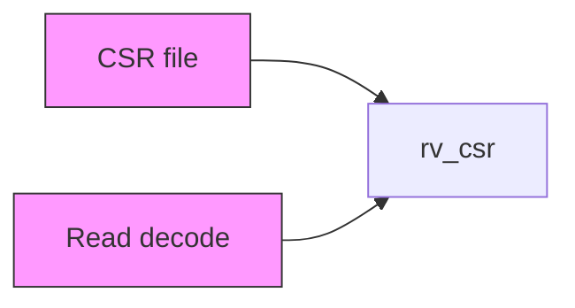

# rv_csr

## Description

The **rv_csr** module SPDX-License-Identifier: Apache-2.0
 SMVDU-TITAN-X SoC — Machine-mode CSR file (Zicsr support, Phase 5 Step 5.4)

 Minimal-but-honest M-mode ISA CSR set:
   mstatus misa mie mtvec mscratch mepc mcause mtval mhartid
   mcycle/minstret (+ cycle/instret aliases)

 Contract with the pipeline (see rv_core_top wiring):
  - READ is combinational: csr_rdata follows csr_raddr in the same cycle
    execute samples it (distance-1 RAW between two CSR ops needs no extra
    forwarding because a younger op reaches EX at least one cycle after an
    older op's synchronous write lands).
  - WRITE is synchronous and single-issue: csr_we pulses only on the cycle
    the owning instruction leaves EX (gated upstream by !stall/!flush/
    !mul_div_stall), so flushed/stalled instructions never commit state.
  - Trap entry: core redirects PC to mtvec and captures mepc/mcause via
    trap_we; mret restores via mret_we (mstatus.MPIE->MIE shuffle here).
  - Interrupts arrive as mip_* inputs; mip_int raises when pending&enabled.
    Consumption (mtvec dispatch) is the core's job — this block only
    reports.
`timescale 1ns/1ps
`include "params.vh"
`include "isa_pkg.vh"

## Interface

### Inputs

| Name | Width | Description |
|------|-------|-------------|
| wire | 1 | – |
| wire | 1 | – |
| wire | 1 | – |
| wire | 1 | – |
| wire | 1 | – |
| wire | 1 | – |
| wire | 1 | – |
| wire | 1 | – |
| wire | 1 | – |
| wire | 1 | – |
| wire | 1 | – |
| wire | 1 | – |
| wire | 1 | – |
| wire | 1 | – |

### Outputs

| Name | Width | Description |
|------|-------|-------------|
| reg | 1 | – |
| wire | 1 | – |
| wire | 1 | – |
| wire | 1 | – |

## Functionality

*rv_csr provides the hardware implementation for its designated function within the SoC.*

## Hierarchical Block Diagram (Mermaid)

## Full Signal‑Level Diagram (Mermaid)

```mermaid
graph LR
    classDef sig fill:#eef,stroke:#555,stroke-width:1px;
    classDef port fill:#cfe,stroke:#333,stroke-width:1px;
    wire["wire\n(input, 1)"]:::port
    wire["wire\n(input, 1)"]:::port
    wire["wire\n(input, 1)"]:::port
    reg["reg\n(output, 1)"]:::port
    wire["wire\n(input, 1)"]:::port
    wire["wire\n(input, 1)"]:::port
    wire["wire\n(input, 1)"]:::port
    wire["wire\n(input, 1)"]:::port
    wire["wire\n(input, 1)"]:::port
    wire["wire\n(input, 1)"]:::port
    wire["wire\n(input, 1)"]:::port
    wire["wire\n(input, 1)"]:::port
    wire["wire\n(input, 1)"]:::port
    wire["wire\n(input, 1)"]:::port
    wire["wire\n(input, 1)"]:::port
    wire["wire\n(output, 1)"]:::port
    wire["wire\n(output, 1)"]:::port
    wire["wire\n(output, 1)"]:::port
    mstatus_q["mstatus_q\n(reg, 64)"]:::sig
    misa_q["misa_q\n(reg, 64)"]:::sig
    mie_q["mie_q\n(reg, 64)"]:::sig
    mtvec_q["mtvec_q\n(reg, 64)"]:::sig
    mscratch_q["mscratch_q\n(reg, 64)"]:::sig
    mepc_q["mepc_q\n(reg, 64)"]:::sig
    mcause_q["mcause_q\n(reg, 64)"]:::sig
    mtval_q["mtval_q\n(reg, 64)"]:::sig
    mcycle_q["mcycle_q\n(reg, 64)"]:::sig
    minstret_q["minstret_q\n(reg, 64)"]:::sig
```

