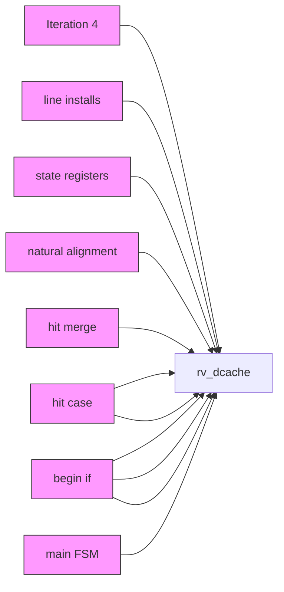

# rv_dcache

## Description

The **rv_dcache** module SPDX-License-Identifier: Apache-2.0
 SMVDU-TITAN-X SoC — 32KB, 8-Way Set-Associative D-Cache with SECDED ECC
 Iteration 4 (Step 5.7 rebuild): Write-Back Write-Allocate, snoop stub,
 REAL flush (writeback-and-invalidate — the old flush dropped dirty data).
 Fixes over iteration 3:
   DC-001 sub-word loads ignored offset[2:0] — every LB/LH/LW read lane 0.
   DC-002 store-hit merge mask was width-broken garbage; proper byte merge.
   DC-003 flush_all silently invalidated dirty lines (data loss); now
          scans all lines and writes dirty ones back before invalidating.
 Geometry: 64-set × 8-way × 64B cacheline = 32KB
`timescale 1ns/1ps
`include "params.vh"

## Interface

### Inputs

| Name | Width | Description |
|------|-------|-------------|
| wire | 1 | – |
| wire | 1 | – |
| wire | 1 | – |
| wire | 1 | – |
| wire | 1 | – |
| wire | 1 | – |
| wire | 1 | – |
| wire | 1 | – |
| wire | 1 | – |
| wire | 1 | – |
| wire | 1 | – |
| wire | 1 | – |
| wire | 1 | – |
| wire | 1 | – |
| wire | 1 | – |
| wire | 1 | – |
| wire | 1 | – |
| wire | 1 | – |
| wire | 1 | – |
| wire | 1 | – |
| wire | 1 | – |
| wire | 1 | – |
| wire | 1 | – |
| wire | 1 | – |
| wire | 1 | – |
| wire | 1 | – |
| wire | 1 | – |

### Outputs

| Name | Width | Description |
|------|-------|-------------|
| reg | 1 | – |
| reg | 1 | – |
| wire | 1 | – |
| wire | 1 | – |
| wire | 1 | – |
| reg | 1 | – |
| reg | 1 | – |
| reg | 1 | – |
| reg | 1 | – |
| reg | 1 | – |
| reg | 1 | – |
| reg | 1 | – |
| reg | 1 | – |
| reg | 1 | – |
| reg | 1 | – |
| reg | 1 | – |
| reg | 1 | – |
| reg | 1 | – |
| reg | 1 | – |
| reg | 1 | – |
| reg | 1 | – |
| reg | 1 | – |
| reg | 1 | – |
| reg | 1 | – |
| reg | 1 | – |
| reg | 1 | – |
| reg | 1 | – |

## Functionality

*rv_dcache provides the hardware implementation for its designated function within the SoC.*

## Hierarchical Block Diagram (Mermaid)

## Full Signal‑Level Diagram (Mermaid)

```mermaid
graph LR
    classDef sig fill:#eef,stroke:#555,stroke-width:1px;
    classDef port fill:#cfe,stroke:#333,stroke-width:1px;
    wire["wire\n(input, 1)"]:::port
    wire["wire\n(input, 1)"]:::port
    wire["wire\n(input, 1)"]:::port
    wire["wire\n(input, 1)"]:::port
    wire["wire\n(input, 1)"]:::port
    wire["wire\n(input, 1)"]:::port
    wire["wire\n(input, 1)"]:::port
    wire["wire\n(input, 1)"]:::port
    reg["reg\n(output, 1)"]:::port
    reg["reg\n(output, 1)"]:::port
    wire["wire\n(output, 1)"]:::port
    wire["wire\n(input, 1)"]:::port
    wire["wire\n(input, 1)"]:::port
    wire["wire\n(input, 1)"]:::port
    wire["wire\n(input, 1)"]:::port
    wire["wire\n(output, 1)"]:::port
    wire["wire\n(input, 1)"]:::port
    wire["wire\n(input, 1)"]:::port
    wire["wire\n(input, 1)"]:::port
    wire["wire\n(output, 1)"]:::port
    reg["reg\n(output, 1)"]:::port
    wire["wire\n(input, 1)"]:::port
    reg["reg\n(output, 1)"]:::port
    reg["reg\n(output, 1)"]:::port
    reg["reg\n(output, 1)"]:::port
    reg["reg\n(output, 1)"]:::port
    reg["reg\n(output, 1)"]:::port
    wire["wire\n(input, 1)"]:::port
    reg["reg\n(output, 1)"]:::port
    wire["wire\n(input, 1)"]:::port
    wire["wire\n(input, 1)"]:::port
    wire["wire\n(input, 1)"]:::port
    reg["reg\n(output, 1)"]:::port
    wire["wire\n(input, 1)"]:::port
    reg["reg\n(output, 1)"]:::port
    reg["reg\n(output, 1)"]:::port
    reg["reg\n(output, 1)"]:::port
    reg["reg\n(output, 1)"]:::port
    reg["reg\n(output, 1)"]:::port
    wire["wire\n(input, 1)"]:::port
    reg["reg\n(output, 1)"]:::port
    reg["reg\n(output, 1)"]:::port
    reg["reg\n(output, 1)"]:::port
    wire["wire\n(input, 1)"]:::port
    reg["reg\n(output, 1)"]:::port
    wire["wire\n(input, 1)"]:::port
    wire["wire\n(input, 1)"]:::port
    wire["wire\n(input, 1)"]:::port
    wire["wire\n(input, 1)"]:::port
    reg["reg\n(output, 1)"]:::port
    reg["reg\n(output, 1)"]:::port
    reg["reg\n(output, 1)"]:::port
    reg["reg\n(output, 1)"]:::port
    reg["reg\n(output, 1)"]:::port
    state["state\n(reg, 4)"]:::sig
    fill_way["fill_way\n(reg, 3)"]:::sig
    fill_beat["fill_beat\n(reg, 3)"]:::sig
    evict_beat["evict_beat\n(reg, 3)"]:::sig
    flush_pend["flush_pend\n(reg, 1)"]:::sig
    flush_run["flush_run\n(reg, 1)"]:::sig
    fsw["fsw\n(reg, 3)"]:::sig
    p["p\n(reg, 7)"]:::sig
```

