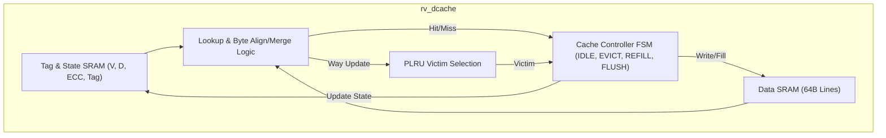
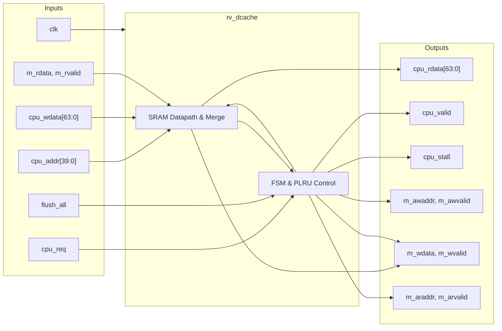

# rv_dcache

## Description

The `rv_dcache` module is a 32KB, 8-way set-associative Level-1 Data Cache designed for the SMVDU-TITAN-X SoC. Operating with 64-byte cachelines and a write-back, write-allocate policy, it acts as the primary data interface between the CPU and the memory subsystem. The cache utilizes a pseudo-LRU (PLRU) replacement policy and integrates an AXI4 master interface capable of 8-beat bursts for efficient cacheline refills and dirty evictions. Recent architectural updates (Iteration 4) include robust byte-level merging for store hits and a comprehensive flush mechanism that safely scans and writes back all dirty lines before invalidation, preventing data loss.

## Interface

### Inputs

| Signal | Width | Description |
|--------|-------|-------------|
| clk | 1 | System clock |
| rst_n | 1 | Active-low asynchronous reset |
| cpu_addr | 40 | Physical address from the CPU (post-MMU) |
| cpu_wdata | 64 | Data to be written to the cache (store operations) |
| cpu_wstrb | 8 | Byte enables for store operations |
| cpu_req | 1 | High when a valid CPU load/store request is present |
| cpu_wr | 1 | High for a store operation, low for a load |
| cpu_size | 3 | Encoded memory access size (Byte, Halfword, Word, Doubleword) |
| is_lr | 1 | Indicates a Load-Reserved atomic operation |
| is_sc | 1 | Indicates a Store-Conditional atomic operation |
| lr_addr_in | 40 | Target address from an active Load-Reserved reservation |
| lr_valid_in | 1 | High if the CPU currently holds a valid LR reservation |
| flush_all | 1 | Triggers a full cache flush (writeback and invalidate) |
| flush_addr_en | 1 | Reserved for targeted address flushing |
| flush_addr | 40 | Reserved target address for flushing |
| m_arready | 1 | AXI4 read address ready |
| m_rvalid | 1 | AXI4 read data valid |
| m_rdata | 64 | AXI4 read data from memory |
| m_rlast | 1 | AXI4 read last beat indicator |
| m_rresp | 2 | AXI4 read response code |
| m_awready | 1 | AXI4 write address ready |
| m_wready | 1 | AXI4 write data ready |
| m_bvalid | 1 | AXI4 write response valid |
| m_bresp | 2 | AXI4 write response code |
| snoop_valid | 1 | L2 coherence snoop request valid |
| snoop_addr | 40 | L2 coherence snoop target address |
| snoop_type | 2 | L2 coherence snoop transaction type |

### Outputs

| Signal | Width | Description |
|--------|-------|-------------|
| cpu_rdata | 64 | Formatted read data returning to the CPU |
| cpu_valid | 1 | High when the load/store operation has successfully completed |
| cpu_stall | 1 | High during a cache miss or flush, indicating the CPU must wait |
| sc_success | 1 | High if a Store-Conditional operation succeeds (reservation matches) |
| flush_busy | 1 | High while the cache is actively flushing dirty lines |
| m_arvalid | 1 | AXI4 read address valid (refill request) |
| m_araddr | 40 | AXI4 read address |
| m_arlen | 8 | AXI4 read burst length (always 7 for 8 beats) |
| m_arsize | 3 | AXI4 read burst size (always 3 for 8 bytes) |
| m_arburst | 2 | AXI4 read burst type (always INCR) |
| m_arlock | 1 | AXI4 exclusive lock hint for LR/SC operations |
| m_rready | 1 | AXI4 read data ready |
| m_awvalid | 1 | AXI4 write address valid (eviction request) |
| m_awaddr | 40 | AXI4 write address |
| m_awlen | 8 | AXI4 write burst length (always 7) |
| m_awsize | 3 | AXI4 write burst size (always 3) |
| m_awburst | 2 | AXI4 write burst type (always INCR) |
| m_wvalid | 1 | AXI4 write data valid |
| m_wdata | 64 | AXI4 write data (evicted dirty cacheline) |
| m_wstrb | 8 | AXI4 write byte enables |
| m_wlast | 1 | AXI4 write last beat indicator |
| m_bready | 1 | AXI4 write response ready |
| snoop_ack | 1 | Acknowledges the L2 snoop request |
| snoop_data_valid| 1 | Validates returned snoop data |
| snoop_data | 512| Full cacheline data returned for coherence |
| ecc_1bit | 1 | Correctable single-bit ECC error flag |
| ecc_2bit | 1 | Uncorrectable double-bit ECC error flag |

## Functionality

The `rv_dcache` orchestrates high-speed data accesses using a 64-set, 8-way configuration. On every request, it concurrently accesses its behavioral Tag and Data SRAM arrays. For a load hit, the selected 64-bit word is shifted and sign-extended based on `cpu_size` before driving `cpu_rdata`. For a store hit, the incoming data is strictly byte-merged using `cpu_wstrb` against the existing cacheline, and the modified line is written back with its dirty bit set. 

On a cache miss, the miss FSM identifies a victim way using the PLRU tree. If the victim is dirty, the FSM transitions to `D_EVICT_WR`, initiating an 8-beat AXI4 write burst to flush the line to main memory. Following eviction (or immediately if the victim is clean), it transitions to `D_REFILL_RQ` to fetch the new 64-byte line via an AXI4 read burst. A dedicated flush mechanism (`flush_all`) safely iterates through all sets and ways; it schedules write-backs for any dirty lines encountered, sequentially invalidating them once the AXI4 writes complete, ensuring absolute memory consistency.

## Hierarchical Block Diagram

## Signal-Level Diagram

