# rv_debug

## Description

The **rv_debug** module SPDX-License-Identifier: Apache-2.0
 SMVDU-TITAN-X SoC — JTAG Debug Module (RISC-V Debug Spec 0.13)
 Iteration 3: 4-pin TAP, DMI registers, Abstract Commands, Program Buffer
 Supports: halt/resume, register access, memory access, 4 hardware triggers
`timescale 1ns/1ps
`include "params.vh"

## Interface

### Inputs

| Name | Width | Description |
|------|-------|-------------|
| wire | 1 | – |
| wire | 1 | – |
| wire | 1 | – |
| wire | 1 | – |
| wire | 1 | – |
| wire | 1 | – |
| wire | 1 | – |
| wire | 1 | – |
| wire | 1 | – |
| wire | 1 | – |
| wire | 1 | – |
| wire | 1 | – |
| wire | 1 | – |
| wire | 1 | – |
| wire | 1 | – |
| wire | 1 | – |
| wire | 1 | – |
| wire | 1 | – |

### Outputs

| Name | Width | Description |
|------|-------|-------------|
| reg | 1 | – |
| reg | 1 | – |
| reg | 1 | – |
| reg | 1 | – |
| reg | 1 | – |
| reg | 1 | – |
| reg | 1 | – |
| reg | 1 | – |
| reg | 1 | – |
| reg | 1 | – |
| reg | 1 | – |
| reg | 1 | – |
| reg | 1 | – |
| reg | 1 | – |
| reg | 1 | – |
| reg | 1 | – |
| reg | 1 | – |

## Functionality

*rv_debug provides the hardware implementation for its designated function within the SoC.*

## Hierarchical Block Diagram (Mermaid)

## Full Signal‑Level Diagram (Mermaid)

```mermaid
graph LR
    classDef sig fill:#eef,stroke:#555,stroke-width:1px;
    classDef port fill:#cfe,stroke:#333,stroke-width:1px;
    wire["wire\n(input, 1)"]:::port
    wire["wire\n(input, 1)"]:::port
    wire["wire\n(input, 1)"]:::port
    wire["wire\n(input, 1)"]:::port
    wire["wire\n(input, 1)"]:::port
    reg["reg\n(output, 1)"]:::port
    reg["reg\n(output, 1)"]:::port
    reg["reg\n(output, 1)"]:::port
    wire["wire\n(input, 1)"]:::port
    wire["wire\n(input, 1)"]:::port
    wire["wire\n(input, 1)"]:::port
    reg["reg\n(output, 1)"]:::port
    reg["reg\n(output, 1)"]:::port
    reg["reg\n(output, 1)"]:::port
    wire["wire\n(input, 1)"]:::port
    reg["reg\n(output, 1)"]:::port
    wire["wire\n(input, 1)"]:::port
    wire["wire\n(input, 1)"]:::port
    reg["reg\n(output, 1)"]:::port
    wire["wire\n(input, 1)"]:::port
    reg["reg\n(output, 1)"]:::port
    wire["wire\n(input, 1)"]:::port
    reg["reg\n(output, 1)"]:::port
    wire["wire\n(input, 1)"]:::port
    wire["wire\n(input, 1)"]:::port
    reg["reg\n(output, 1)"]:::port
    wire["wire\n(input, 1)"]:::port
    reg["reg\n(output, 1)"]:::port
    reg["reg\n(output, 1)"]:::port
    wire["wire\n(input, 1)"]:::port
    reg["reg\n(output, 1)"]:::port
    reg["reg\n(output, 1)"]:::port
    reg["reg\n(output, 1)"]:::port
    wire["wire\n(input, 1)"]:::port
    reg["reg\n(output, 1)"]:::port
    tap_state["tap_state\n(reg, 4)"]:::sig
    ir["ir\n(reg, 5)"]:::sig
    dr_shift["dr_shift\n(reg, 41)"]:::sig
    dr_capture["dr_capture\n(reg, 41)"]:::sig
    dr_read_val["dr_read_val\n(reg, 41)"]:::sig
    dmi_req["dmi_req\n(reg, 1)"]:::sig
    dmi_req_addr["dmi_req_addr\n(reg, 7)"]:::sig
    dmi_req_data["dmi_req_data\n(reg, 32)"]:::sig
    dmi_req_op["dmi_req_op\n(reg, 2)"]:::sig
    dmi_resp_data["dmi_resp_data\n(reg, 32)"]:::sig
    dmi_resp_status["dmi_resp_status\n(reg, 2)"]:::sig
    dmactive["dmactive\n(reg, 1)"]:::sig
    ndmreset["ndmreset\n(reg, 1)"]:::sig
    hartsel["hartsel\n(reg, 20)"]:::sig
    haltreq_r["haltreq_r\n(reg, 1)"]:::sig
    resumereq_r["resumereq_r\n(reg, 1)"]:::sig
    cmderr["cmderr\n(reg, 3)"]:::sig
    busy["busy\n(reg, 1)"]:::sig
    data0["data0\n(reg, 32)"]:::sig
    data1["data1\n(reg, 32)"]:::sig
    sbversion["sbversion\n(reg, 3)"]:::sig
    sbaccess["sbaccess\n(reg, 3)"]:::sig
    sbaddress["sbaddress\n(reg, 40)"]:::sig
    dmi_sync0["dmi_sync0\n(reg, 41)"]:::sig
    dmi_sync1["dmi_sync1\n(reg, 41)"]:::sig
```

