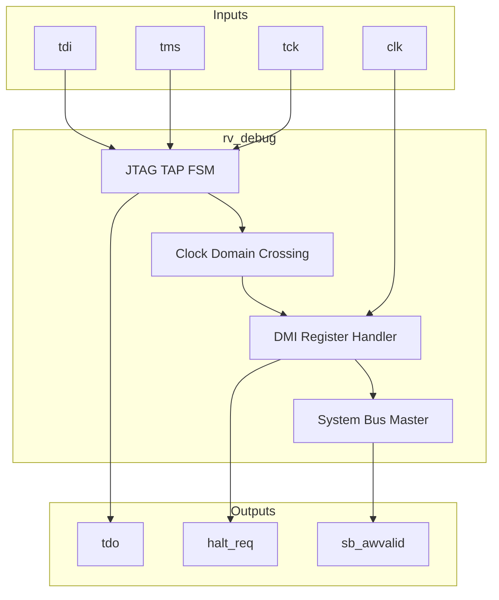
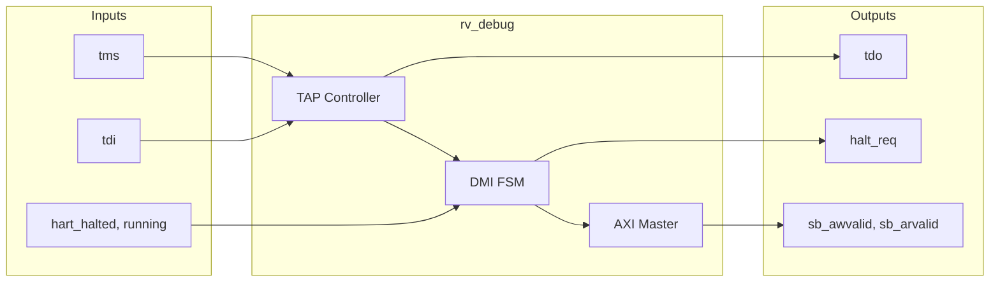

# rv_debug

## Description
The `rv_debug` module implements a RISC-V Debug Module based on the debug spec 0.13. It includes an IEEE 1149.1 compliant JTAG TAP controller, a Debug Module Interface (DMI), and abstract command support for halting, resuming, and accessing registers/memory. It acts as an AXI4 system bus master to read and write memory directly.

## Interface

### Inputs
| Signal | Width | Description |
|--------|-------|-------------|
| clk | 1 | System clock |
| rst_n | 1 | Active-low asynchronous reset |
| tck | 1 | JTAG Test Clock |
| tms | 1 | JTAG Test Mode Select |
| tdi | 1 | JTAG Test Data In |
| hart_halted | N | Status flags indicating which harts are halted |
| hart_running | N | Status flags indicating which harts are running |
| hart_unavail | N | Status flags indicating which harts are unavailable |
| reg_rdata | 64 | Data read from the core register file |
| cmd_done | 1 | Abstract command complete |
| cmd_err | 1 | Abstract command error |
| sb_arready | 1 | System bus read address ready |
| sb_rvalid | 1 | System bus read data valid |
| sb_rdata | 64 | System bus read data |
| sb_rresp | 2 | System bus read response |
| sb_awready | 1 | System bus write address ready |
| sb_wready | 1 | System bus write data ready |
| sb_bvalid | 1 | System bus write response valid |

### Outputs
| Signal | Width | Description |
|--------|-------|-------------|
| tdo | 1 | JTAG Test Data Out |
| halt_req | N | Request signals to halt harts |
| resume_req | N | Request signals to resume harts |
| reg_sel | 5 | Register select for abstract command |
| reg_wr | 1 | Write enable for abstract command |
| reg_wdata | 64 | Write data for abstract command |
| cmd_exec | 1 | Execute pulse for abstract command |
| sb_arvalid | 1 | System bus read address valid |
| sb_araddr | 40 | System bus read address |
| sb_rready | 1 | System bus read data ready |
| sb_awvalid | 1 | System bus write address valid |
| sb_awaddr | 40 | System bus write address |
| sb_wvalid | 1 | System bus write data valid |
| sb_wdata | 64 | System bus write data |
| sb_wstrb | 8 | System bus write strobes |
| sb_wlast | 1 | System bus write last beat |
| sb_bready | 1 | System bus write response ready |

## Functionality
This module runs a canonical 16-state JTAG TAP FSM clocked by `tck`. The TAP interacts with the DMI shift register to form reads and writes. A clock-domain crossing synchronizes DMI requests into the core's `clk` domain, where a handler services them. Through DMI, external debuggers can write the `DMCONTROL` register to halt/resume the core, trigger abstract commands to view/edit registers, or use the system bus AXI master port to bypass the core and interact directly with system memory.

## Hierarchical Block Diagram

## Signal-Level Diagram

