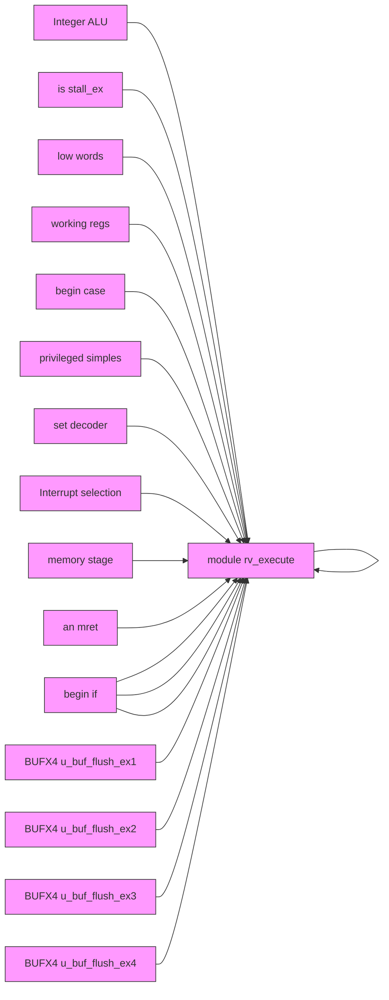

# rv_execute

## Description

The **rv_execute** module SPDX-License-Identifier: Apache-2.0
 SMVDU-TITAN-X SoC — RV64GC Execute / ALU Stage
 Iteration 3: Adds M-extension (MUL/DIV) + A-extension (Atomics)
 Target: SCL 180nm, 125-200 MHz
`timescale 1ns/1ps
`include "params.vh"
`include "isa_pkg.vh"

## Interface

### Inputs

| Name | Width | Description |
|------|-------|-------------|
| wire | 1 | – |
| wire | 1 | – |
| wire | 1 | – |
| wire | 1 | – |
| wire | 1 | – |
| wire | 1 | – |
| wire | 1 | – |
| wire | 1 | – |
| wire | 1 | – |
| wire | 1 | – |
| wire | 1 | – |
| wire | 1 | – |
| wire | 1 | – |
| wire | 1 | – |
| wire | 1 | – |
| wire | 1 | – |
| wire | 1 | – |
| wire | 1 | – |
| wire | 1 | – |
| wire | 1 | – |
| wire | 1 | – |
| wire | 1 | – |
| wire | 1 | – |
| wire | 1 | – |
| wire | 1 | – |
| wire | 1 | – |
| wire | 1 | – |
| wire | 1 | – |
| wire | 1 | – |
| wire | 1 | – |
| wire | 1 | – |
| wire | 1 | – |
| wire | 1 | – |
| wire | 1 | – |
| wire | 1 | – |
| wire | 1 | – |
| wire | 1 | – |
| wire | 1 | – |
| wire | 1 | – |
| wire | 1 | – |
| wire | 1 | – |

### Outputs

| Name | Width | Description |
|------|-------|-------------|
| reg | 1 | – |
| reg | 1 | – |
| reg | 1 | – |
| reg | 1 | – |
| reg | 1 | – |
| reg | 1 | – |
| reg | 1 | – |
| reg | 1 | – |
| reg | 1 | – |
| reg | 1 | – |
| reg | 1 | – |
| wire | 1 | – |
| reg | 1 | – |
| reg | 1 | – |
| reg | 1 | – |
| reg | 1 | – |

## Functionality

*rv_execute provides the hardware implementation for its designated function within the SoC.*

## Hierarchical Block Diagram (Mermaid)

## Full Signal‑Level Diagram (Mermaid)

```mermaid
graph LR
    classDef sig fill:#eef,stroke:#555,stroke-width:1px;
    classDef port fill:#cfe,stroke:#333,stroke-width:1px;
    wire["wire\n(input, 1)"]:::port
    wire["wire\n(input, 1)"]:::port
    wire["wire\n(input, 1)"]:::port
    wire["wire\n(input, 1)"]:::port
    wire["wire\n(input, 1)"]:::port
    wire["wire\n(input, 1)"]:::port
    wire["wire\n(input, 1)"]:::port
    wire["wire\n(input, 1)"]:::port
    wire["wire\n(input, 1)"]:::port
    wire["wire\n(input, 1)"]:::port
    wire["wire\n(input, 1)"]:::port
    wire["wire\n(input, 1)"]:::port
    wire["wire\n(input, 1)"]:::port
    wire["wire\n(input, 1)"]:::port
    wire["wire\n(input, 1)"]:::port
    wire["wire\n(input, 1)"]:::port
    wire["wire\n(input, 1)"]:::port
    wire["wire\n(input, 1)"]:::port
    wire["wire\n(input, 1)"]:::port
    wire["wire\n(input, 1)"]:::port
    wire["wire\n(input, 1)"]:::port
    wire["wire\n(input, 1)"]:::port
    wire["wire\n(input, 1)"]:::port
    wire["wire\n(input, 1)"]:::port
    wire["wire\n(input, 1)"]:::port
    wire["wire\n(input, 1)"]:::port
    wire["wire\n(input, 1)"]:::port
    wire["wire\n(input, 1)"]:::port
    wire["wire\n(input, 1)"]:::port
    wire["wire\n(input, 1)"]:::port
    wire["wire\n(input, 1)"]:::port
    wire["wire\n(input, 1)"]:::port
    wire["wire\n(input, 1)"]:::port
    wire["wire\n(input, 1)"]:::port
    wire["wire\n(input, 1)"]:::port
    wire["wire\n(input, 1)"]:::port
    wire["wire\n(input, 1)"]:::port
    wire["wire\n(input, 1)"]:::port
    wire["wire\n(input, 1)"]:::port
    wire["wire\n(input, 1)"]:::port
    wire["wire\n(input, 1)"]:::port
    reg["reg\n(output, 1)"]:::port
    reg["reg\n(output, 1)"]:::port
    reg["reg\n(output, 1)"]:::port
    reg["reg\n(output, 1)"]:::port
    reg["reg\n(output, 1)"]:::port
    reg["reg\n(output, 1)"]:::port
    reg["reg\n(output, 1)"]:::port
    reg["reg\n(output, 1)"]:::port
    reg["reg\n(output, 1)"]:::port
    reg["reg\n(output, 1)"]:::port
    reg["reg\n(output, 1)"]:::port
    wire["wire\n(output, 1)"]:::port
    reg["reg\n(output, 1)"]:::port
    reg["reg\n(output, 1)"]:::port
    reg["reg\n(output, 1)"]:::port
    reg["reg\n(output, 1)"]:::port
    alu_res_comb["alu_res_comb\n(reg, 64)"]:::sig
    mx_state["mx_state\n(reg, 2)"]:::sig
    mx_a["mx_a\n(reg, 64)"]:::sig
    mx_b["mx_b\n(reg, 64)"]:::sig
    mx_opcode_q["mx_opcode_q\n(reg, 7)"]:::sig
    mx_aluop_q["mx_aluop_q\n(reg, 5)"]:::sig
    mx_rd_q["mx_rd_q\n(reg, 5)"]:::sig
    mx_f3_q["mx_f3_q\n(reg, 3)"]:::sig
    mx_rw_q["mx_rw_q\n(reg, 1)"]:::sig
    mx_v_q["mx_v_q\n(reg, 1)"]:::sig
    mx_fin["mx_fin\n(reg, 1)"]:::sig
    d_rem["d_rem\n(reg, 64)"]:::sig
    d_quot["d_quot\n(reg, 64)"]:::sig
    d_x["d_x\n(reg, 64)"]:::sig
    d_y["d_y\n(reg, 64)"]:::sig
    d_cnt["d_cnt\n(reg, 6)"]:::sig
    d_special["d_special\n(reg, 1)"]:::sig
    d_last["d_last\n(reg, 1)"]:::sig
    d_neg_q["d_neg_q\n(reg, 1)"]:::sig
    d_neg_r["d_neg_r\n(reg, 1)"]:::sig
    d_result_q["d_result_q\n(reg, 64)"]:::sig
    mul_r["mul_r\n(reg, 64)"]:::sig
    div_r["div_r\n(reg, 64)"]:::sig
    trap_cause_w["trap_cause_w\n(reg, 64)"]:::sig
    csr_old["csr_old\n(wire, 64)"]:::sig
    mtvec_q["mtvec_q\n(wire, 64)"]:::sig
    mepc_q["mepc_q\n(wire, 64)"]:::sig
    irq_pend["irq_pend\n(wire, 1)"]:::sig
    branch_comb["branch_comb\n(reg, 1)"]:::sig
    flush_ex_1["flush_ex_1\n(wire, 1)"]:::sig
    flush_ex_2["flush_ex_2\n(wire, 1)"]:::sig
    flush_ex_3["flush_ex_3\n(wire, 1)"]:::sig
    flush_ex_4["flush_ex_4\n(wire, 1)"]:::sig
```

