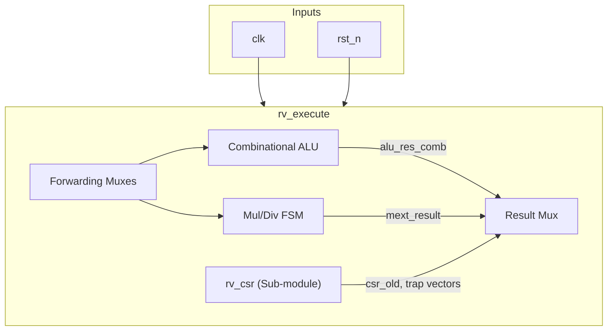
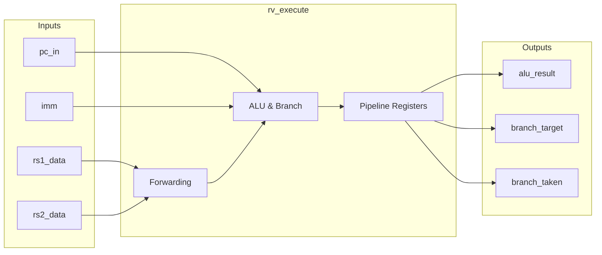

# rv_execute

## Description
The `rv_execute` module is the execute and ALU stage of the RISC-V pipeline, supporting integer arithmetic, branch resolution, and M-extension multi-cycle operations (MUL/DIV). It evaluates branch conditions and computes branch targets, forwarding the results to the fetch stage. It also instantiates the CSR unit to handle system instructions, traps, and interrupts, while passing through data and control signals for the memory and writeback stages.

## Interface

### Inputs
| Signal | Width | Description |
|--------|-------|-------------|
| clk | 1 | System clock |
| rst_n | 1 | Active-low asynchronous reset |
| stall | 1 | Pipeline stall signal |
| flush | 1 | Pipeline flush signal |
| pc_in | 64 | Program counter from decode |
| rs1_data | 64 | Source register 1 data |
| rs2_data | 64 | Source register 2 data |
| imm | 64 | Immediate value |
| rd_in | 5 | Destination register address |
| rs1_addr | 5 | Source register 1 address |
| rs2_addr | 5 | Source register 2 address |
| funct3 | 3 | Instruction funct3 field |
| funct7 | 7 | Instruction funct7 field |
| opcode | 7 | Instruction opcode |
| alu_op | 5 | ALU operation code |
| mem_read | 1 | Memory read enable |
| mem_write | 1 | Memory write enable |
| reg_write | 1 | Register write enable |
| branch | 1 | Branch instruction indicator |
| jal | 1 | Jump and link indicator |
| jalr | 1 | Jump and link register indicator |
| is_amo | 1 | Atomic memory operation indicator |
| amo_funct5 | 5 | AMO operation code |
| is_csr | 1 | CSR instruction indicator |
| csr_op | 2 | CSR operation type |
| is_ecall | 1 | Environment call indicator |
| is_ebreak | 1 | Environment break indicator |
| is_mret | 1 | Machine return indicator |
| irq_m_ext | 1 | External machine interrupt |
| irq_m_timer | 1 | Timer machine interrupt |
| irq_m_soft | 1 | Software machine interrupt |
| valid_in | 1 | Input valid signal |
| fwd_mem_data | 64 | Forwarded data from memory stage |
| fwd_mem_valid | 1 | Memory stage forwarding valid |
| fwd_mem_rd | 5 | Memory stage forwarding destination register |
| fwd_wb_data | 64 | Forwarded data from writeback stage |
| fwd_wb_valid | 1 | Writeback stage forwarding valid |
| fwd_wb_rd | 5 | Writeback stage forwarding destination register |
| fpu_result | 64 | Floating-point unit result |
| fpu_valid | 1 | FPU result valid |
| fpu_done | 1 | FPU operation done |

### Outputs
| Signal | Width | Description |
|--------|-------|-------------|
| alu_result | 64 | ALU computation result |
| rs2_out | 64 | Source register 2 data passed to memory stage |
| rd_out | 5 | Destination register address passed to memory stage |
| funct3_out | 3 | Instruction funct3 field passed to memory stage |
| opcode_out | 7 | Instruction opcode passed to memory stage |
| mem_read_out | 1 | Memory read enable passed to memory stage |
| mem_write_out | 1 | Memory write enable passed to memory stage |
| reg_write_out | 1 | Register write enable passed to memory stage |
| is_amo_out | 1 | Atomic memory operation indicator passed to memory stage |
| amo_funct5_out | 5 | AMO operation code passed to memory stage |
| valid_out | 1 | Valid output signal |
| mul_div_stall | 1 | Stall signal indicating active multi-cycle M-extension operation |
| branch_taken | 1 | Branch condition met, target valid |
| branch_target | 64 | Computed branch target address |
| lr_addr | 64 | Load-reserved address for A-extension |
| lr_valid | 1 | Load-reserved active |

## Functionality
The execute stage features a combinational integer ALU for basic operations and a state machine for multi-cycle multiplication and division (M-extension). It incorporates forwarding multiplexers to resolve data hazards from the memory and writeback stages. A branch resolution block calculates targets for jumps and conditional branches, issuing flushes if a branch is taken. It also instantiates the `rv_csr` module, capturing trap conditions and interrupts to alter control flow (e.g., via `mret` or exceptions).

## Hierarchical Block Diagram

## Signal-Level Diagram

