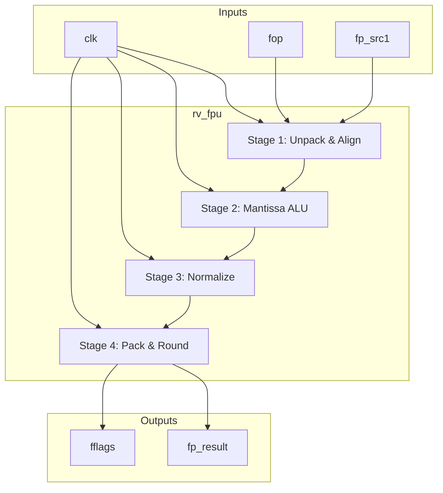
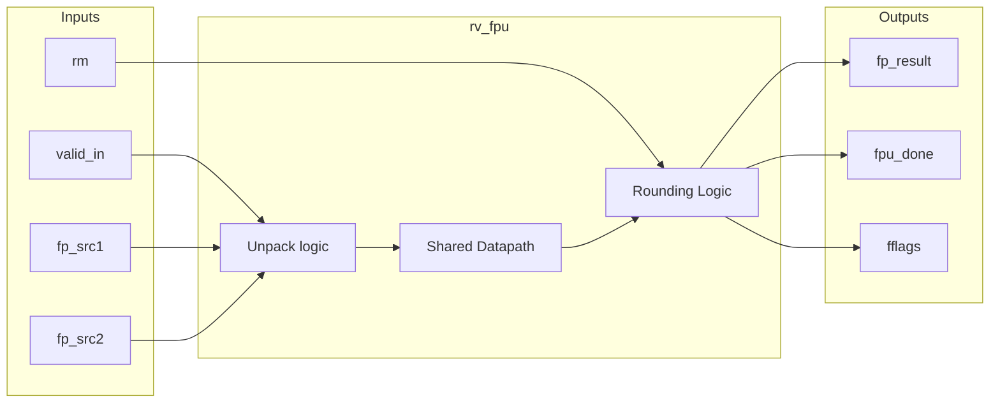

# rv_fpu

## Description
The `rv_fpu` module is a fully pipelined, IEEE 754-2008 compliant Floating Point Unit supporting both Single Precision (SP) and Double Precision (DP) formats (F and D extensions). It features a 4-stage pipeline that shares a datapath for both precisions, performing operations like FADD, FSUB, FMUL, FDIV, FCVT, FCMP, and FMIN/FMAX.

## Interface

### Inputs
| Signal | Width | Description |
|--------|-------|-------------|
| clk | 1 | System clock |
| rst_n | 1 | Active-low asynchronous reset |
| fop | 5 | Floating point operation code |
| fmt | 2 | Precision format (00=SP, 01=DP) |
| rm | 3 | Rounding mode |
| valid_in | 1 | Input valid signal |
| fp_src1 | 64 | Floating point source register 1 |
| fp_src2 | 64 | Floating point source register 2 |
| fp_src3 | 64 | Floating point source register 3 (for FMA) |
| int_src | 64 | Integer source for FCVT operations |
| frm_csr | 3 | Dynamic rounding mode from CSR |

### Outputs
| Signal | Width | Description |
|--------|-------|-------------|
| fp_result | 64 | Floating point result |
| result_valid | 1 | Floating point result valid |
| fflags | 5 | IEEE exception flags (NV, DZ, OF, UF, NX) |
| fpu_done | 1 | FPU operation complete |
| int_result | 64 | Integer result for FCMP or FCVT |
| int_result_valid | 1 | Integer result valid |

## Functionality
The module is divided into four pipeline stages. Stage 1 unpacks operands, handles special cases (NaN, Inf, Denormals), and aligns exponents. Stage 2 performs mantissa addition, subtraction, or multiplication using a wide shared adder/multiplier. Stage 3 counts leading zeros and normalizes the mantissa. Stage 4 applies the selected rounding mode (RNE, RTZ, RDN, RUP, RMM), packs the sign, exponent, and mantissa, and handles integer/floating-point conversions.

## Hierarchical Block Diagram

## Signal-Level Diagram

