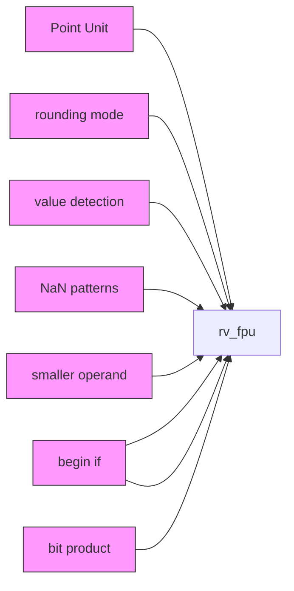

# rv_fpu

## Description

The **rv_fpu** module SPDX-License-Identifier: Apache-2.0
 SMVDU-TITAN-X SoC — IEEE 754-2008 Floating Point Unit (F + D extensions)
 Iteration 3: RV64GC FPU — 4-stage pipeline, shared SP/DP datapath
 Target: SCL 180nm, 125-200 MHz
 Supports: FADD/FSUB/FMUL/FDIV/FSQRT/FMA, FCVT, FMIN/FMAX, FCMP, FMV
 Rounding modes: RNE, RTZ, RDN, RUP, RMM, DYN
`timescale 1ns/1ps
`include "params.vh"
`include "isa_pkg.vh"

## Interface

### Inputs

| Name | Width | Description |
|------|-------|-------------|
| wire | 1 | – |
| wire | 1 | – |
| wire | 1 | – |
| wire | 1 | – |
| wire | 1 | – |
| wire | 1 | – |
| wire | 1 | – |
| wire | 1 | – |
| wire | 1 | – |
| wire | 1 | – |
| wire | 1 | – |

### Outputs

| Name | Width | Description |
|------|-------|-------------|
| reg | 1 | – |
| reg | 1 | – |
| reg | 1 | – |
| reg | 1 | – |
| reg | 1 | – |
| reg | 1 | – |

## Functionality

*rv_fpu provides the hardware implementation for its designated function within the SoC.*

## Hierarchical Block Diagram (Mermaid)

## Full Signal‑Level Diagram (Mermaid)

```mermaid
graph LR
    classDef sig fill:#eef,stroke:#555,stroke-width:1px;
    classDef port fill:#cfe,stroke:#333,stroke-width:1px;
    wire["wire\n(input, 1)"]:::port
    wire["wire\n(input, 1)"]:::port
    wire["wire\n(input, 1)"]:::port
    wire["wire\n(input, 1)"]:::port
    wire["wire\n(input, 1)"]:::port
    wire["wire\n(input, 1)"]:::port
    wire["wire\n(input, 1)"]:::port
    wire["wire\n(input, 1)"]:::port
    wire["wire\n(input, 1)"]:::port
    wire["wire\n(input, 1)"]:::port
    wire["wire\n(input, 1)"]:::port
    reg["reg\n(output, 1)"]:::port
    reg["reg\n(output, 1)"]:::port
    reg["reg\n(output, 1)"]:::port
    reg["reg\n(output, 1)"]:::port
    reg["reg\n(output, 1)"]:::port
    reg["reg\n(output, 1)"]:::port
    s1_valid["s1_valid\n(reg, 1)"]:::sig
    s1_fop["s1_fop\n(reg, 5)"]:::sig
    s1_fmt["s1_fmt\n(reg, 2)"]:::sig
    s1_rm["s1_rm\n(reg, 3)"]:::sig
    s1_sgn_a["s1_sgn_a\n(reg, 1)"]:::sig
    s1_sgn_b["s1_sgn_b\n(reg, 1)"]:::sig
    s1_sgn_c["s1_sgn_c\n(reg, 1)"]:::sig
    s1_exp_a["s1_exp_a\n(reg, 8)"]:::sig
    s1_exp_b["s1_exp_b\n(reg, 8)"]:::sig
    s1_sig_a["s1_sig_a\n(reg, 25)"]:::sig
    s1_sig_b["s1_sig_b\n(reg, 25)"]:::sig
    s1_dp_sgn_a["s1_dp_sgn_a\n(reg, 1)"]:::sig
    s1_dp_sgn_b["s1_dp_sgn_b\n(reg, 1)"]:::sig
    s1_dp_exp_a["s1_dp_exp_a\n(reg, 11)"]:::sig
    s1_dp_exp_b["s1_dp_exp_b\n(reg, 11)"]:::sig
    s1_dp_sig_a["s1_dp_sig_a\n(reg, 54)"]:::sig
    s1_dp_sig_b["s1_dp_sig_b\n(reg, 54)"]:::sig
    s1_exp_diff["s1_exp_diff\n(reg, 8)"]:::sig
    s1_dp_exp_diff["s1_dp_exp_diff\n(reg, 11)"]:::sig
    s1_int_src["s1_int_src\n(reg, 64)"]:::sig
    s2_valid["s2_valid\n(reg, 1)"]:::sig
    s2_fop["s2_fop\n(reg, 5)"]:::sig
    s2_fmt["s2_fmt\n(reg, 2)"]:::sig
    s2_rm["s2_rm\n(reg, 3)"]:::sig
    s2_result_sgn["s2_result_sgn\n(reg, 1)"]:::sig
    s2_result_exp["s2_result_exp\n(reg, 8)"]:::sig
    s2_result_sig["s2_result_sig\n(reg, 50)"]:::sig
    s2_dp_result_exp["s2_dp_result_exp\n(reg, 11)"]:::sig
    s2_dp_result_sig["s2_dp_result_sig\n(reg, 106)"]:::sig
    s2_fflags["s2_fflags\n(reg, 5)"]:::sig
    s2_int_src["s2_int_src\n(reg, 64)"]:::sig
    s2_is_nan["s2_is_nan\n(reg, 1)"]:::sig
    s2_is_inf["s2_is_inf\n(reg, 1)"]:::sig
    s2_is_zero["s2_is_zero\n(reg, 1)"]:::sig
    s2_special_result["s2_special_result\n(reg, 64)"]:::sig
    s2_special_valid["s2_special_valid\n(reg, 1)"]:::sig
    s3_valid["s3_valid\n(reg, 1)"]:::sig
    s3_fop["s3_fop\n(reg, 5)"]:::sig
    s3_fmt["s3_fmt\n(reg, 2)"]:::sig
    s3_rm["s3_rm\n(reg, 3)"]:::sig
    s3_result_sgn["s3_result_sgn\n(reg, 1)"]:::sig
    s3_result_exp["s3_result_exp\n(reg, 9)"]:::sig
    s3_result_sig["s3_result_sig\n(reg, 26)"]:::sig
    s3_dp_result_exp["s3_dp_result_exp\n(reg, 12)"]:::sig
    s3_dp_result_sig["s3_dp_result_sig\n(reg, 56)"]:::sig
    s3_fflags["s3_fflags\n(reg, 5)"]:::sig
    s3_special_result["s3_special_result\n(reg, 64)"]:::sig
    s3_special_valid["s3_special_valid\n(reg, 1)"]:::sig
    s3_is_nan["s3_is_nan\n(reg, 1)"]:::sig
    s3_is_inf["s3_is_inf\n(reg, 1)"]:::sig
    s3_is_zero["s3_is_zero\n(reg, 1)"]:::sig
    sp_lzc["sp_lzc\n(reg, 6)"]:::sig
```

