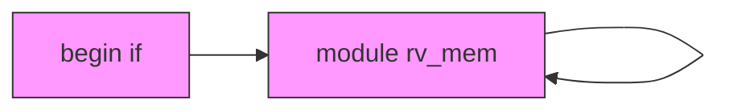
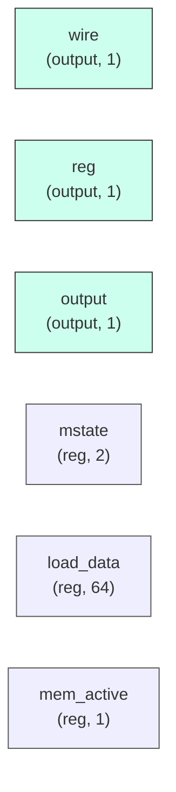

# rv_mem

## Description

The **rv_mem** module SPDX-License-Identifier: Apache-2.0
 SMVDU-TITAN-X SoC — RV64I Memory Access Stage
`timescale 1ns/1ps

## Interface

### Inputs

| Name | Width | Description |
|------|-------|-------------|
| wire | 1 | – |
| wire | 1 | – |
| wire | 1 | – |
| wire | 1 | – |
| wire | 1 | – |
| wire | 1 | – |
| wire | 1 | – |
| wire | 1 | – |
| wire | 1 | – |
| wire | 1 | – |
| wire | 1 | – |
| wire | 1 | – |
| wire | 1 | – |
| wire | 1 | – |
| wire | 1 | – |
| wire | 1 | – |
| wire | 1 | – |
| wire | 1 | – |
| wire | 1 | – |

### Outputs

| Name | Width | Description |
|------|-------|-------------|
| reg | 1 | – |
| reg | 1 | – |
| reg | 1 | – |
| reg | 1 | – |
| reg | 1 | – |
| reg | 1 | – |
| reg | 1 | – |
| reg | 1 | – |
| reg | 1 | – |
| reg | 1 | – |
| reg | 1 | – |
| reg | 1 | – |
| reg | 1 | – |
| output | 1 | – |
| wire | 1 | – |
| wire | 1 | – |
| wire | 1 | – |

## Functionality

*rv_mem provides the hardware implementation for its designated function within the SoC.*

## Hierarchical Block Diagram (Mermaid)

## Full Signal‑Level Diagram (Mermaid)

