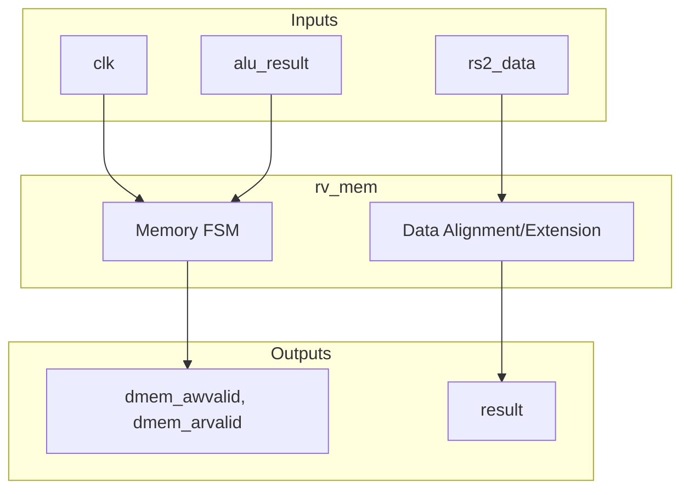
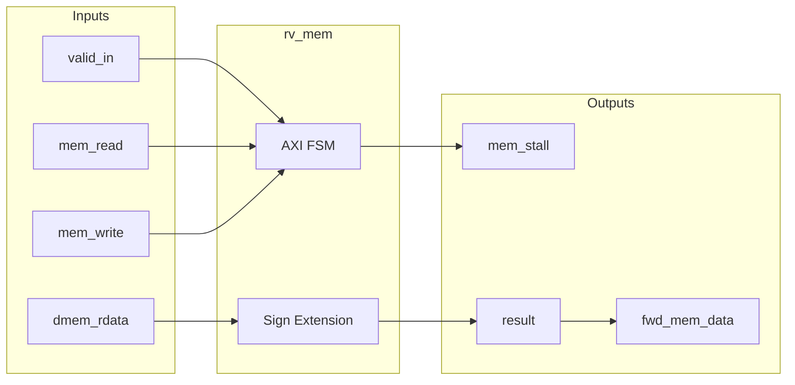

# rv_mem

## Description
The `rv_mem` module handles data memory accesses via an AXI4-Lite master interface. It manages load and store instructions by coordinating the address and data phases, stalling the pipeline while the transaction is in flight. Load data is properly sign-extended based on the instruction size (`funct3`), and store data/strobes are appropriately shifted into the correct byte lanes.

## Interface

### Inputs
| Signal | Width | Description |
|--------|-------|-------------|
| clk | 1 | System clock |
| rst_n | 1 | Active-low asynchronous reset |
| flush | 1 | Pipeline flush signal |
| alu_result | 64 | ALU result from execute stage (address for memory ops) |
| rs2_data | 64 | Store data from execute stage |
| rd_in | 5 | Destination register address |
| funct3 | 3 | Instruction funct3 field for memory size/sign extension |
| opcode | 7 | Instruction opcode |
| mem_read | 1 | Memory read enable |
| mem_write | 1 | Memory write enable |
| reg_write | 1 | Register write enable |
| valid_in | 1 | Input valid signal |
| dmem_awready | 1 | AXI4 write address ready |
| dmem_wready | 1 | AXI4 write data ready |
| dmem_bvalid | 1 | AXI4 write response valid |
| dmem_arready | 1 | AXI4 read address ready |
| dmem_rvalid | 1 | AXI4 read data valid |
| dmem_rdata | 64 | AXI4 read data |
| dmem_rresp | 2 | AXI4 read response |

### Outputs
| Signal | Width | Description |
|--------|-------|-------------|
| dmem_awvalid | 1 | AXI4 write address valid |
| dmem_awaddr | 40 | AXI4 write address |
| dmem_wvalid | 1 | AXI4 write data valid |
| dmem_wdata | 64 | AXI4 write data |
| dmem_wstrb | 8 | AXI4 write strobes |
| dmem_bready | 1 | AXI4 write response ready |
| dmem_arvalid | 1 | AXI4 read address valid |
| dmem_araddr | 40 | AXI4 read address |
| dmem_rready | 1 | AXI4 read data ready |
| result | 64 | Output result (memory data or pass-through ALU data) |
| rd_out | 5 | Destination register address passed to writeback |
| reg_write_out | 1 | Register write enable passed to writeback |
| valid_out | 1 | Valid output signal |
| fwd_mem_data | 64 | Forwarded data for earlier pipeline stages |
| fwd_mem_rd | 5 | Forwarded destination register |
| fwd_mem_valid | 1 | Forwarding valid signal |
| mem_stall | 1 | Stall signal indicating memory transaction in progress |

## Functionality
This module contains an FSM with states for idle, address, and data phases to interface with an AXI memory interconnect. For non-memory instructions, it passes `alu_result` directly to `result`. For stores, it calculates the proper byte lane offsets for both `dmem_wdata` and `dmem_wstrb` using the lower 3 bits of the address. For loads, it shifts the read data down from the correct byte lane and applies sign or zero extension based on `funct3`. It holds `mem_stall` high during bus operations to freeze earlier pipeline stages.

## Hierarchical Block Diagram

## Signal-Level Diagram

