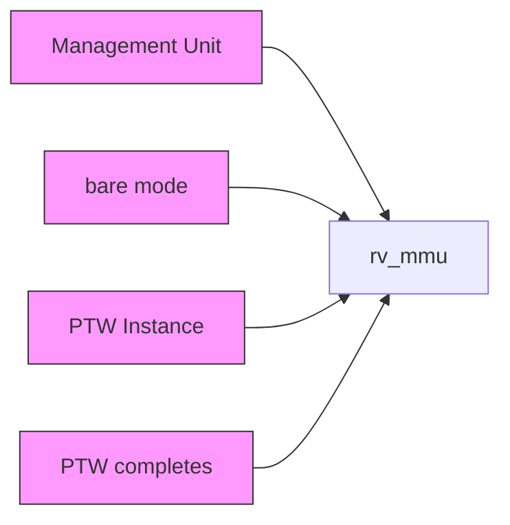

# rv_mmu

## Description

The **rv_mmu** module SPDX-License-Identifier: Apache-2.0
 SMVDU-TITAN-X SoC — Sv39 Memory Management Unit (Top-level)
 Iteration 3: Integrates TLB + PTW, manages SATP CSR, mode switching
 Instantiated once for I-side and once for D-side per core
`timescale 1ns/1ps
`include "params.vh"
`include "isa_pkg.vh"

## Interface

### Inputs

| Name | Width | Description |
|------|-------|-------------|
| wire | 1 | – |
| wire | 1 | – |
| wire | 1 | – |
| wire | 1 | – |
| wire | 1 | – |
| wire | 1 | – |
| wire | 1 | – |
| wire | 1 | – |
| wire | 1 | – |
| wire | 1 | – |
| wire | 1 | – |
| wire | 1 | – |
| wire | 1 | – |
| wire | 1 | – |
| wire | 1 | – |
| wire | 1 | – |
| wire | 1 | – |
| wire | 1 | – |

### Outputs

| Name | Width | Description |
|------|-------|-------------|
| wire | 1 | – |
| wire | 1 | – |
| wire | 1 | – |
| output | 1 | – |
| wire | 1 | – |
| wire | 1 | – |
| wire | 1 | – |
| wire | 1 | – |

## Functionality

*rv_mmu provides the hardware implementation for its designated function within the SoC.*

## Hierarchical Block Diagram (Mermaid)

## Full Signal‑Level Diagram (Mermaid)

```mermaid
graph LR
    classDef sig fill:#eef,stroke:#555,stroke-width:1px;
    classDef port fill:#cfe,stroke:#333,stroke-width:1px;
    wire["wire\n(input, 1)"]:::port
    wire["wire\n(input, 1)"]:::port
    wire["wire\n(input, 1)"]:::port
    wire["wire\n(input, 1)"]:::port
    wire["wire\n(input, 1)"]:::port
    wire["wire\n(input, 1)"]:::port
    wire["wire\n(input, 1)"]:::port
    wire["wire\n(input, 1)"]:::port
    wire["wire\n(input, 1)"]:::port
    wire["wire\n(output, 1)"]:::port
    wire["wire\n(output, 1)"]:::port
    wire["wire\n(output, 1)"]:::port
    output["output\n(output, 1)"]:::port
    wire["wire\n(output, 1)"]:::port
    wire["wire\n(output, 1)"]:::port
    wire["wire\n(input, 1)"]:::port
    wire["wire\n(output, 1)"]:::port
    wire["wire\n(input, 1)"]:::port
    wire["wire\n(output, 1)"]:::port
    wire["wire\n(input, 1)"]:::port
    wire["wire\n(input, 1)"]:::port
    wire["wire\n(input, 1)"]:::port
    wire["wire\n(input, 1)"]:::port
    wire["wire\n(input, 1)"]:::port
    wire["wire\n(input, 1)"]:::port
    wire["wire\n(input, 1)"]:::port
    tlb_pa["tlb_pa\n(wire, 38)"]:::sig
    tlb_hit["tlb_hit\n(wire, 1)"]:::sig
    tlb_perm_r["tlb_perm_r\n(wire, 1)"]:::sig
    tlb_perm_w["tlb_perm_w\n(wire, 1)"]:::sig
    tlb_perm_x["tlb_perm_x\n(wire, 1)"]:::sig
    tlb_perm_u["tlb_perm_u\n(wire, 1)"]:::sig
    tlb_page_fault["tlb_page_fault\n(wire, 1)"]:::sig
    ptw_fill_valid["ptw_fill_valid\n(wire, 1)"]:::sig
    ptw_fill_va["ptw_fill_va\n(wire, 39)"]:::sig
    ptw_fill_pa["ptw_fill_pa\n(wire, 38)"]:::sig
    ptw_fill_asid["ptw_fill_asid\n(wire, 16)"]:::sig
    ptw_fill_perm["ptw_fill_perm\n(wire, 8)"]:::sig
    ptw_fill_level["ptw_fill_level\n(wire, 2)"]:::sig
    ptw_busy["ptw_busy\n(wire, 1)"]:::sig
    ptw_page_fault["ptw_page_fault\n(wire, 1)"]:::sig
    ptw_fault_addr["ptw_fault_addr\n(wire, 64)"]:::sig
```

