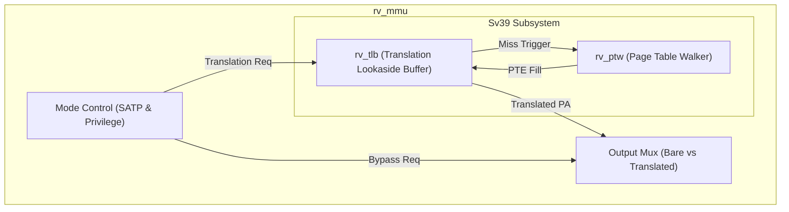
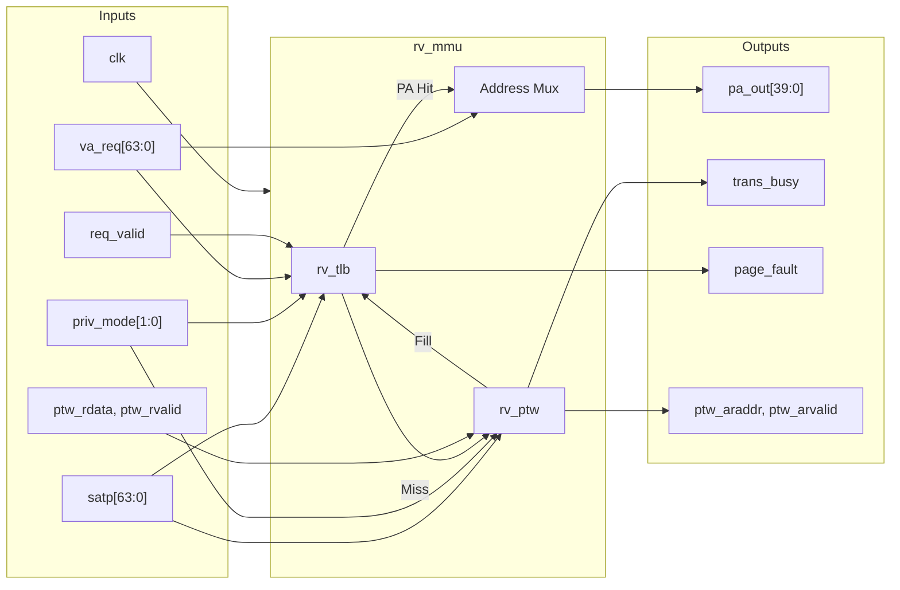

# rv_mmu

## Description

The `rv_mmu` module is the top-level Memory Management Unit for the SMVDU-TITAN-X SoC, implementing the RISC-V Sv39 virtual memory architecture. It dynamically routes translation requests based on the core's current privilege mode and the `satp` CSR configuration, seamlessly falling back to bare mode (pass-through) when paging is disabled or during M-mode execution. Internally, it instantiates and orchestrates the `rv_tlb` (Translation Lookaside Buffer) for fast caching and the `rv_ptw` (Page Table Walker) to service TLB misses via memory fetches. The MMU manages the pipeline interface, stalling the core during page table walks, handling `SFENCE.VMA` invalidations, and accurately reporting precise page faults.

## Interface

### Inputs

| Signal | Width | Description |
|--------|-------|-------------|
| clk | 1 | System clock |
| rst_n | 1 | Active-low asynchronous reset |
| satp | 64 | Supervisor Address Translation and Protection CSR (mode, ASID, PPN) |
| priv_mode | 2 | Current CPU privilege mode (00=User, 01=Supervisor, 11=Machine) |
| va_req | 64 | Virtual address requested by the CPU pipeline |
| req_valid | 1 | High when a valid translation request is made |
| req_r | 1 | High if the requested access is a read (load) |
| req_w | 1 | High if the requested access is a write (store) |
| req_x | 1 | High if the requested access is an instruction fetch |
| ptw_arready | 1 | AXI4 read address ready from interconnect |
| ptw_rvalid | 1 | AXI4 read data valid from interconnect |
| ptw_rdata | 64 | AXI4 read data (Page Table Entry) |
| ptw_rresp | 2 | AXI4 read response |
| sfence_vma | 1 | Triggers a global TLB flush |
| sfence_asid_en | 1 | Triggers an ASID-specific TLB flush |
| sfence_va_en | 1 | Triggers a VA-specific TLB flush |
| sfence_va_val | 64 | Virtual address for targeted TLB flush |
| sfence_asid_val | 64 | ASID for targeted TLB flush |

### Outputs

| Signal | Width | Description |
|--------|-------|-------------|
| pa_out | 40 | Translated physical address output |
| trans_valid | 1 | High when the translation completes (hit or after PTW fill) |
| trans_busy | 1 | High when the MMU is servicing a TLB miss, stalling the pipeline |
| page_fault | 1 | High when an access violation or invalid PTE is detected |
| fault_va | 64 | The faulting virtual address for the `stval` CSR |
| ptw_arvalid | 1 | AXI4 read address valid from the PTW |
| ptw_araddr | 40 | AXI4 read address from the PTW |
| ptw_rready | 1 | AXI4 read data ready from the PTW |

## Functionality

Upon receiving a valid translation request (`req_valid`), `rv_mmu` determines the active translation scheme. If the core is in M-mode or `satp.mode` is set to bare (0), it instantly passes the `va_req` through to `pa_out` and asserts `trans_valid`. If Sv39 mode is active, the request is routed to the integrated `rv_tlb`. On a TLB hit, the translated physical address and permissions are evaluated combinationally; if permissions fail, `page_fault` is asserted immediately. On a TLB miss, the MMU asserts `trans_busy` to stall the pipeline and awakens the `rv_ptw` module. The PTW performs sequential AXI4 memory reads to traverse the page tables. Upon finding a valid leaf PTE, it pushes a fill request back to the TLB and terminates the walk. The MMU also forwards `SFENCE.VMA` control signals directly to the TLB to maintain translation coherence.

## Hierarchical Block Diagram

## Signal-Level Diagram

