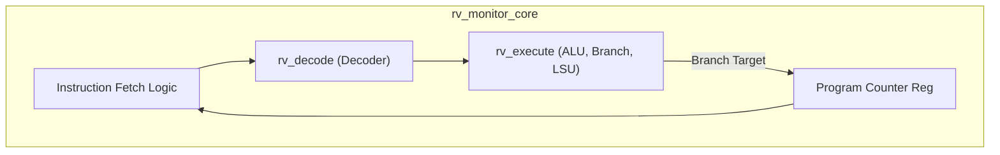
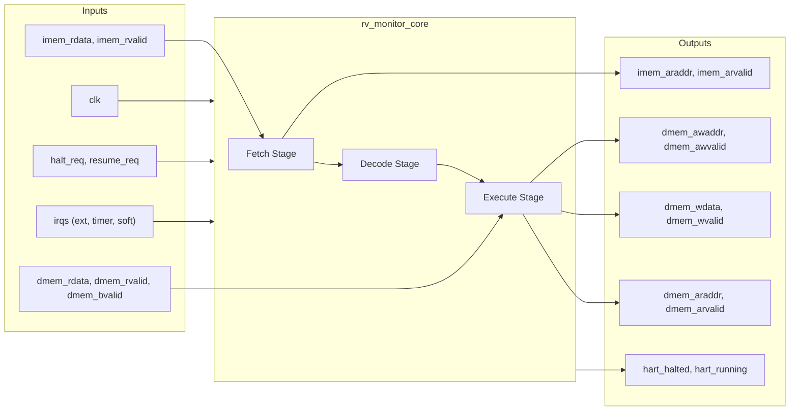

# rv_monitor_core

## Description

The `rv_monitor_core` is a lightweight RV64IMAC (RISC-V 64-bit Integer, Multiply/Divide, Atomic, Compressed) Monitor Core within the SMVDU-TITAN-X SoC. Designed similarly to the SiFive E51, it functions as a highly privileged management processor, operating exclusively in Machine mode (M-mode) without an MMU. The core employs a simple 5-stage pipeline (Fetch, Decode, Execute) and interfaces directly with the system memory interconnect via distinct AXI4 master ports for instruction fetch and data access. With integrated debug support and hardware interrupt lines, it is tailored for robust bootloading, system monitoring, and hardware management tasks.

## Interface

### Inputs

| Signal | Width | Description |
|--------|-------|-------------|
| clk | 1 | System clock |
| rst_n | 1 | Active-low asynchronous reset |
| irq_m_ext | 1 | Machine external interrupt |
| irq_m_timer | 1 | Machine timer interrupt |
| irq_m_soft | 1 | Machine software interrupt |
| imem_arready | 1 | AXI4 instruction read address ready |
| imem_rdata | 64 | AXI4 instruction read data (32-bit instruction extracted) |
| imem_rvalid | 1 | AXI4 instruction read valid |
| imem_rresp | 2 | AXI4 instruction read response |
| dmem_awready | 1 | AXI4 data write address ready |
| dmem_wready | 1 | AXI4 data write data ready |
| dmem_bvalid | 1 | AXI4 data write response valid |
| dmem_bresp | 2 | AXI4 data write response |
| dmem_arready | 1 | AXI4 data read address ready |
| dmem_rvalid | 1 | AXI4 data read valid |
| dmem_rdata | 64 | AXI4 data read data |
| dmem_rlast | 1 | AXI4 data read last beat indicator |
| dmem_rresp | 2 | AXI4 data read response |
| halt_req | 1 | Debug halt request to suspend the core |
| resume_req | 1 | Debug resume request to un-halt the core |

### Outputs

| Signal | Width | Description |
|--------|-------|-------------|
| imem_araddr | 40 | AXI4 instruction read address (Program Counter) |
| imem_arvalid | 1 | AXI4 instruction read address valid |
| dmem_awvalid | 1 | AXI4 data write address valid |
| dmem_awaddr | 40 | AXI4 data write address |
| dmem_awlen | 8 | AXI4 data write burst length (0 for single beat) |
| dmem_awsize | 3 | AXI4 data write transfer size |
| dmem_awburst | 2 | AXI4 data write burst type |
| dmem_wvalid | 1 | AXI4 data write valid |
| dmem_wdata | 64 | AXI4 data write data |
| dmem_wstrb | 8 | AXI4 data write byte enables |
| dmem_wlast | 1 | AXI4 data write last beat indicator |
| dmem_bready | 1 | AXI4 data write response ready |
| dmem_arvalid | 1 | AXI4 data read address valid |
| dmem_araddr | 40 | AXI4 data read address |
| dmem_arlen | 8 | AXI4 data read burst length (0 for single beat) |
| dmem_arsize | 3 | AXI4 data read transfer size |
| dmem_arburst | 2 | AXI4 data read burst type |
| dmem_rready | 1 | AXI4 data read ready |
| hart_halted | 1 | Indicates the hart is currently halted for debug |
| hart_running | 1 | Indicates the hart is actively executing |

## Functionality

The `rv_monitor_core` utilizes a streamlined 5-stage pipeline. The Fetch stage issues instruction requests via the `imem` AXI4-Lite interface. Upon receiving a valid instruction, the `rv_decode` sub-module determines the operation type, source registers, and necessary control signals. The `rv_execute` sub-module performs ALUs operations, branch evaluations, and generates memory access requests. Since the monitor core lacks a data cache, all load and store operations are driven directly to the `dmem` AXI4 interface as single-beat transactions. The pipeline stalls if a structural hazard occurs (like a multi-cycle multiplication/division) or if memory transactions are not immediately accepted. The core exclusively runs in Machine mode, responding instantly to external, timer, and software interrupts, and supporting JTAG/Debug halts.

## Hierarchical Block Diagram

## Signal-Level Diagram

