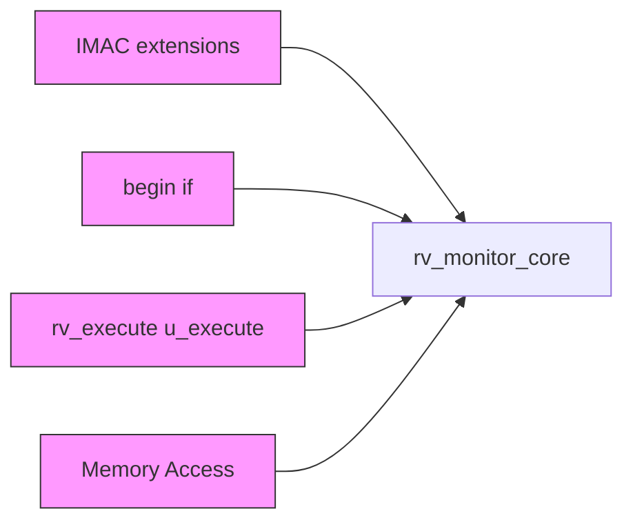

# rv_monitor_core

## Description

The **rv_monitor_core** module SPDX-License-Identifier: Apache-2.0
 SMVDU-TITAN-X SoC — RV64IMAC Monitor Core
 Iteration 3: SiFive E51 equivalent
 Target: SCL 180nm, 125-200 MHz
 Features: 64-bit, IMAC extensions (no FPU), Bare/M-mode (no MMU), simple PMP.
 5-stage pipeline with tightly-integrated memory / direct AXI interface.
`timescale 1ns/1ps
`include "params.vh"
`include "isa_pkg.vh"

## Interface

### Inputs

| Name | Width | Description |
|------|-------|-------------|
| wire | 1 | – |
| wire | 1 | – |
| wire | 1 | – |
| wire | 1 | – |
| wire | 1 | – |
| wire | 1 | – |
| wire | 1 | – |
| wire | 1 | – |
| wire | 1 | – |
| wire | 1 | – |
| wire | 1 | – |
| wire | 1 | – |
| wire | 1 | – |
| wire | 1 | – |
| wire | 1 | – |
| wire | 1 | – |
| wire | 1 | – |
| wire | 1 | – |
| wire | 1 | – |
| wire | 1 | – |

### Outputs

| Name | Width | Description |
|------|-------|-------------|
| wire | 1 | – |
| wire | 1 | – |
| wire | 1 | – |
| wire | 1 | – |
| wire | 1 | – |
| wire | 1 | – |
| wire | 1 | – |
| wire | 1 | – |
| wire | 1 | – |
| wire | 1 | – |
| wire | 1 | – |
| wire | 1 | – |
| wire | 1 | – |
| wire | 1 | – |
| wire | 1 | – |
| wire | 1 | – |
| wire | 1 | – |
| wire | 1 | – |
| wire | 1 | – |
| wire | 1 | – |

## Functionality

*rv_monitor_core provides the hardware implementation for its designated function within the SoC.*

## Hierarchical Block Diagram (Mermaid)

## Full Signal‑Level Diagram (Mermaid)

```mermaid
graph LR
    classDef sig fill:#eef,stroke:#555,stroke-width:1px;
    classDef port fill:#cfe,stroke:#333,stroke-width:1px;
    wire["wire\n(input, 1)"]:::port
    wire["wire\n(input, 1)"]:::port
    wire["wire\n(input, 1)"]:::port
    wire["wire\n(input, 1)"]:::port
    wire["wire\n(input, 1)"]:::port
    wire["wire\n(output, 1)"]:::port
    wire["wire\n(output, 1)"]:::port
    wire["wire\n(input, 1)"]:::port
    wire["wire\n(input, 1)"]:::port
    wire["wire\n(input, 1)"]:::port
    wire["wire\n(input, 1)"]:::port
    wire["wire\n(output, 1)"]:::port
    wire["wire\n(input, 1)"]:::port
    wire["wire\n(output, 1)"]:::port
    wire["wire\n(output, 1)"]:::port
    wire["wire\n(output, 1)"]:::port
    wire["wire\n(output, 1)"]:::port
    wire["wire\n(output, 1)"]:::port
    wire["wire\n(input, 1)"]:::port
    wire["wire\n(output, 1)"]:::port
    wire["wire\n(output, 1)"]:::port
    wire["wire\n(output, 1)"]:::port
    wire["wire\n(input, 1)"]:::port
    wire["wire\n(output, 1)"]:::port
    wire["wire\n(input, 1)"]:::port
    wire["wire\n(output, 1)"]:::port
    wire["wire\n(input, 1)"]:::port
    wire["wire\n(output, 1)"]:::port
    wire["wire\n(output, 1)"]:::port
    wire["wire\n(output, 1)"]:::port
    wire["wire\n(output, 1)"]:::port
    wire["wire\n(input, 1)"]:::port
    wire["wire\n(output, 1)"]:::port
    wire["wire\n(input, 1)"]:::port
    wire["wire\n(input, 1)"]:::port
    wire["wire\n(input, 1)"]:::port
    wire["wire\n(input, 1)"]:::port
    wire["wire\n(input, 1)"]:::port
    wire["wire\n(output, 1)"]:::port
    wire["wire\n(output, 1)"]:::port
    stall["stall\n(wire, 1)"]:::sig
    flush_fe["flush_fe\n(wire, 1)"]:::sig
    flush_de["flush_de\n(wire, 1)"]:::sig
    branch_target["branch_target\n(wire, 64)"]:::sig
    branch_taken["branch_taken\n(wire, 1)"]:::sig
    fe_pc["fe_pc\n(wire, 64)"]:::sig
    fe_instr["fe_instr\n(wire, 32)"]:::sig
    fe_valid["fe_valid\n(wire, 1)"]:::sig
    pc_reg["pc_reg\n(reg, 64)"]:::sig
    de_pc["de_pc\n(wire, 64)"]:::sig
    de_rs1["de_rs1\n(wire, 64)"]:::sig
    de_rs2["de_rs2\n(wire, 64)"]:::sig
    de_imm["de_imm\n(wire, 64)"]:::sig
    de_rd["de_rd\n(wire, 5)"]:::sig
    de_rs1a["de_rs1a\n(wire, 5)"]:::sig
    de_rs2a["de_rs2a\n(wire, 5)"]:::sig
    de_f3["de_f3\n(wire, 3)"]:::sig
    de_f7["de_f7\n(wire, 7)"]:::sig
    de_op["de_op\n(wire, 7)"]:::sig
    de_aluop["de_aluop\n(wire, 5)"]:::sig
    de_amo_f5["de_amo_f5\n(wire, 5)"]:::sig
    de_memr["de_memr\n(wire, 1)"]:::sig
    de_memw["de_memw\n(wire, 1)"]:::sig
    de_regw["de_regw\n(wire, 1)"]:::sig
    de_branch["de_branch\n(wire, 1)"]:::sig
    de_jal["de_jal\n(wire, 1)"]:::sig
    de_jalr["de_jalr\n(wire, 1)"]:::sig
    de_is_amo["de_is_amo\n(wire, 1)"]:::sig
    de_valid["de_valid\n(wire, 1)"]:::sig
    ex_alures["ex_alures\n(wire, 64)"]:::sig
    ex_rs2["ex_rs2\n(wire, 64)"]:::sig
    ex_lr_addr["ex_lr_addr\n(wire, 64)"]:::sig
    ex_rd["ex_rd\n(wire, 5)"]:::sig
    ex_amo_f5["ex_amo_f5\n(wire, 5)"]:::sig
    ex_f3["ex_f3\n(wire, 3)"]:::sig
    ex_op["ex_op\n(wire, 7)"]:::sig
    ex_memr["ex_memr\n(wire, 1)"]:::sig
    ex_memw["ex_memw\n(wire, 1)"]:::sig
    ex_regw["ex_regw\n(wire, 1)"]:::sig
    ex_is_amo["ex_is_amo\n(wire, 1)"]:::sig
    ex_valid["ex_valid\n(wire, 1)"]:::sig
    ex_lr_valid["ex_lr_valid\n(wire, 1)"]:::sig
    mul_div_stall["mul_div_stall\n(wire, 1)"]:::sig
```

