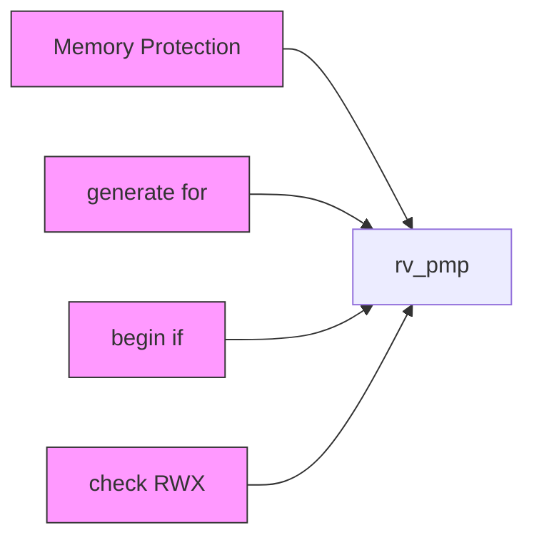
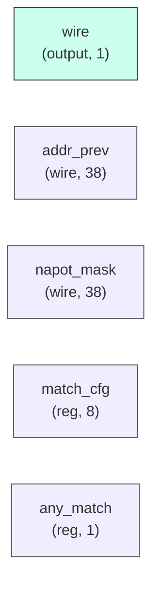

# rv_pmp

## Description

The **rv_pmp** module SPDX-License-Identifier: Apache-2.0
 SMVDU-TITAN-X SoC — Physical Memory Protection (PMP)
 Iteration 3: 8 PMP entries per hart, placed after MMU output
 RISC-V Privileged Spec v1.12: TOR, NA4, NAPOT, and OFF modes
 Placement: between MMU PA output and L1 cache AXI master
`timescale 1ns/1ps
`include "params.vh"
`include "isa_pkg.vh"

## Interface

### Inputs

| Name | Width | Description |
|------|-------|-------------|
| wire | 1 | – |
| wire | 1 | – |
| wire | 1 | – |
| wire | 1 | – |
| wire | 1 | – |
| wire | 1 | – |
| wire | 1 | – |
| wire | 1 | – |
| wire | 1 | – |
| wire | 1 | – |
| wire | 1 | – |

### Outputs

| Name | Width | Description |
|------|-------|-------------|
| wire | 1 | – |

## Functionality

*rv_pmp provides the hardware implementation for its designated function within the SoC.*

## Hierarchical Block Diagram (Mermaid)

## Full Signal‑Level Diagram (Mermaid)

