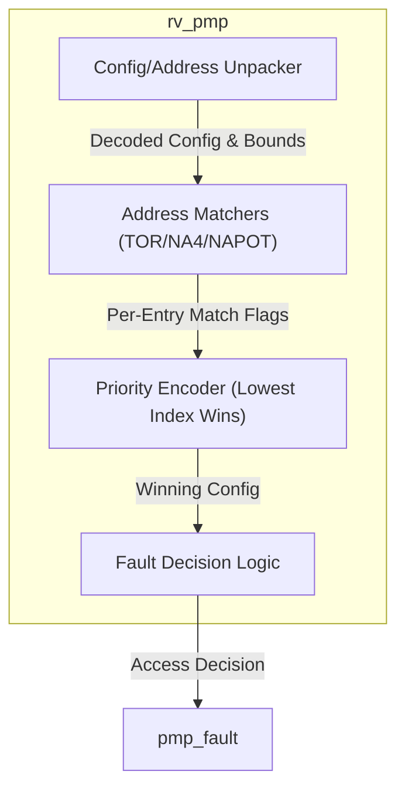
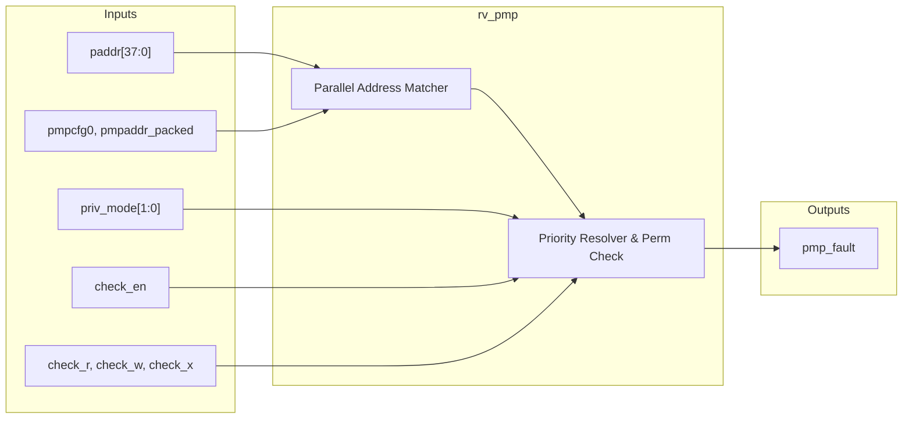

# rv_pmp

## Description

The `rv_pmp` module provides Physical Memory Protection (PMP) for the SMVDU-TITAN-X SoC, fully compliant with the RISC-V Privileged Specification v1.12. Configured to support 8 entries per hardware thread (hart), it is situated architecturally between the MMU's physical address output and the L1 cache. The module dynamically filters memory accesses based on the current privilege mode (Machine, Supervisor, or User) and evaluates permissions against the active PMP rules. It fully supports all addressing modes: OFF, TOR (Top of Range), NA4 (Naturally Aligned 4-byte region), and NAPOT (Naturally Aligned Power-of-Two). By acting as a strict gatekeeper, it prevents unauthorized software from accessing protected memory regions.

## Interface

### Inputs

| Signal | Width | Description |
|--------|-------|-------------|
| clk | 1 | System clock |
| rst_n | 1 | Active-low asynchronous reset |
| paddr | 38 | 38-bit physical address of the current memory access |
| check_r | 1 | High if the access is a load (read) |
| check_w | 1 | High if the access is a store (write) |
| check_x | 1 | High if the access is an instruction fetch (execute) |
| priv_mode | 2 | Current CPU privilege mode (0=U, 1=S, 3=M) |
| check_en | 1 | Indicates a valid memory access check is required |
| pmpcfg0 | 64 | Packed configuration CSR for PMP entries 0-7 |
| pmpcfg2 | 64 | Packed configuration CSR for PMP entries 8-15 (reserved for expansion) |
| pmpaddr_packed | 304 | Packed array of all 8 PMP address registers (8 * 38 bits) |

### Outputs

| Signal | Width | Description |
|--------|-------|-------------|
| pmp_fault | 1 | High when the requested memory access violates PMP rules |

## Functionality

The `rv_pmp` evaluates physical memory addresses (`paddr`) against its 8 configured regions on every valid access (`check_en`). Internally, the `pmpaddr_packed` bus is unpacked into discrete 38-bit bounds, and `pmpcfg0` is sliced into individual 8-bit configurations governing permissions (R, W, X) and address modes (A field: OFF, TOR, NA4, NAPOT) for each entry. The logic concurrently determines if `paddr` falls within the boundaries defined by each active entry's mode. Using a priority encoder, the lowest-numbered matching entry determines the enforced permissions. A fault is signaled (`pmp_fault` = 1) under several conditions: if a matched entry restricts the requested R/W/X access; if the entry is locked (enforced even in M-mode); or if no entries match and the core is executing in S-mode or U-mode. Conversely, M-mode accesses are permitted to bypass PMP checks if no entries match or if the matching entry is unlocked. 

## Hierarchical Block Diagram

## Signal-Level Diagram

