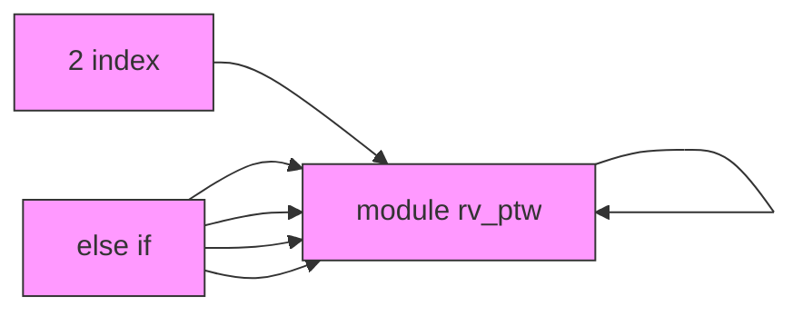

# rv_ptw

## Description

The **rv_ptw** module SPDX-License-Identifier: Apache-2.0
 SMVDU-TITAN-X SoC — Sv39 Page Table Walker
 Iteration 3: 3-level page table walk with AXI4 master interface
 On TLB miss: performs 3 sequential AXI4 reads through page tables
 Issues page faults on invalid/protection-violation PTEs
`timescale 1ns/1ps
`include "params.vh"
`include "isa_pkg.vh"

## Interface

### Inputs

| Name | Width | Description |
|------|-------|-------------|
| wire | 1 | – |
| wire | 1 | – |
| wire | 1 | – |
| wire | 1 | – |
| wire | 1 | – |
| wire | 1 | – |
| wire | 1 | – |
| wire | 1 | – |
| wire | 1 | – |
| wire | 1 | – |
| wire | 1 | – |
| wire | 1 | – |
| wire | 1 | – |
| wire | 1 | – |

### Outputs

| Name | Width | Description |
|------|-------|-------------|
| wire | 1 | – |
| reg | 1 | – |
| reg | 1 | – |
| reg | 1 | – |
| reg | 1 | – |
| reg | 1 | – |
| reg | 1 | – |
| reg | 1 | – |
| reg | 1 | – |
| reg | 1 | – |
| reg | 1 | – |
| reg | 1 | – |
| reg | 1 | – |

## Functionality

*rv_ptw provides the hardware implementation for its designated function within the SoC.*

## Hierarchical Block Diagram (Mermaid)

## Full Signal‑Level Diagram (Mermaid)

```mermaid
graph LR
    classDef sig fill:#eef,stroke:#555,stroke-width:1px;
    classDef port fill:#cfe,stroke:#333,stroke-width:1px;
    wire["wire\n(input, 1)"]:::port
    wire["wire\n(input, 1)"]:::port
    wire["wire\n(input, 1)"]:::port
    wire["wire\n(input, 1)"]:::port
    wire["wire\n(input, 1)"]:::port
    wire["wire\n(input, 1)"]:::port
    wire["wire\n(input, 1)"]:::port
    wire["wire\n(input, 1)"]:::port
    wire["wire\n(input, 1)"]:::port
    wire["wire\n(input, 1)"]:::port
    wire["wire\n(output, 1)"]:::port
    reg["reg\n(output, 1)"]:::port
    reg["reg\n(output, 1)"]:::port
    reg["reg\n(output, 1)"]:::port
    reg["reg\n(output, 1)"]:::port
    reg["reg\n(output, 1)"]:::port
    reg["reg\n(output, 1)"]:::port
    reg["reg\n(output, 1)"]:::port
    reg["reg\n(output, 1)"]:::port
    reg["reg\n(output, 1)"]:::port
    reg["reg\n(output, 1)"]:::port
    wire["wire\n(input, 1)"]:::port
    reg["reg\n(output, 1)"]:::port
    wire["wire\n(input, 1)"]:::port
    reg["reg\n(output, 1)"]:::port
    wire["wire\n(input, 1)"]:::port
    wire["wire\n(input, 1)"]:::port
    ptw_state["ptw_state\n(reg, 3)"]:::sig
    l2_ppn["l2_ppn\n(reg, 44)"]:::sig
    l1_ppn["l1_ppn\n(reg, 44)"]:::sig
    va_saved["va_saved\n(reg, 39)"]:::sig
    asid_saved["asid_saved\n(reg, 16)"]:::sig
    acc_r["acc_r\n(reg, 1)"]:::sig
    acc_w["acc_w\n(reg, 1)"]:::sig
    acc_x["acc_x\n(reg, 1)"]:::sig
    priv_s_saved["priv_s_saved\n(reg, 1)"]:::sig
```

