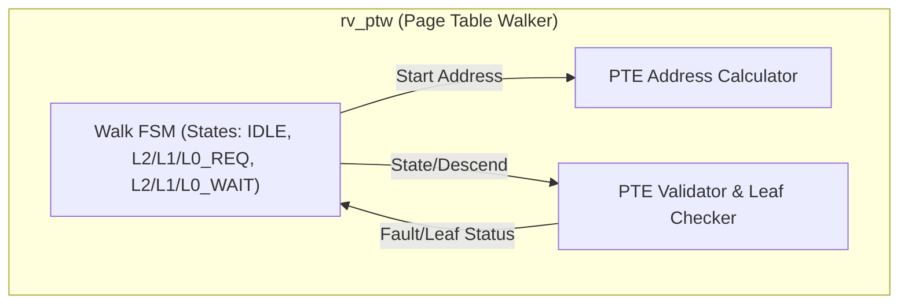
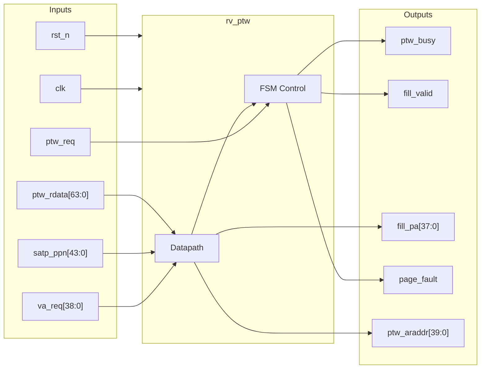

# rv_ptw

## Description

The `rv_ptw` module is an Sv39 Page Table Walker designed for the SMVDU-TITAN-X SoC. Its primary role is to service TLB misses by walking the 3-level RISC-V page table hierarchy in physical memory. It uses an AXI4-Lite master interface to issue sequential memory read requests for Level-2, Level-1, and Level-0 Page Table Entries (PTEs). The internal finite state machine (FSM) gracefully handles 1GB and 2MB superpages, halting the walk early when a leaf PTE is encountered at higher levels. If a fetched PTE is invalid, lacks proper permissions, or fails the leaf checks, the module immediately generates a page fault, effectively trapping the pipeline.

## Interface

### Inputs

| Signal | Width | Description |
|--------|-------|-------------|
| clk | 1 | System clock |
| rst_n | 1 | Active-low asynchronous reset |
| va_req | 39 | 39-bit virtual address requested by the MMU on a TLB miss |
| asid_req | 16 | 16-bit Address Space ID associated with the request |
| satp_ppn | 44 | Root page table Physical Page Number from the `satp` CSR |
| ptw_req | 1 | High when a valid Page Table Walk request is initiated |
| access_r | 1 | High if the faulting access is a read (load) |
| access_w | 1 | High if the faulting access is a write (store) |
| access_x | 1 | High if the faulting access is an instruction fetch |
| priv_s | 1 | High if the current privilege mode is Supervisor |
| ptw_arready | 1 | AXI4 read address ready from the memory interconnect |
| ptw_rvalid | 1 | AXI4 read data valid from the memory interconnect |
| ptw_rdata | 64 | 64-bit Page Table Entry (PTE) fetched from memory |
| ptw_rresp | 2 | AXI4 read response code |

### Outputs

| Signal | Width | Description |
|--------|-------|-------------|
| ptw_busy | 1 | High when the PTW FSM is actively walking the page tables |
| fill_valid | 1 | High when a successful leaf PTE is found and ready to be filled into the TLB |
| fill_va | 39 | The original virtual address associated with the TLB fill |
| fill_pa | 38 | The 38-bit translated physical address (PPN + Page Offset) |
| fill_asid | 16 | The ASID associated with the filled translation |
| fill_perm | 8 | PTE permission and status bits to cache in the TLB |
| fill_level | 2 | Page granularity level (2 for 1GB, 1 for 2MB, 0 for 4KB) |
| page_fault | 1 | High when a page fault exception is detected during the walk |
| fault_addr | 64 | The exact faulting virtual address, formatted for the `stval` CSR |
| fault_type | 2 | Encoded fault type (0=fetch, 1=load, 2=store) |
| ptw_arvalid | 1 | AXI4 read address valid signal |
| ptw_araddr | 40 | AXI4 read address for fetching the PTE |
| ptw_rready | 1 | AXI4 read data ready signal |

## Functionality

The `rv_ptw` module operates as a hardware FSM driven by TLB miss requests. When `ptw_req` is asserted, the FSM transitions from `PTW_IDLE` and calculates the Level-2 PTE address using `satp_ppn` and `VPN[2]`. It issues an AXI4 read via the `ptw_araddr` port. Once the memory responds, the FSM checks the 64-bit PTE. If the PTE is invalid or encodes a protection violation, a `page_fault` is instantly signaled. If the PTE is valid and has Execute, Read, or Write permissions set, it is identified as a leaf PTE (a 1GB superpage at Level-2), and the FSM asserts `fill_valid` with the translation. Otherwise, it extracts the intermediate PPN and repeats the process for Level-1 (using `VPN[1]`) and potentially Level-0 (using `VPN[0]`). At Level-0, the PTE must be a leaf; if not, a fault is generated. Throughout this process, the module stalls the MMU by keeping `ptw_busy` high until the walk completes or faults.

## Hierarchical Block Diagram

## Signal-Level Diagram

