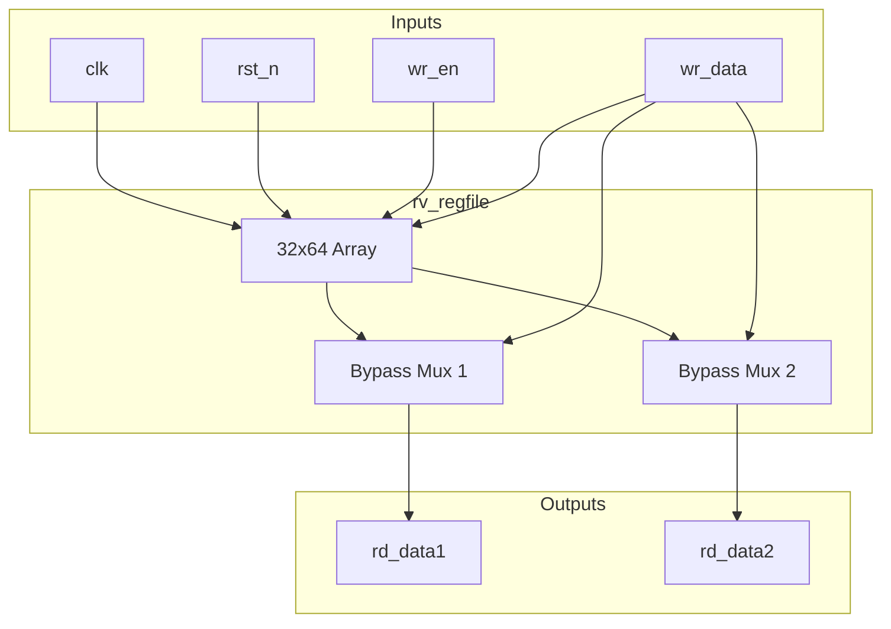
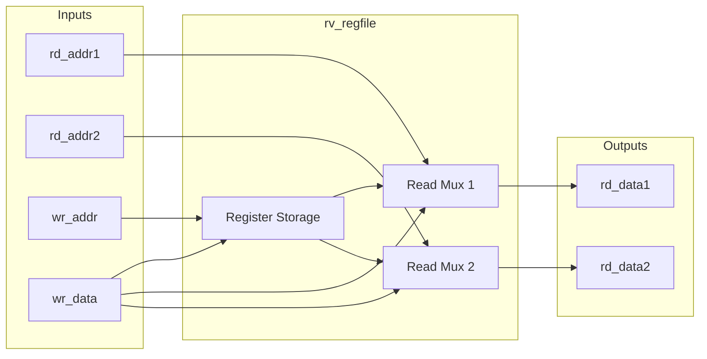

# rv_regfile

## Description
The `rv_regfile` module is a 32x64-bit general-purpose integer register file for the RV64 architecture. It provides two asynchronous read ports for fetching source operands in the decode stage and one synchronous write port for the writeback stage. It includes an internal write-first bypass to handle structural hazards where an instruction reads a register in the same cycle it is being written.

## Interface

### Inputs
| Signal | Width | Description |
|--------|-------|-------------|
| clk | 1 | System clock |
| rst_n | 1 | Active-low asynchronous reset |
| rd_addr1 | 5 | Read port 1 address |
| rd_addr2 | 5 | Read port 2 address |
| wr_en | 1 | Write enable |
| wr_addr | 5 | Write address |
| wr_data | 64 | Write data |

### Outputs
| Signal | Width | Description |
|--------|-------|-------------|
| rd_data1 | 64 | Read port 1 data |
| rd_data2 | 64 | Read port 2 data |

## Functionality
The register file instantiates a 32-entry array of 64-bit registers. Register `x0` is hardwired to zero; writes to it are ignored, and reads always return 0. The read ports are combinational. To support write-before-read forwarding, a multiplexer checks if the write address matches the read address while `wr_en` is high. If so, it forwards `wr_data` directly to the output instead of reading the stale value from the memory array.

## Hierarchical Block Diagram

## Signal-Level Diagram

