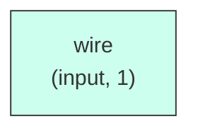

# rv_regfile

## Description

The **rv_regfile** module SPDX-License-Identifier: Apache-2.0
 SMVDU-TITAN-X SoC — RV64 Integer Register File (32 × 64-bit)

 Two asynchronous read ports, one synchronous write port.
 Write-first bypass: a read of the register being written THIS edge
 returns the incoming data, matching the architectural write-before-read
 ordering consumers expect across the WB->decode feedback path.
 x0 is architecturally hardwired to zero — writes to it are dropped and
 reads always return 0 regardless of stored content.
`timescale 1ns/1ps

## Interface

### Inputs

| Name | Width | Description |
|------|-------|-------------|
| wire | 1 | – |
| wire | 1 | – |
| wire | 1 | – |
| wire | 1 | – |
| wire | 1 | – |
| wire | 1 | – |
| wire | 1 | – |

### Outputs

| Name | Width | Description |
|------|-------|-------------|
| wire | 1 | – |
| wire | 1 | – |

## Functionality

*rv_regfile provides the hardware implementation for its designated function within the SoC.*

## Hierarchical Block Diagram (Mermaid)

## Full Signal‑Level Diagram (Mermaid)

