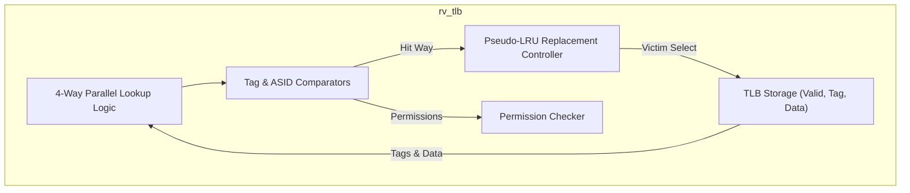
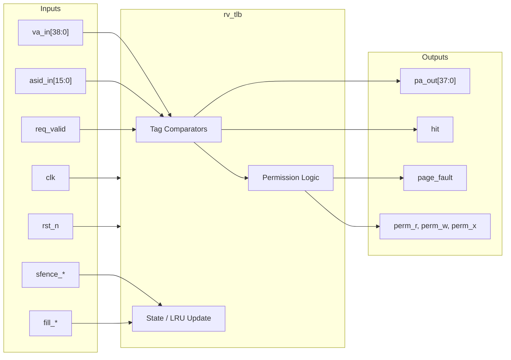

# rv_tlb

## Description

The `rv_tlb` module is a Translation Lookaside Buffer (TLB) implementing the RISC-V Sv39 virtual memory specification. It is structured as a 32-entry, 4-way set-associative cache designed to translate 39-bit virtual addresses into 38-bit physical addresses. To efficiently manage translations across different processes, entries are tagged with a 16-bit Address Space ID (ASID) or marked as global. The TLB caches mappings for 4KB pages as well as 2MB and 1GB superpages seamlessly. A Pseudo-LRU (PLRU) replacement policy ensures high hit rates, while dedicated logic supports fast, targeted invalidations via the `SFENCE.VMA` instruction.

## Interface

### Inputs

| Signal | Width | Description |
|--------|-------|-------------|
| clk | 1 | System clock |
| rst_n | 1 | Active-low asynchronous reset |
| va_in | 39 | Virtual address to be translated |
| asid_in | 16 | Current Address Space ID from the `satp` CSR |
| req_valid | 1 | High when a valid translation request is made |
| fill_valid | 1 | High when the Page Table Walker provides a new translation to insert |
| fill_va | 39 | The virtual address associated with the new fill |
| fill_pa | 38 | The translated physical page number to install |
| fill_asid | 16 | The ASID associated with the new fill |
| fill_perm | 8 | Permission bits (D,A,G,U,X,W,R,V) from the leaf PTE |
| fill_level | 2 | Indicates page size (0=4KB, 1=2MB, 2=1GB) |
| sfence_vma | 1 | Global TLB flush signal triggered by `SFENCE.VMA` |
| sfence_asid | 1 | Flush TLB entries matching a specific ASID |
| sfence_asid_val | 16 | The target ASID for the ASID-specific flush |
| sfence_va | 1 | Flush TLB entries matching a specific virtual address |
| sfence_va_val | 39 | The target virtual address for the VA-specific flush |
| access_r | 1 | High if the requested access is a read |
| access_w | 1 | High if the requested access is a write |
| access_x | 1 | High if the requested access is an instruction fetch |
| priv_s | 1 | Current privilege mode is Supervisor (0 for User mode) |

### Outputs

| Signal | Width | Description |
|--------|-------|-------------|
| pa_out | 38 | The successfully translated 38-bit physical address |
| hit | 1 | High when the requested `va_in` matches a valid TLB entry |
| perm_r | 1 | Read permission granted by the matching TLB entry |
| perm_w | 1 | Write permission granted by the matching TLB entry |
| perm_x | 1 | Execute permission granted by the matching TLB entry |
| perm_u | 1 | User-mode access permitted by the matching TLB entry |
| page_fault | 1 | High when a matched TLB entry lacks the required permissions for the access |

## Functionality

The TLB processes lookup requests continuously. Upon receiving `req_valid`, it extracts the set index from the virtual address (`va_in`) and concurrently compares the Virtual Page Number (VPN) against the 4 ways within that set. The comparison dynamically accounts for page sizes; for a 1GB superpage, only the top 9 VPN bits are checked, whereas all 27 bits are checked for a 4KB page. An entry hits if it is valid, the VPN matches, and either the ASID matches `asid_in` or the global bit is set. If a hit occurs, `pa_out` is generated by concatenating the cached PPN with the page offset, and a PLRU state update is triggered. Simultaneously, access control logic cross-references the requested access types (`access_r/w/x`) and privilege mode (`priv_s`) against the cached permissions. If the required privileges are missing, `page_fault` is asserted. On a miss, external logic triggers a PTW; once resolved, `fill_valid` drives the new PTE into the set, evicting the least recently used way. The module also comprehensively handles TLB maintenance by clearing matching valid bits during `SFENCE.VMA` operations.

## Hierarchical Block Diagram

## Signal-Level Diagram

