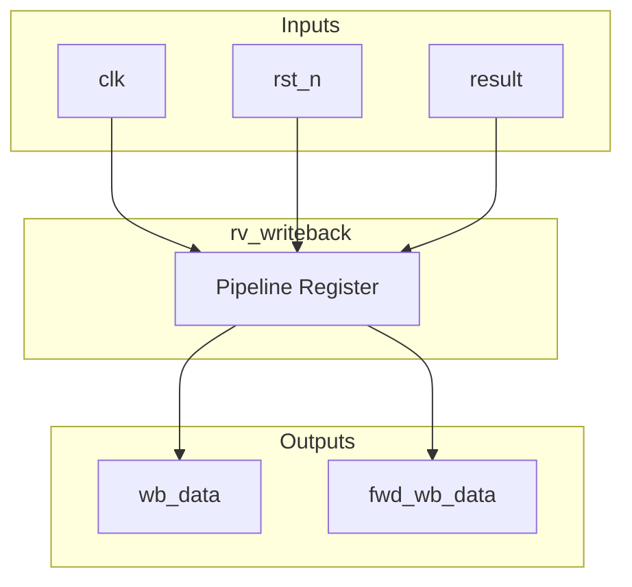
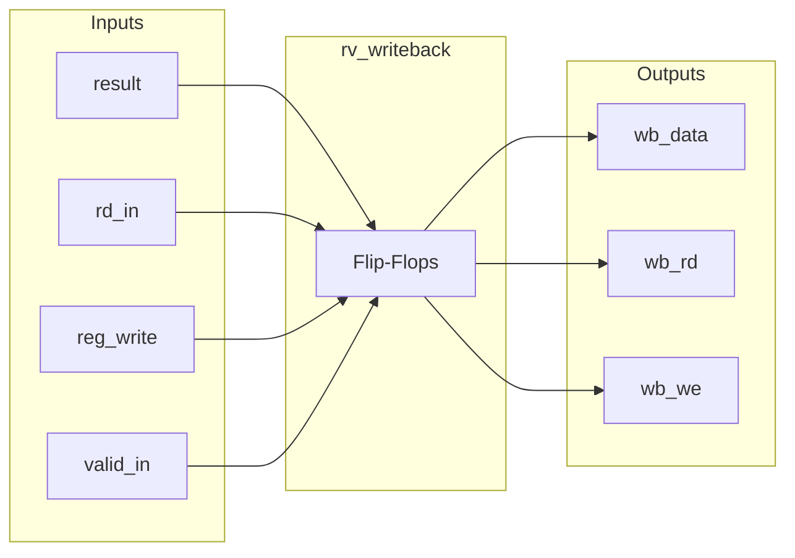

# rv_writeback

## Description
The `rv_writeback` module is the final stage of the pipeline. It simply registers the incoming result from the memory stage and drives the write port of the register file (located in the decode stage). It also provides a forwarding path back to the execute stage to resolve distance-2 data hazards.

## Interface

### Inputs
| Signal | Width | Description |
|--------|-------|-------------|
| clk | 1 | System clock |
| rst_n | 1 | Active-low asynchronous reset |
| result | 64 | Result data from memory stage |
| rd_in | 5 | Destination register address |
| reg_write | 1 | Register write enable |
| valid_in | 1 | Input valid signal |

### Outputs
| Signal | Width | Description |
|--------|-------|-------------|
| wb_data | 64 | Data to be written to the register file |
| wb_rd | 5 | Destination register address for the register file |
| wb_we | 1 | Write enable for the register file (forces 0 for x0) |
| fwd_wb_data | 64 | Forwarded data for earlier pipeline stages |
| fwd_wb_rd | 5 | Forwarded destination register |
| fwd_wb_valid | 1 | Forwarding valid signal |

## Functionality
This module captures the execution result and destination information into pipeline registers on the clock edge. It outputs these registered values as write signals to the integer register file. A check is included to disable writes to register `x0`. The same outputs are exposed combinationally as forwarding paths (`fwd_wb_*`) to provide the freshest data to dependent instructions in the execute stage before they are formally written to the register file.

## Hierarchical Block Diagram

## Signal-Level Diagram

