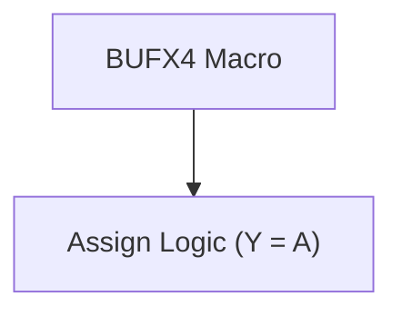
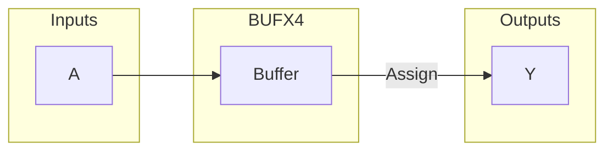

# BUFX4 / buf_macros

## Description

`buf_macros.v` defines a simple structural buffer macro (`BUFX4`) for the SMVDU-TITAN-X SoC. It is typically used for driving high-fanout nets (such as resets, flushes, or clocks) across large pipeline registers to meet strict physical synthesis and timing closure constraints. In RTL simulation, this module acts merely as a transparent continuous assignment passing the input `A` to the output `Y`. It is guarded by an `ifndef TITANX_STDCELL_STUBS` directive to prevent conflicts during synthesis or simulation if the standard cell library stubs are already included in the compilation unit.

## Interface

### Inputs

| Signal | Width | Description |
|--------|-------|-------------|
| A | 1 | Logical input signal to be buffered |

### Outputs

| Signal | Width | Description |
|--------|-------|-------------|
| Y | 1 | Buffered logical output signal |

## Functionality

The module implements a single continuous assignment (`assign Y = A;`). During physical implementation, the synthesis tool maps this structural instantiation directly to an actual high-drive standard cell buffer (e.g., a BUFX4 cell from a typical 180nm standard cell library). The explicit instantiation in the RTL helps the designer manually replicate logic to relieve high fanout constraints (like the flush signal tree in a wide pipeline decode register).

## Hierarchical Block Diagram

## Signal-Level Diagram

