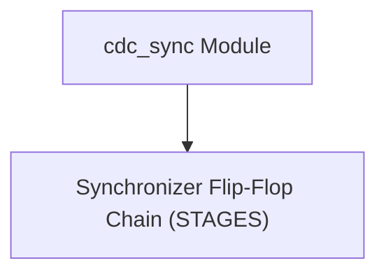
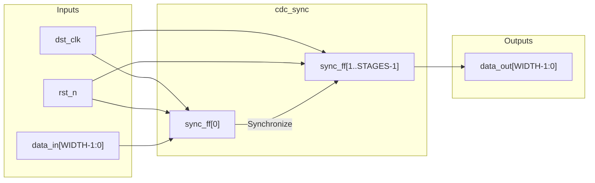

# cdc_sync

## Description

`cdc_sync` is a generic parameterized Clock Domain Crossing (CDC) synchronizer for the SMVDU-TITAN-X SoC. It is designed to safely transfer signals from an asynchronous clock domain into the destination clock domain (`dst_clk`) by passing them through a chain of flip-flops to mitigate metastability. The number of synchronization stages is configurable via the `STAGES` parameter (defaulting to 2), and it can handle arbitrary bus widths via the `WIDTH` parameter. The flip-flops are tagged with the `ASYNC_REG` attribute to guide synthesis tools into packing the synchronizer chain closely, reducing routing delays and maximizing mean time between failures (MTBF).

## Interface

### Inputs

| Signal | Width | Description |
|--------|-------|-------------|
| dst_clk | 1 | Destination clock domain signal |
| rst_n | 1 | Active-low asynchronous reset |
| data_in | WIDTH | Input data from the asynchronous/source clock domain |

### Outputs

| Signal | Width | Description |
|--------|-------|-------------|
| data_out | WIDTH | Synchronized data output in the destination clock domain |

## Functionality

The module implements a shift register of flip-flops parameterized by `STAGES`. Upon the rising edge of `dst_clk`, the first stage `sync_ff[0]` captures the raw, asynchronous `data_in`. On each subsequent cycle, the data propagates to the next stage (`sync_ff[1]`, `sync_ff[2]`, etc.) until it reaches the final stage, which drives `data_out`. If metastability occurs at the first stage, the subsequent stages provide necessary resolution time for the signal to settle to a valid logic level before being consumed by the destination domain logic. During an asynchronous reset (`rst_n` low), every stage in the synchronizer chain is properly cleared to zero.

## Hierarchical Block Diagram

## Signal-Level Diagram

