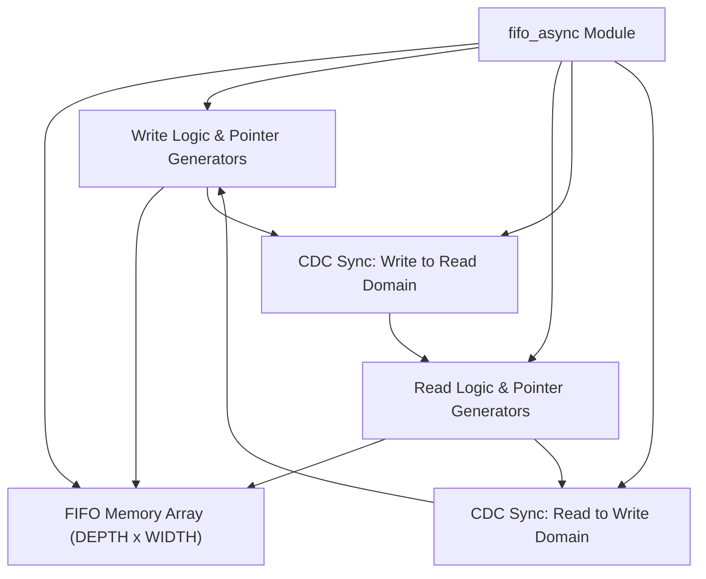
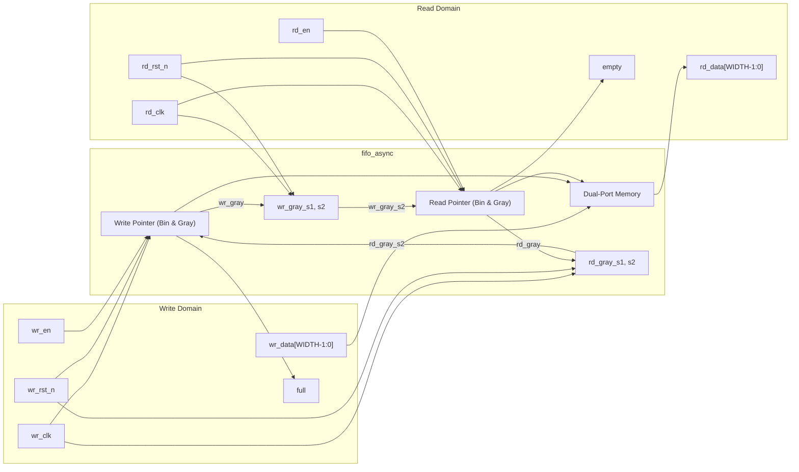

# fifo_async

## Description

`fifo_async` is a parameterized asynchronous FIFO designed for the SMVDU-TITAN-X SoC to reliably pass data between two independent clock domains. It utilizes robust Clock Domain Crossing (CDC) techniques by maintaining read and write pointers in both binary and Gray-code formats. The Gray-coded pointers are transferred across clock domains using dedicated two-stage flip-flop synchronizers (tagged with `ASYNC_REG`), ensuring that only one bit changes at a time. This prevents multi-bit metastability errors. The module supports configurable data widths and depths, seamlessly generating the required address widths and managing full/empty flags through Gray-code pointer comparisons.

## Interface

### Inputs

| Signal | Width | Description |
|--------|-------|-------------|
| wr_clk | 1 | Write domain clock |
| wr_rst_n | 1 | Write domain active-low asynchronous reset |
| wr_en | 1 | Write enable signal; active high |
| wr_data | WIDTH | Data to be written into the FIFO |
| rd_clk | 1 | Read domain clock |
| rd_rst_n | 1 | Read domain active-low asynchronous reset |
| rd_en | 1 | Read enable signal; active high |

### Outputs

| Signal | Width | Description |
|--------|-------|-------------|
| full | 1 | FIFO full flag in the write clock domain |
| rd_data | WIDTH | Data read from the FIFO |
| empty | 1 | FIFO empty flag in the read clock domain |

## Functionality

The FIFO memory is modeled as an array of registers (`mem`). The write and read logic operate in their respective isolated clock domains (`wr_clk` and `rd_clk`). Upon a valid write operation (`wr_en` high and not `full`), data is written to memory, and the write binary pointer increments. A combinational function converts this binary pointer to a Gray-coded pointer (`wr_gray`), which is then registered and safely passed into the read domain through a two-stage synchronizer (`wr_gray_s1`, `wr_gray_s2`). The read operation behaves similarly, converting the read pointer to Gray-code and synchronizing it back to the write domain. The `empty` flag is asserted when the read pointer matches the synchronized write pointer. The `full` flag is asserted when the write pointer matches the synchronized read pointer with the upper two bits inverted (indicating the write pointer has wrapped exactly one cycle ahead).

## Hierarchical Block Diagram

## Signal-Level Diagram

