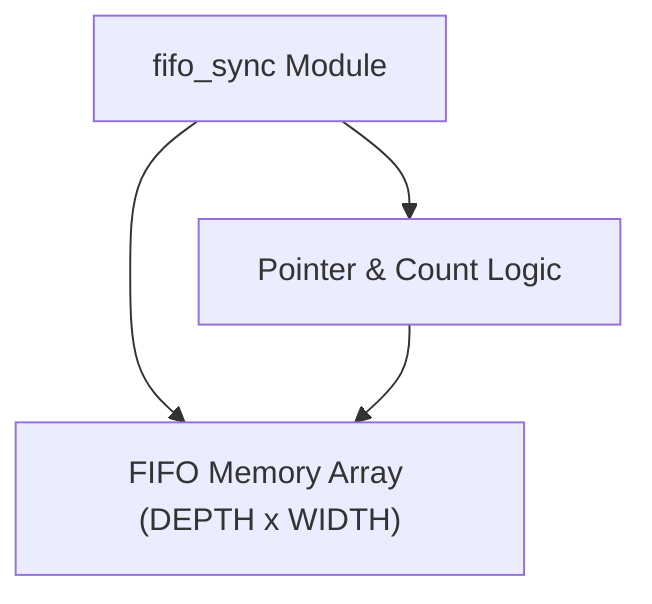
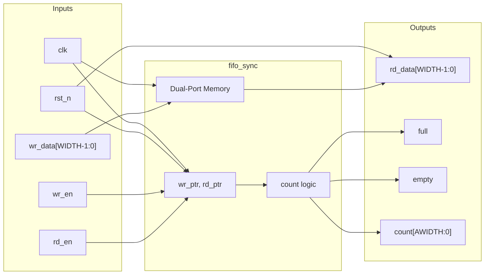

# fifo_sync

## Description

`fifo_sync` is a generic, fully parameterized synchronous FIFO for the SMVDU-TITAN-X SoC. It provides a simple, robust queue for buffering data within a single clock domain. Configurable for arbitrary data width (`WIDTH`) and capacity (`DEPTH`), the module automatically computes the required address bus sizes using the `$clog2` function. It features built-in overflow and underflow protection by explicitly masking `wr_en` against the `full` flag, and `rd_en` against the `empty` flag. An explicit element `count` output is provided to allow downstream modules to inspect the exact queue occupancy.

## Interface

### Inputs

| Signal | Width | Description |
|--------|-------|-------------|
| clk | 1 | System clock |
| rst_n | 1 | Active-low asynchronous reset |
| wr_en | 1 | Write enable signal; requests pushing data into the FIFO |
| rd_en | 1 | Read enable signal; requests popping data from the FIFO |
| wr_data | WIDTH | Data to be written into the FIFO |

### Outputs

| Signal | Width | Description |
|--------|-------|-------------|
| rd_data | WIDTH | Data read out of the FIFO |
| full | 1 | Flag indicating the FIFO is full; further writes will be ignored |
| empty | 1 | Flag indicating the FIFO is empty; further reads will be ignored |
| count | AWIDTH+1 | The exact number of entries currently stored in the FIFO |

## Functionality

The FIFO memory is implemented as a behavioral register array (`mem`). Write and read pointers are sized with an extra MSB to gracefully distinguish between full and empty states via straightforward arithmetic subtraction (`wr_ptr - rd_ptr`). On a clock edge, if a valid write is requested (`wr_en` and not `full`), `wr_data` is stored into the memory array at the `wr_ptr` index, and `wr_ptr` is incremented. Concurrently, if a valid read is requested (`rd_en` and not `empty`), the data at `rd_ptr` is registered into the `rd_data` output buffer, and `rd_ptr` is incremented. The difference between the two pointers directly yields the current occupancy (`count`), which directly drives the `full` and `empty` combinational flags.

## Hierarchical Block Diagram

## Signal-Level Diagram

