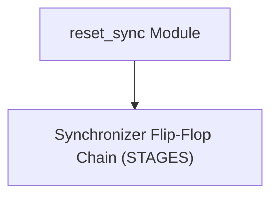
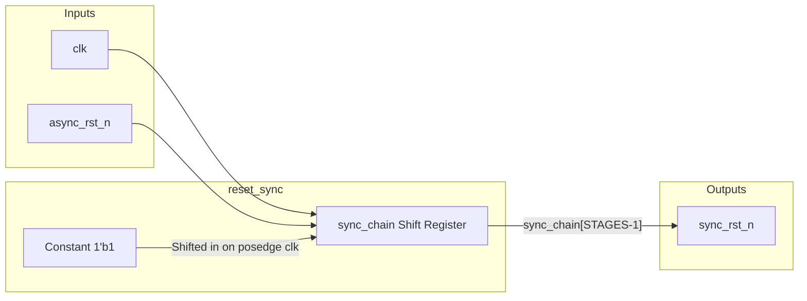

# reset_sync

## Description

`reset_sync` is a highly crucial utility module for the SMVDU-TITAN-X SoC designed to synchronize an asynchronous active-low reset signal to a specific clock domain. Its purpose is to guarantee that the deassertion (release) of a global or external reset is perfectly synchronized to the target clock, preventing recovery and removal timing violations in the destination logic. When the asynchronous reset is asserted, the output immediately goes low. When it is released, the release propagates synchronously through a configured number of flip-flop stages (default 2, marked with `ASYNC_REG`) before finally deasserting the output.

## Interface

### Inputs

| Signal | Width | Description |
|--------|-------|-------------|
| clk | 1 | Destination clock domain |
| async_rst_n | 1 | Asynchronous active-low reset input |

### Outputs

| Signal | Width | Description |
|--------|-------|-------------|
| sync_rst_n | 1 | Synchronized active-low reset output |

## Functionality

The design employs a simple shift register parameterized by `STAGES`. During the assertion phase (when `async_rst_n` goes low), the entire flip-flop chain is asynchronously cleared to zero. This zero immediately passes to `sync_rst_n`, immediately asserting the reset for the target clock domain. Once `async_rst_n` is released (goes high), the shift register begins shifting in a constant `1` on every rising edge of `clk`. It takes exactly `STAGES` clock cycles for the logic `1` to propagate through the chain to the output. This delayed, synchronous release eliminates the risk of flip-flops in the target domain entering a metastable state due to a reset release occurring too close to the active clock edge.

## Hierarchical Block Diagram

## Signal-Level Diagram

