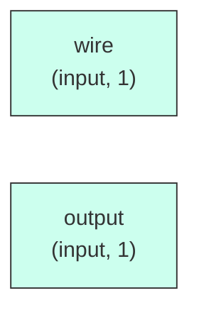

# reset_sync

## Description

The **reset_sync** module SPDX-License-Identifier: Apache-2.0
 SMVDU-TITAN-X SoC — Reset Synchronizer
 Synchronizes asynchronous active-low reset deassertion to a clock domain.
 Two-stage pipeline ensures metastability-free reset release.
`timescale 1ns/1ps

## Interface

### Inputs

| Name | Width | Description |
|------|-------|-------------|
| wire | 1 | – |
| wire | 1 | – |
| output | 1 | – |

## Functionality

*reset_sync provides the hardware implementation for its designated function within the SoC.*

## Hierarchical Block Diagram (Mermaid)

```mermaid
graph LR
    classDef sub fill:#f9f,stroke:#333,stroke-width:1px;
```

## Full Signal‑Level Diagram (Mermaid)


