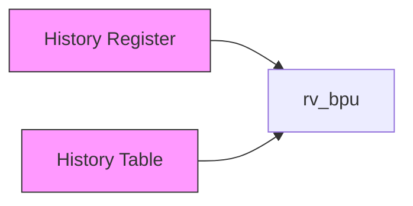
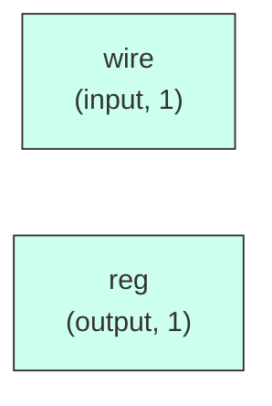

# rv_bpu

## Description

The **rv_bpu** module SPDX-License-Identifier: Apache-2.0
 SMVDU-TITAN-X SoC — Branch Prediction Unit
 Iteration 3: Tournament predictor — Gshare + Local History + BTB
 Target: SCL 180nm, 125-200 MHz
 Architecture:
   - Local History Table: 2-bit saturating counter, 2K entries, 11-bit index
   - Global History Register (GHR): 12-bit shift register
   - Gshare predictor: PC[12:1] XOR GHR → 4K saturating counter table
   - Tournament meta-predictor: selects between local and global
   - BTB: 512-entry direct-mapped branch target buffer
`timescale 1ns/1ps
`include "params.vh"

## Interface

### Inputs

| Name | Width | Description |
|------|-------|-------------|
| wire | 1 | – |
| wire | 1 | – |
| wire | 1 | – |
| wire | 1 | – |
| wire | 1 | – |
| wire | 1 | – |
| wire | 1 | – |
| wire | 1 | – |
| wire | 1 | – |
| wire | 1 | – |

### Outputs

| Name | Width | Description |
|------|-------|-------------|
| reg | 1 | – |
| reg | 1 | – |
| reg | 1 | – |

## Functionality

*rv_bpu provides the hardware implementation for its designated function within the SoC.*

## Hierarchical Block Diagram (Mermaid)

## Full Signal‑Level Diagram (Mermaid)

