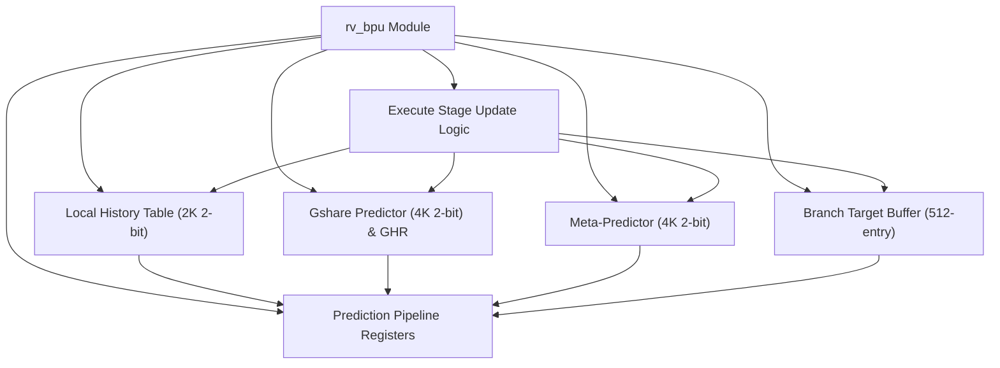
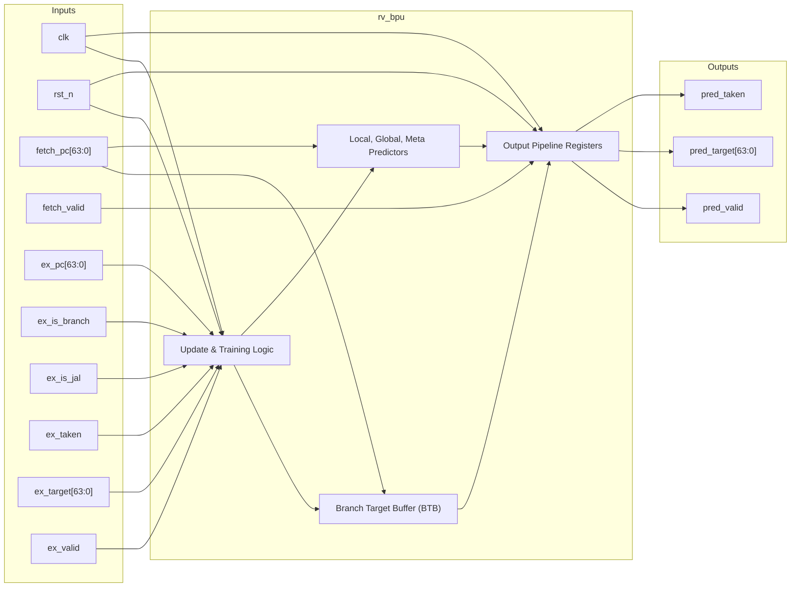

# rv_bpu

## Description

`rv_bpu` is the Branch Prediction Unit for the SMVDU-TITAN-X RISC-V SoC, employing a sophisticated Tournament Predictor architecture. It combines a Local History Table (2K entries) and a Gshare Predictor (4K entries indexed by PC XORed with a 12-bit Global History Register) to independently predict branch outcomes. A 4K-entry Meta-Predictor evaluates the accuracy of both predictors in real time, dynamically selecting the most reliable one for a given branch. Finally, a 512-entry direct-mapped Branch Target Buffer (BTB) supplies the predicted jump target. Predictions are registered and delivered in the next cycle, while the predictor's state is asynchronously updated with precise resolution data provided by the execute stage.

## Interface

### Inputs

| Signal | Width | Description |
|--------|-------|-------------|
| clk | 1 | System clock |
| rst_n | 1 | Active-low asynchronous reset |
| fetch_pc | 64 | Program counter of the instruction currently being fetched to index predictors |
| fetch_valid | 1 | Flag indicating a valid fetch request is present |
| ex_pc | 64 | Program counter of the resolving branch instruction from the execute stage |
| ex_is_branch | 1 | Flag indicating the resolving instruction is a conditional branch |
| ex_is_jal | 1 | Flag indicating the resolving instruction is an unconditional jump (JAL) |
| ex_taken | 1 | Actual outcome of the branch (1 if taken, 0 if not taken) |
| ex_target | 64 | Actual target address resolved by the execute stage |
| ex_valid | 1 | Flag indicating valid resolution information from the execute stage |

### Outputs

| Signal | Width | Description |
|--------|-------|-------------|
| pred_taken | 1 | Registered predicted outcome (1 if taken, 0 if not taken) |
| pred_target | 64 | Registered predicted branch target address from the BTB |
| pred_valid | 1 | Flag indicating a BTB hit, meaning the prediction is valid and usable |

## Functionality

The module leverages three concurrent 2-bit saturating counter arrays to make predictions. The Local predictor indexes into a 2K-entry table using PC bits, while the Global (Gshare) predictor hashes the PC with a 12-bit shift register (GHR) to index a 4K-entry table. A third Meta-Predictor table selects between the Local and Global predictions based on historical accuracy. The BTB verifies the branch's presence through tag matching. Upon prediction, outcomes are latched to outputs (`pred_taken`, `pred_target`, `pred_valid`). When the execute stage resolves a branch, it asserts `ex_valid`, prompting the BPU to update the appropriate 2-bit counters in all three tables based on the actual outcome, shift the new history into the GHR, and update the BTB tag and target fields for future queries.

## Hierarchical Block Diagram

## Signal-Level Diagram

