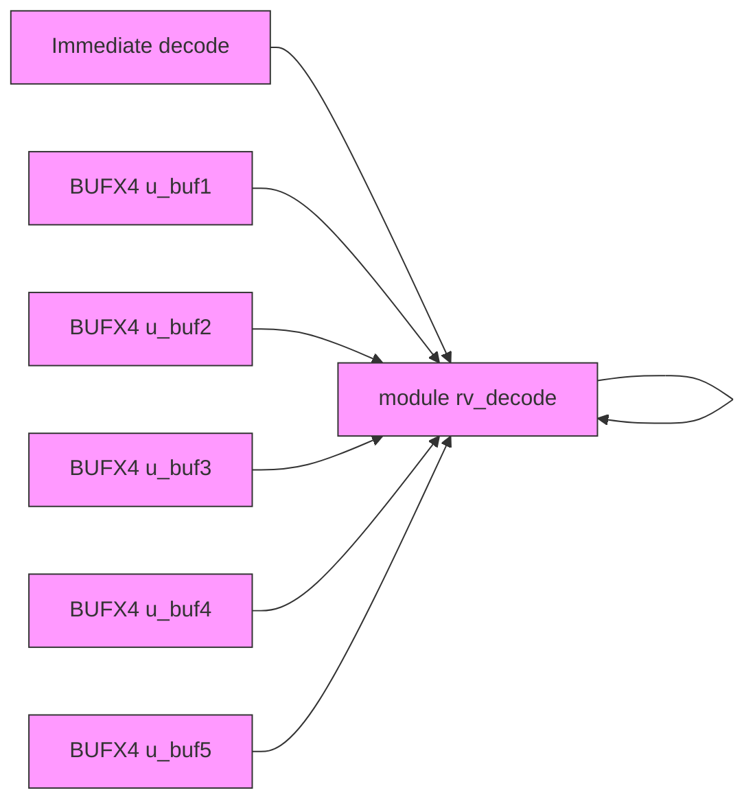

# rv_decode

## Description

The **rv_decode** module SPDX-License-Identifier: Apache-2.0
 SMVDU-TITAN-X SoC — RV64I Decode + Register File Stage
`timescale 1ns/1ps
 Shared ISA constants — single source of truth shared with execute/top.
 (isa_constants.vh was a drifted 4-bit localparam duplicate; retired.)
 Included at file scope, matching every other consumer of this header.
`include "isa_pkg.vh"

## Interface

### Inputs

| Name | Width | Description |
|------|-------|-------------|
| wire | 1 | – |
| wire | 1 | – |
| wire | 1 | – |
| wire | 1 | – |
| wire | 1 | – |
| wire | 1 | – |
| wire | 1 | – |
| wire | 1 | – |
| wire | 1 | – |
| wire | 1 | – |

### Outputs

| Name | Width | Description |
|------|-------|-------------|
| reg | 1 | – |
| reg | 1 | – |
| reg | 1 | – |
| reg | 1 | – |
| reg | 1 | – |
| reg | 1 | – |
| reg | 1 | – |
| reg | 1 | – |
| reg | 1 | – |
| reg | 1 | – |
| reg | 1 | – |
| reg | 1 | – |
| reg | 1 | – |
| reg | 1 | – |
| reg | 1 | – |
| reg | 1 | – |
| reg | 1 | – |
| reg | 1 | – |
| reg | 1 | – |
| reg | 1 | – |
| reg | 1 | – |
| reg | 1 | – |
| reg | 1 | – |

## Functionality

*rv_decode provides the hardware implementation for its designated function within the SoC.*

## Hierarchical Block Diagram (Mermaid)

## Full Signal‑Level Diagram (Mermaid)

```mermaid
graph LR
    classDef sig fill:#eef,stroke:#555,stroke-width:1px;
    classDef port fill:#cfe,stroke:#333,stroke-width:1px;
    wire["wire\n(input, 1)"]:::port
    wire["wire\n(input, 1)"]:::port
    wire["wire\n(input, 1)"]:::port
    wire["wire\n(input, 1)"]:::port
    wire["wire\n(input, 1)"]:::port
    wire["wire\n(input, 1)"]:::port
    wire["wire\n(input, 1)"]:::port
    wire["wire\n(input, 1)"]:::port
    wire["wire\n(input, 1)"]:::port
    wire["wire\n(input, 1)"]:::port
    reg["reg\n(output, 1)"]:::port
    reg["reg\n(output, 1)"]:::port
    reg["reg\n(output, 1)"]:::port
    reg["reg\n(output, 1)"]:::port
    reg["reg\n(output, 1)"]:::port
    reg["reg\n(output, 1)"]:::port
    reg["reg\n(output, 1)"]:::port
    reg["reg\n(output, 1)"]:::port
    reg["reg\n(output, 1)"]:::port
    reg["reg\n(output, 1)"]:::port
    reg["reg\n(output, 1)"]:::port
    reg["reg\n(output, 1)"]:::port
    reg["reg\n(output, 1)"]:::port
    reg["reg\n(output, 1)"]:::port
    reg["reg\n(output, 1)"]:::port
    reg["reg\n(output, 1)"]:::port
    reg["reg\n(output, 1)"]:::port
    reg["reg\n(output, 1)"]:::port
    reg["reg\n(output, 1)"]:::port
    reg["reg\n(output, 1)"]:::port
    reg["reg\n(output, 1)"]:::port
    reg["reg\n(output, 1)"]:::port
    reg["reg\n(output, 1)"]:::port
    imm_comb["imm_comb\n(reg, 64)"]:::sig
    alu_op_comb["alu_op_comb\n(reg, 5)"]:::sig
    mem_r_comb["mem_r_comb\n(reg, 1)"]:::sig
    mem_w_comb["mem_w_comb\n(reg, 1)"]:::sig
    reg_w_comb["reg_w_comb\n(reg, 1)"]:::sig
    br_comb["br_comb\n(reg, 1)"]:::sig
    jal_comb["jal_comb\n(reg, 1)"]:::sig
    jalr_comb["jalr_comb\n(reg, 1)"]:::sig
    csr_comb["csr_comb\n(reg, 1)"]:::sig
    ec_comb["ec_comb\n(reg, 1)"]:::sig
    eb_comb["eb_comb\n(reg, 1)"]:::sig
    mret_comb["mret_comb\n(reg, 1)"]:::sig
    csrop_comb["csrop_comb\n(reg, 2)"]:::sig
    rf_rs1_data["rf_rs1_data\n(wire, 64)"]:::sig
    rf_rs2_data["rf_rs2_data\n(wire, 64)"]:::sig
    flush_buf1["flush_buf1\n(wire, 1)"]:::sig
    flush_buf2["flush_buf2\n(wire, 1)"]:::sig
    flush_buf3["flush_buf3\n(wire, 1)"]:::sig
    flush_buf4["flush_buf4\n(wire, 1)"]:::sig
    flush_buf5["flush_buf5\n(wire, 1)"]:::sig
```

