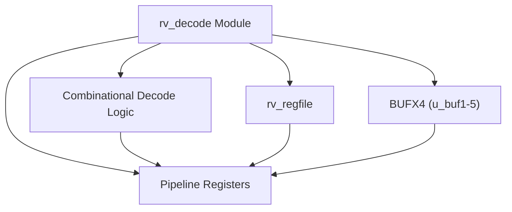
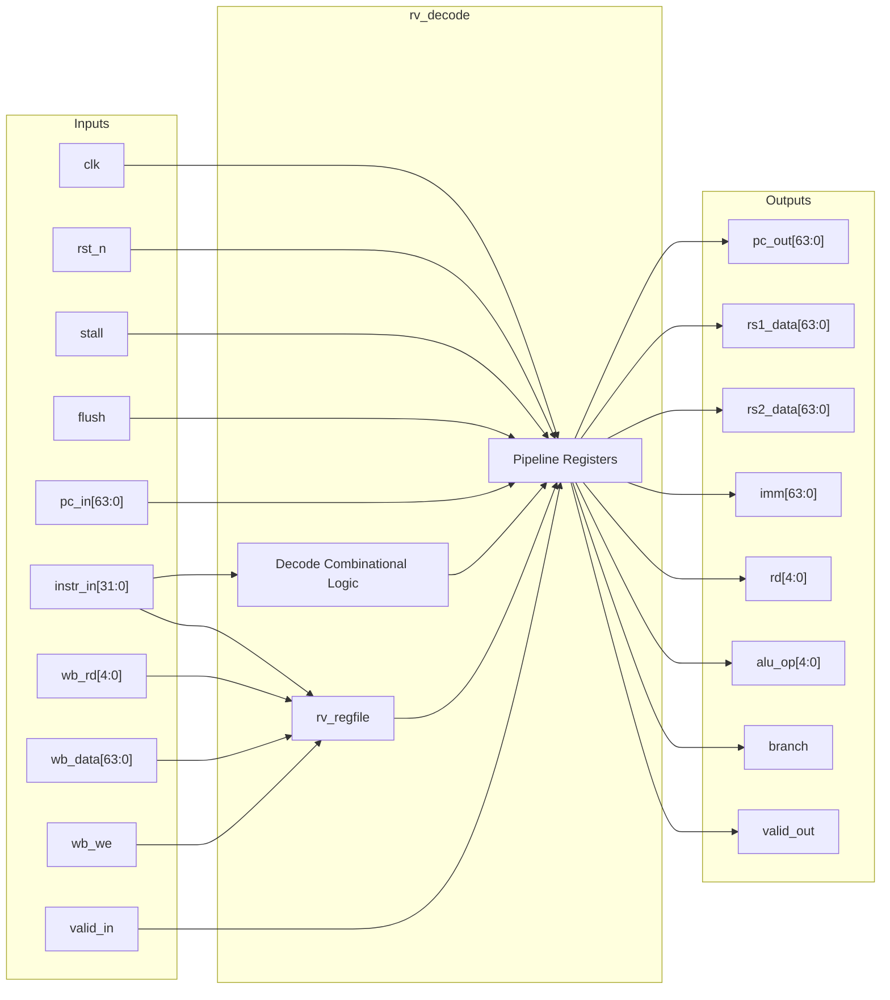

# rv_decode

## Description

`rv_decode` is the instruction decode and register file stage for the SMVDU-TITAN-X RISC-V (RV64I) SoC. It is responsible for taking fetched 32-bit instructions and decoding them into microarchitectural control signals, immediate values, and register addresses. The module instantiates the `rv_regfile` sub-module to read source register operands and supports internal forwarding from the writeback stage to resolve data hazards. Additionally, it features high-fanout buffering for the `flush` signal using `BUFX4` macros and includes full decode support for the M-extension (multiply/divide) as well as system instructions (CSR operations, `ecall`, `ebreak`, `mret`). 

## Interface

### Inputs

| Signal | Width | Description |
|--------|-------|-------------|
| clk | 1 | System clock |
| rst_n | 1 | Active-low asynchronous reset |
| stall | 1 | Pipeline stall signal to freeze the decode stage |
| flush | 1 | Pipeline flush signal to clear the decode stage |
| pc_in | 64 | Program counter value from the fetch stage |
| instr_in | 32 | Fetched instruction from the fetch stage |
| valid_in | 1 | Valid flag indicating valid input from the fetch stage |
| wb_rd | 5 | Destination register address from the writeback stage |
| wb_data | 64 | Data from the writeback stage to be written to the register file |
| wb_we | 1 | Write enable signal from the writeback stage |

### Outputs

| Signal | Width | Description |
|--------|-------|-------------|
| pc_out | 64 | Program counter value passed to the execute stage |
| rs1_data | 64 | Source register 1 data passed to the execute stage |
| rs2_data | 64 | Source register 2 data passed to the execute stage |
| imm | 64 | Sign-extended immediate value passed to the execute stage |
| rd | 5 | Destination register address passed to the execute stage |
| rs1_addr | 5 | Source register 1 address |
| rs2_addr | 5 | Source register 2 address |
| funct3 | 3 | Instruction funct3 field passed to the execute stage |
| funct7 | 7 | Instruction funct7 field passed to the execute stage |
| opcode | 7 | Instruction opcode field passed to the execute stage |
| alu_op | 5 | Decoded ALU operation code |
| mem_read | 1 | Control signal indicating a memory read operation |
| mem_write | 1 | Control signal indicating a memory write operation |
| reg_write | 1 | Control signal indicating a register file write operation |
| branch | 1 | Control signal indicating a conditional branch instruction |
| jal | 1 | Control signal indicating a JAL instruction |
| jalr | 1 | Control signal indicating a JALR instruction |
| is_csr | 1 | Control signal indicating a CSR instruction |
| csr_op | 2 | Decoded CSR operation type |
| is_ecall | 1 | Control signal indicating an ECALL instruction |
| is_ebreak | 1 | Control signal indicating an EBREAK instruction |
| is_mret | 1 | Control signal indicating an MRET instruction |
| valid_out | 1 | Valid flag indicating valid instruction delivery to execute |

## Functionality

The module combinationally extracts instruction fields (`opcode`, `funct3`, `funct7`, `rs1`, `rs2`, `rd`) and decodes them to generate control signals (e.g., `alu_op`, `mem_read`, `reg_write`, `is_csr`). It supports various instruction formats, sign-extending immediates accurately for RV64I (including correctly zero-padding upper bits for specific instructions). The `rv_regfile` sub-module is instantiated to handle register reads, while writeback bypassing ensures that if the writeback stage writes to a register currently being read, the new data is immediately forwarded. Control signals and operand data are then latched into pipeline registers. The `flush` input is buffered via `BUFX4` macros to meet timing constraints across the wide pipeline register.

## Hierarchical Block Diagram

## Signal-Level Diagram

