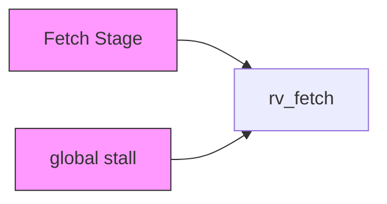
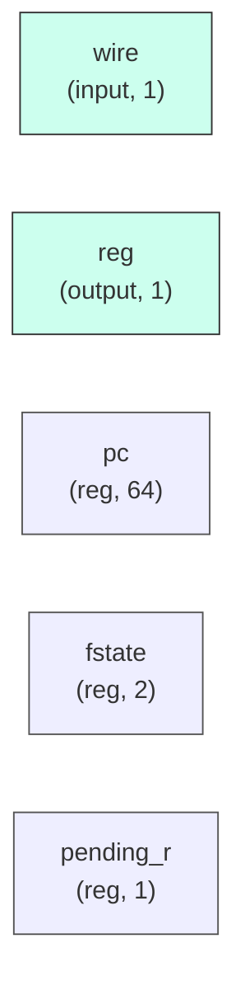

# rv_fetch

## Description

The **rv_fetch** module SPDX-License-Identifier: Apache-2.0
 SMVDU-Titan-X SoC — RISC-V Instruction Fetch Stage (RV64I)

 Single-outstanding AXI-Lite fetch FSM with redirect-safe teardown:
 on a redirect the unit first drains any orphaned transaction belonging
 to the abandoned stream (an unaccepted AR, or an R beat already owed)
 before issuing the redirected fetch. Without that drain the stale
 instruction would be paired with the NEW pc_out — silent execution of
 the wrong instruction at the wrong architectural address.
`timescale 1ns/1ps
`include "params.vh"

## Interface

### Inputs

| Name | Width | Description |
|------|-------|-------------|
| wire | 1 | – |
| wire | 1 | – |
| wire | 1 | – |
| wire | 1 | – |
| wire | 1 | – |
| wire | 1 | – |
| wire | 1 | – |
| wire | 1 | – |
| wire | 1 | – |
| wire | 1 | – |

### Outputs

| Name | Width | Description |
|------|-------|-------------|
| reg | 1 | – |
| reg | 1 | – |
| wire | 1 | – |
| reg | 1 | – |
| reg | 1 | – |
| reg | 1 | – |

## Functionality

*rv_fetch provides the hardware implementation for its designated function within the SoC.*

## Hierarchical Block Diagram (Mermaid)

## Full Signal‑Level Diagram (Mermaid)

