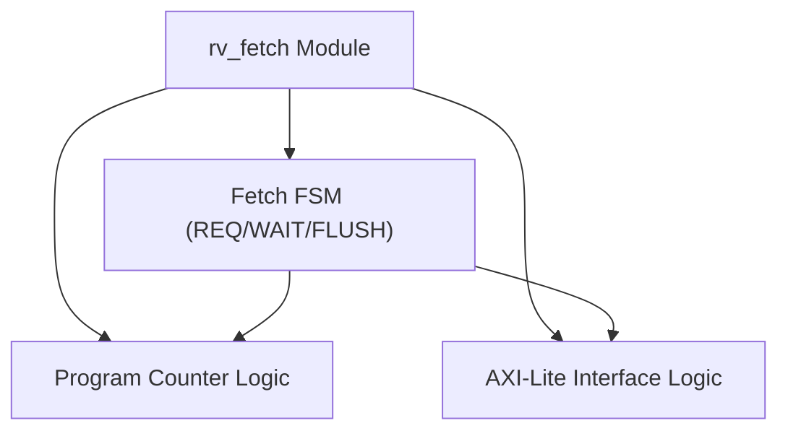
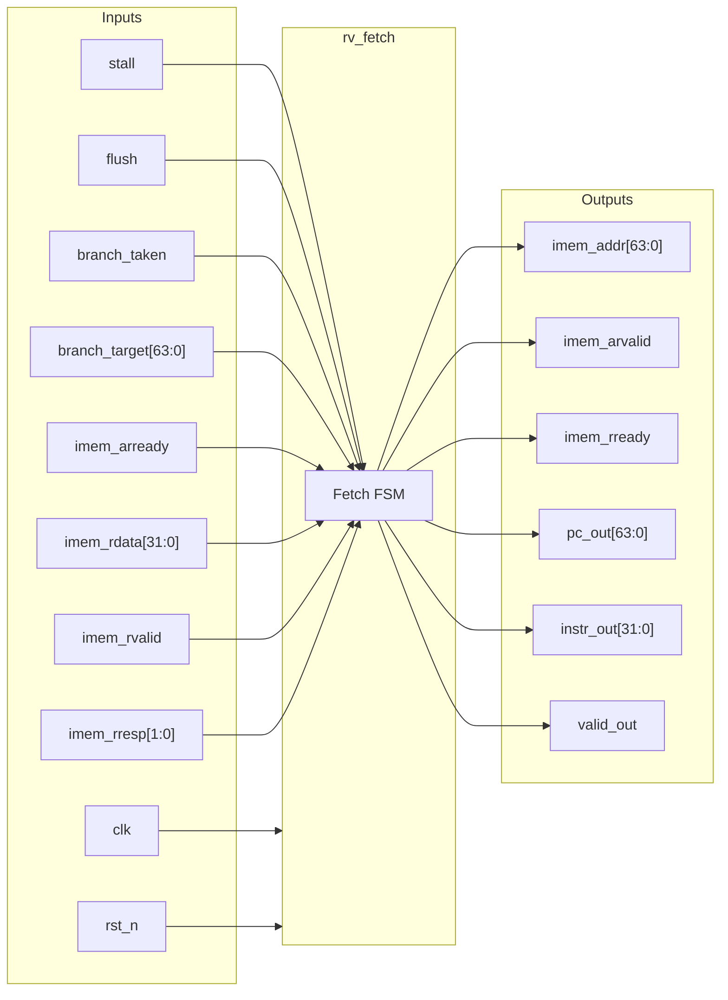

# rv_fetch

## Description

`rv_fetch` is the instruction fetch stage for the SMVDU-Titan-X RISC-V (RV64I) SoC. It interfaces with the instruction memory using a single-outstanding AXI-Lite read channel. A key architectural feature is its redirect-safe teardown mechanism: upon receiving a control flow redirect (e.g., from a branch or a flush), the internal FSM meticulously drains any orphaned transactions (such as an unaccepted address request or an owed read data beat) before initiating the new fetch. This ensures that a stale instruction on the abandoned execution path is never mistakenly paired with the new program counter, preserving correct architectural behavior.

## Interface

### Inputs

| Signal | Width | Description |
|--------|-------|-------------|
| clk | 1 | System clock |
| rst_n | 1 | Active-low asynchronous reset |
| stall | 1 | Pipeline stall signal to freeze the fetch stage |
| flush | 1 | Pipeline flush signal to discard the current fetch |
| branch_taken | 1 | Control signal indicating a branch was taken |
| branch_target | 64 | Target PC address for a taken branch or redirect |
| imem_arready | 1 | AXI-Lite read address ready signal from memory |
| imem_rdata | 32 | AXI-Lite read data from instruction memory |
| imem_rvalid | 1 | AXI-Lite read valid signal from memory |
| imem_rresp | 2 | AXI-Lite read response from memory |

### Outputs

| Signal | Width | Description |
|--------|-------|-------------|
| imem_addr | 64 | AXI-Lite read address channel – target address for instruction fetch |
| imem_arvalid | 1 | AXI-Lite read address valid signal |
| imem_rready | 1 | AXI-Lite read ready signal to accept incoming instruction data |
| pc_out | 64 | Program counter value sent to the decode stage |
| instr_out | 32 | Fetched instruction sent to the decode stage |
| valid_out | 1 | Valid flag indicating a successful instruction fetch delivery to decode |

## Functionality

The module is built around a three-state Finite State Machine (`F_REQ`, `F_WAIT`, and `F_FLUSH`). In normal operation, it cycles between requesting a fetch (`F_REQ`) and waiting for the memory response via AXI-Lite (`F_WAIT`). It maintains a clean transaction boundary by allowing only one outstanding AXI-Lite read at a time. If a pipeline flush or taken branch occurs (a redirect), it transitions to a dedicated drain state (`F_FLUSH`). During this drain, any incomplete AXI-Lite transactions (such as a pending AR beat or an unreceived R beat) are safely ignored or completed to satisfy the bus protocol without affecting the architectural state. Once the orphaned beats are consumed, the fetch stream restarts precisely at the new `branch_target`. The stall conditions are properly handled by holding instructions valid until decode stage is ready.

## Hierarchical Block Diagram

## Signal-Level Diagram

