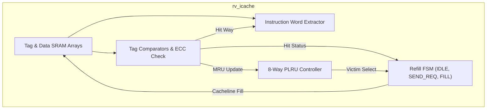
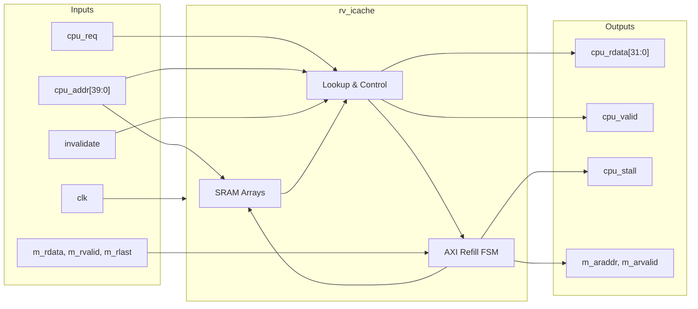

# rv_icache

## Description

The `rv_icache` module implements a 32KB, 8-way set-associative Level-1 Instruction Cache for the SMVDU-TITAN-X SoC. Configured with 64-byte cachelines and utilizing a Virtually Indexed, Physically Tagged (VIPT) architecture, it supplies 32-bit instruction words to the CPU fetch stage with minimal latency. It uses an 8-way Pseudo-LRU (PLRU) binary tree for optimal victim selection and integrates SECDED ECC logic (modeled behaviorally via Hsiao code) to detect and protect against memory corruption. When a cache miss occurs, the integrated AXI4 master fetches the required 64-byte block using an efficient 8-beat INCR burst.

## Interface

### Inputs

| Signal | Width | Description |
|--------|-------|-------------|
| clk | 1 | System clock |
| rst_n | 1 | Active-low asynchronous reset |
| cpu_addr | 40 | Physical address requested by the CPU fetch stage |
| cpu_req | 1 | High when the CPU is requesting an instruction |
| invalidate | 1 | Flushes the entire cache by clearing all valid bits synchronously |
| m_arready | 1 | AXI4 read address ready signal from the interconnect |
| m_rvalid | 1 | AXI4 read data valid signal |
| m_rdata | 64 | AXI4 read data beat (8 bytes per beat) |
| m_rlast | 1 | High on the final beat of an AXI4 read burst |
| m_rresp | 2 | AXI4 read response code |

### Outputs

| Signal | Width | Description |
|--------|-------|-------------|
| cpu_rdata | 32 | The fetched 32-bit instruction word returned to the CPU |
| cpu_valid | 1 | High when the requested instruction data is valid |
| cpu_stall | 1 | High during a cache miss refill, stalling the CPU fetch stage |
| m_arvalid | 1 | AXI4 read address valid for initiating a refill burst |
| m_araddr | 40 | AXI4 read address |
| m_arlen | 8 | AXI4 burst length (fixed at 7 for 8 beats) |
| m_arsize | 3 | AXI4 burst size (fixed at 3 for 8 bytes/beat) |
| m_arburst | 2 | AXI4 burst type (fixed at INCR: 01) |
| m_rready | 1 | AXI4 read data ready signal |
| ecc_1bit | 1 | High if a correctable single-bit ECC error is detected |
| ecc_2bit | 1 | High if an uncorrectable double-bit ECC error is detected |

## Functionality

The `rv_icache` evaluates instruction fetch requests combinationally against its SRAM arrays. The 40-bit physical address is split into a 28-bit tag, 6-bit set index, and 6-bit byte offset. All 8 ways in the addressed set are read concurrently, and their valid bits and tags are compared to identify a hit. On a hit, the specific 32-bit instruction word is extracted from the 64-byte line using the byte offset, `cpu_valid` is asserted, and the PLRU tree is updated to mark the way as Most Recently Used. 

On a cache miss, the cache stalls the CPU (`cpu_stall` = 1) and enters its refill FSM (`SEND_REQ`). It asserts an AXI4 read address targeting the aligned cacheline. Once the interconnect accepts the address, the FSM transitions to `FILL`, capturing the incoming 8 beats (64 bytes) sequentially. Upon receiving `m_rlast`, the assembled cacheline and computed ECC tag are written into the victim way identified by the PLRU logic, resolving the miss and returning the cache to the `IDLE` state.

## Hierarchical Block Diagram

## Signal-Level Diagram

