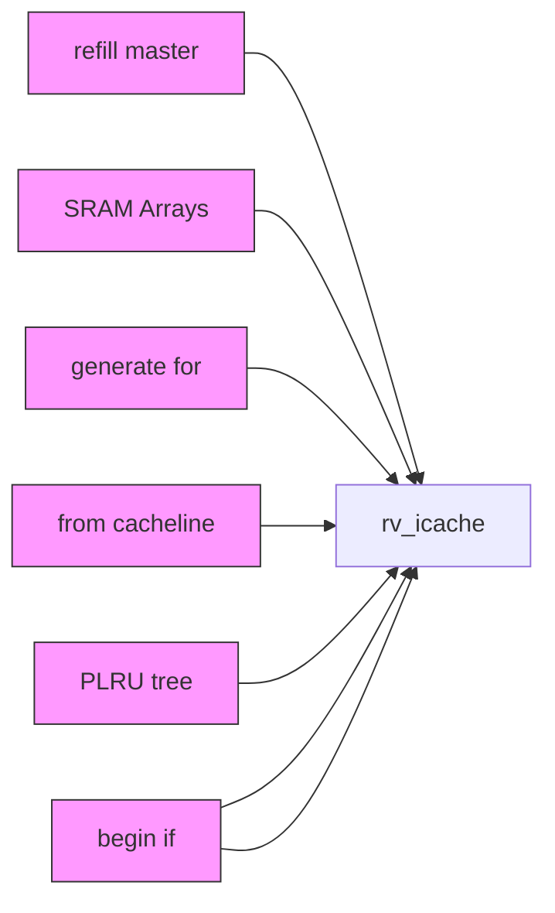
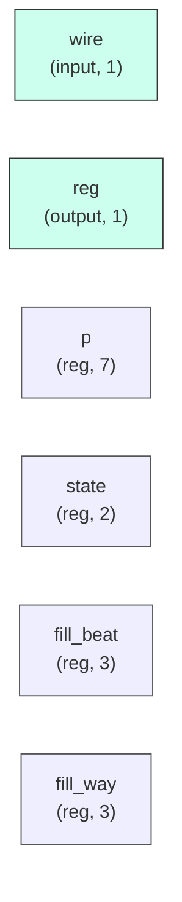

# rv_icache

## Description

The **rv_icache** module SPDX-License-Identifier: Apache-2.0
 SMVDU-TITAN-X SoC — 32KB, 8-Way Set-Associative I-Cache with SECDED ECC
 Iteration 3: VIPT, PLRU replacement, AXI4 refill master (8-beat burst)
 Target: SCL 180nm, 125-200 MHz
 Geometry: 64-set × 8-way × 64B cacheline = 32KB
`timescale 1ns/1ps
`include "params.vh"

## Interface

### Inputs

| Name | Width | Description |
|------|-------|-------------|
| wire | 1 | – |
| wire | 1 | – |
| wire | 1 | – |
| wire | 1 | – |
| wire | 1 | – |
| wire | 1 | – |
| wire | 1 | – |
| wire | 1 | – |
| wire | 1 | – |
| wire | 1 | – |

### Outputs

| Name | Width | Description |
|------|-------|-------------|
| reg | 1 | – |
| reg | 1 | – |
| wire | 1 | – |
| reg | 1 | – |
| reg | 1 | – |
| reg | 1 | – |
| reg | 1 | – |
| reg | 1 | – |
| reg | 1 | – |
| reg | 1 | – |
| reg | 1 | – |

## Functionality

*rv_icache provides the hardware implementation for its designated function within the SoC.*

## Hierarchical Block Diagram (Mermaid)

## Full Signal‑Level Diagram (Mermaid)

