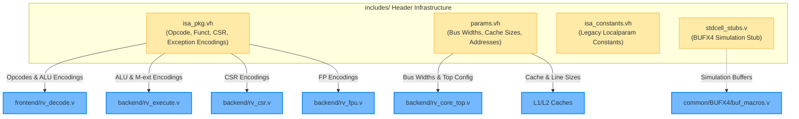

# Includes Directory — Central Architecture Packages & Headers

This directory contains the central specification header files, ISA packages, SoC system parameters, and standard cell simulation models for the **SMVDU TITAN-X SoC**.

---

## 📁 Files Summary

| File | Type | Description | Included By |
|------|------|-------------|-------------|
| [`isa_pkg.vh`](isa_pkg.vh) | Header (`.vh`) | Complete RISC-V RV64GC opcode encodings, M/A/F/D/C extensions, CSR address map, ALU operation selectors, exception & interrupt causes | 10 modules (`rv_decode`, `rv_execute`, `rv_csr`, `rv_fpu`, `rv_mmu`, `rv_tlb`, `rv_ptw`, `rv_pmp`, `rv_core_top`, `rv_monitor_core`) |
| [`params.vh`](params.vh) | Header (`.vh`) | System-wide configuration parameters: bus widths (AXI4 40-bit addr, 64-bit data), cache sizes (32KB L1I/D, 2MB L2), MMU Sv39 constants, memory map addresses | 16 modules (`rv_fetch`, `rv_icache`, `rv_dcache`, `rv_bpu`, `l2_cache_top`, `l2_snoop_filter`, `rv_debug`, etc.) |
| [`isa_constants.vh`](isa_constants.vh) | Header (`.vh`) | Legacy localparam definitions for base integer opcodes and ALU operation codes | Architecture reference & fallback |
| [`stdcell_stubs.v`](stdcell_stubs.v) | Verilog (`.v`) | Behavioral simulation stubs for SCL 180nm standard cells (e.g. `BUFX4` high-fanout buffer) | Simulation builds |

---

## 1. `isa_pkg.vh` — Central RISC-V ISA Package

Defines the binary encodings required across the CPU pipeline:
* **Base Opcodes:** `OP_LUI`, `OP_AUIPC`, `OP_JAL`, `OP_JALR`, `OP_BRANCH`, `OP_LOAD`, `OP_STORE`, `OP_IMM`, `OP_REG`, `OP_IMM64`, `OP_REG64`, `OP_SYSTEM`, `OP_FENCE`
* **M-Extension:** Funct3 codes (`F3_MUL`, `F3_MULH`, `F3_MULHSU`, `F3_MULHU`, `F3_DIV`, `F3_DIVU`, `F3_REM`, `F3_REMU`) and funct7 (`F7_MEXT = 7'b0000001`)
* **A-Extension:** Atomic Memory Operation funct5 codes (`AMO_LR`, `AMO_SC`, `AMO_SWAP`, `AMO_ADD`, `AMO_XOR`, `AMO_AND`, `AMO_OR`, `AMO_MIN`, `AMO_MAX`)
* **F/D-Extensions:** Floating point arithmetic and memory opcodes (`OP_FP`, `OP_FMADD`, `OP_FMSUB`, `OP_LOAD_FP`, `OP_STORE_FP`) and funct5 codes
* **CSR Address Map:** Machine mode (`CSR_MSTATUS`, `CSR_MEPC`, `CSR_MTVEC`, `CSR_MCAUSE`, `CSR_PMP*`), Supervisor mode (`CSR_SSTATUS`, `CSR_SATP`, `CSR_STVEC`), and FP status
* **ALU Operations:** 5-bit control signals (`ALU_ADD`, `ALU_SUB`, `ALU_SLT`, `ALU_MUL`, `ALU_DIV`, etc.)
* **Exception & Interrupt Causes:** Full RISC-V privileged specification exception and interrupt vectors

---

## 2. `params.vh` — Central Parameters Header

Defines system-level configuration parameters for SCL 180nm tapeout:
* **Core & Harts:** `XLEN=64`, 4 Application Harts (`NUM_APP_HARTS=4`), 1 Monitor Hart (`NUM_MON_HARTS=1`), `RESET_PC = 64'h0000_0000_0002_0000` (eNVM base)
* **AXI4 Fabric:** 40-bit address (`AXI_ADDR_WIDTH=40`), 64-bit data (`AXI_DATA_WIDTH=64`), 15 Masters (`NUM_AXI_MASTERS=15`), 9 Slaves (`NUM_AXI_SLAVES=9`)
* **L1 Caches:** 32KB 8-way set-associative I-Cache & D-Cache, 64-byte cache lines, SECDED ECC
* **L2 Cache:** 2MB 16-way set-associative shared cache, 4 SRAM banks (512KB each)
* **MMU (Sv39):** 39-bit virtual address, 38-bit physical address, 4KB page size, 32-entry TLB, 8 PMP entries
* **Memory Map:** DDR base `0x8000_0000` (2GB), eNVM base `0x0002_0000` (128KB), APB base `0x4000_0000`

---

## 3. `stdcell_stubs.v` — Standard Cell Behavioral Stubs

Provides behavioral simulation models for foundry library cells that are structurally instantiated within the RTL:
* `BUFX4`: 4x drive strength buffer used to resolve high-fanout nets (e.g. pipeline flush and hazard signals). During synthesis, the EDA tool maps this to the physical 180nm library cell.

