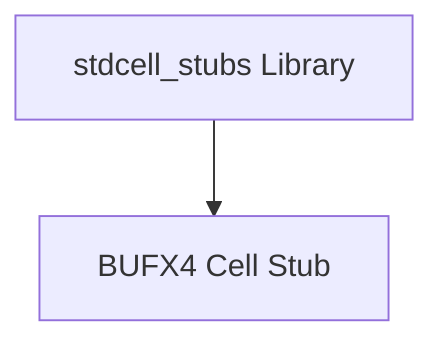
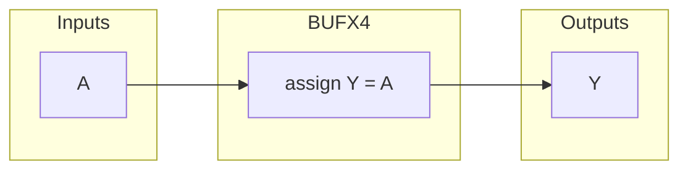

# stdcell_stubs

## Description

`stdcell_stubs.v` is the canonical library of standard cell RTL stubs used for verification of the SMVDU-TITAN-X SoC targeting a 180nm process node. It provides behavioral simulation models for standard cells that are structurally instantiated within the design. Currently, it includes the stub for `BUFX4`, a 4x drive strength buffer used to resolve high fanout nets. The file is wrapped in an include guard (`TITANX_STDCELL_STUBS`) to prevent redefinition errors if the file is passed multiple times to the compiler or alongside isolated macro definitions.

## Interface

### Inputs

| Signal | Width | Description |
|--------|-------|-------------|
| A | 1 | Logical input signal for the BUFX4 cell |

### Outputs

| Signal | Width | Description |
|--------|-------|-------------|
| Y | 1 | Logical output signal for the BUFX4 cell |

## Functionality

In behavioral simulation, standard cell stubs act as simple logical equivalents of their physical counterparts. The `BUFX4` cell is implemented as a continuous assignment from `A` to `Y`, simply passing the logical value through without any actual electrical delays. During synthesis, the synthesis tool substitutes this RTL stub with a physical timing-characterized layout cell from the 180nm standard cell library, allowing the tool to properly buffer signals and meet timing closures based on physical wireloads.

## Hierarchical Block Diagram

## Signal-Level Diagram

