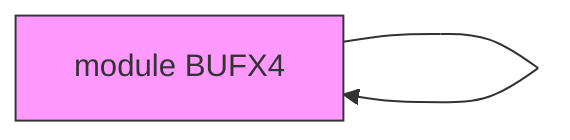
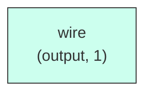

# BUFX4

## Description

The **BUFX4** module Standard cell stub library for 180nm verification
 Canonical home of cell stubs. Guarded so it may be listed on any compile
 line regardless of ../common/* also being present.
`ifndef TITANX_STDCELL_STUBS
`define TITANX_STDCELL_STUBS

 BUFX4: 4X drive strength buffer

## Interface

### Inputs

| Name | Width | Description |
|------|-------|-------------|
| wire | 1 | – |

### Outputs

| Name | Width | Description |
|------|-------|-------------|
| wire | 1 | – |

## Functionality

*BUFX4 provides the hardware implementation for its designated function within the SoC.*

## Hierarchical Block Diagram (Mermaid)

## Full Signal‑Level Diagram (Mermaid)

